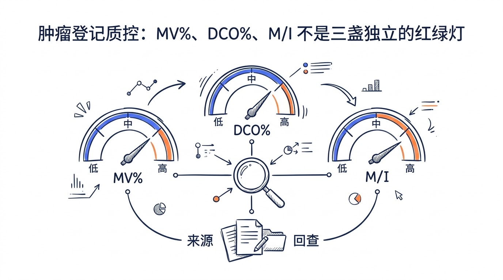
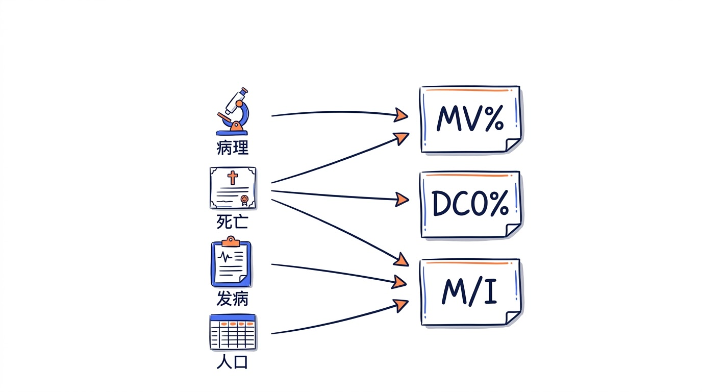
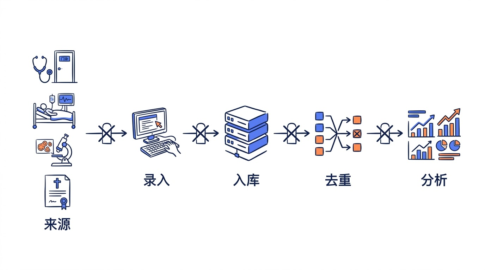
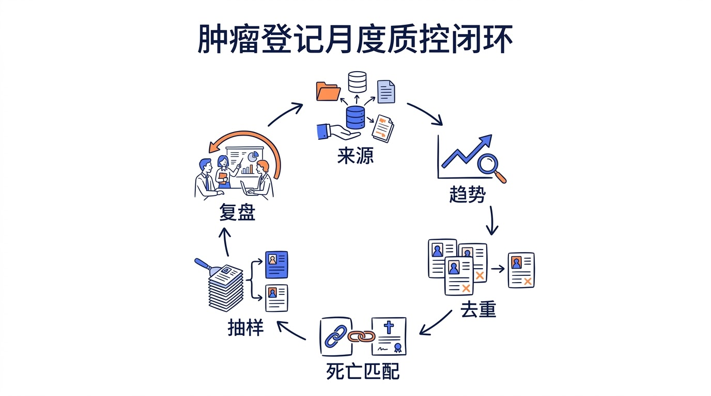

## 先看一张“很漂亮”的质控表

MV% 大于 `66%`，DCO% 低于 `15%`，M/I 在 `0.6–0.8` 之间，年度发病率波动不超过 `10%`。

这组数字，很多肿瘤登记同行一眼就熟。它出现在 2011 年《全国慢性病预防控制工作规范（试行）》的示范区考核条目里。四个数都在区间内，表格上齐刷刷一排绿色。

那数据就没问题了？

**真不一定。**

假设一个登记处主要从病理科收病例，**MV%** 当然好看，但那些没有组织学诊断的临床病例，会不会已经漏在门外？又比如，DCO% 很低，可能说明常规病例发现得好；也可能是死亡证明根本没有顺利进入登记系统。

所以我对质控表的第一反应，不是看绿灯有几盏，而是问一句：**这个数，到底是怎么来的？**

## 质控不是三个比例，是四类证据

IARC 把人群肿瘤登记的数据质量分为四个维度：**可比性、有效性、及时性、完整性**。这四个词看着像教科书，落到案头，问的其实是四类很具体的问题。

**可比性**要问：今年和去年的口径真一样吗？两地发病率不同，是疾病负担不同，还是发病日期、多原发癌规则、ICD-O 版本或登记范围变了？口径一变，趋势图上就可能凭空长出一个拐点。

**有效性**关心记录是否真实、准确。性别与部位冲突，容易查；形态学与解剖部位的可疑组合，也可以用规则拦一道。难的是那些“每个字段都合法，放在一起却不对”的记录。这时候得回到病理、病案或原报告卡。没捷径。

**及时性**也不是越快越好。一批还没完成死亡匹配和补漏的数据，提前交出去是很快，可它还不适合支撑稳健的年度比较。IARC 把这件事说得很明白：及时性与完整性之间存在取舍。

不急，先把截止日期记清楚。

**完整性**最容易被误读。姓名、身份证号、诊断日期都填了，叫“项目完整”；辖区里应该登记的新发病例被尽可能找到，才是“病例发现完整”。**卡填得满，不代表人找得齐。**

## MV%、DCO%、M/I，请和“来源”绑在一起看

**MV%** 是经形态学证实的病例比例。数值较高，通常支持诊断的准确性；但它不是单向赛跑。某年 MV% 突然接近 `100%`，我会先查病例来源是否缩窄，再看病理诊断能力是否真的发生了变化。

**DCO%** 是仅由死亡证明获得信息的病例比例。数值过高，往往提示常规病例发现或死亡回溯不足；可它同时受死亡证明可获性、死因书写质量、跨库匹配和追溯能力影响。因此，**DCO% 低不能单独证明完整性高**。

**M/I** 是同一时期死亡数与新发病例数之比。它会同时受病例发现、死亡登记质量、当地癌谱和生存水平影响。把全部癌种的 M/I 压成一个数，再用一条红线判断好坏，信息丢得太多。

我更愿意按性别、癌种、年龄组、医院和年度拆开，把三项指标与来源构成、缺失率、发病趋势放在同一张图上。哪一组先变？变化从哪家机构开始？这才有办案的感觉。

## 一条真正能跑起来的质控线

先别急着再做一张仪表盘。把数据流画出来：门诊、住院、病理、放疗、医保、死亡证明、社区随访……每个来源的更新频率、负责人、唯一标识、退回通道和最长延迟，都写上。

然后才轮到规则。

- 录入时：拦必填项、日期逻辑和非法值。
- 入库前：查部位—形态学、性别—部位、年龄—癌种等组合。
- 合并时：做人员去重，再按多原发癌规则判断肿瘤条数。
- 分析前：看时间趋势、癌种构成、年龄分布和来源分布有没有突变。

这里有个特别容易踩的坑：警报越多，不代表质控越强。一个警报如果没有负责人、截止日期、回查证据和处理结论，那它只是一个红点。过几天，大家就对红点免疫了。

所以，发现“某医院某月上报数骤降”之后，下一步不是标红，而是查接口日志、病理清单、住院病案和人员变动。**异常要有主人，也要有下文。**

还有版本。什么时候换了 ICD-O 编码表？哪天修改了重复判定规则？哪家医院在 6 月开始自动上报？没有变更日志，半年后再看曲线，真的会懵。

## 自动化很有用，但脚本跑完不等于质控完成

2026 年 3 月 1 日起施行的《上海市肿瘤登记管理办法》，已经明确鼓励后台数据交换、智能提醒插件，以及从医院诊疗系统自动抓取信息。这个方向我很赞成。人工转抄就是会制造错误，而且很累。

可自动化只会稳定地执行已经写清的规则。某家医院悄悄换了病理代码，它未必知道；两条合法记录是重报还是多原发癌，它也未必判得对。

说实话，我对“全自动质控”这个说法一直有点警惕。好的自动化，应该把人从复制、粘贴和批量比对中腾出来，让人把时间用在编码判断、来源回查和跨机构沟通上。这才是人机分工。

## 下个月，可以从这份清单开始

别一上来就想做一套完美系统。先拿最近 `12 个月`的数据，做几件小事：

1. 按来源核对应报数、实报数和延迟，不只看总数。
2. 按医院、性别、癌种和年龄组拆分 MV%、DCO%、M/I 与缺失率，找出变化最突然的几组。
3. 复核重报候选和多原发癌候选，把“为什么合并”或“为什么保留”记下来。
4. 把死亡资料与发病库再对一遍，给新发现的肿瘤死亡病例排上回溯。
5. 从高风险字段里抽样重抽象或重编码，把差错反馈给规则和培训（不是只改掉这一条）。
6. 每个异常留下负责人、证据、日期和结论，下月回看有没有复发。

有点碎。但质控本来就不是只靠一次“大清理”，而是靠这些小动作每个月都发生。

## 写在最后

我越来越觉得，肿瘤登记质控更像办案，不像考试。指标是线索，原始记录是证据，数据流是现场，还得留下一条能复盘的处理记录。

只问“三项指标合格了吗”，很容易得到一个漂亮的答案。继续问下去——**这个变化从哪来，能不能追回去？**

这时，质控才算真开始。

### 参考资料

- [IARC：Quality control at the population-based cancer registry](https://publications.iarc.who.int/_publications/media/download/3827/77466e390723d27d694a765d89ff095173fca104.pdf)
- [IARC：Comparability and Quality Control in Cancer Registration](https://publications.iarc.who.int/Book-And-Report-Series/Iarc-Technical-Publications/Comparability-And-Quality-Control-In-Cancer-Registration-1994)
- [国家卫生健康委：肿瘤登记管理办法](https://www.nhc.gov.cn/jkj/c100063/201502/365ceb5ebd1346e69626ffcc787d7b4a.shtml)
- [上海市卫生健康委：上海市肿瘤登记管理办法（2026）](https://www.shanghai.gov.cn/gwk/search/content/a9e440078362493e951c3bf6a180c401)
