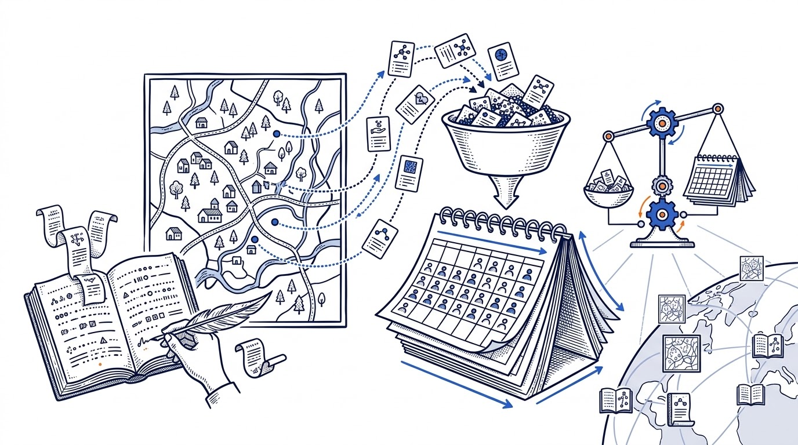
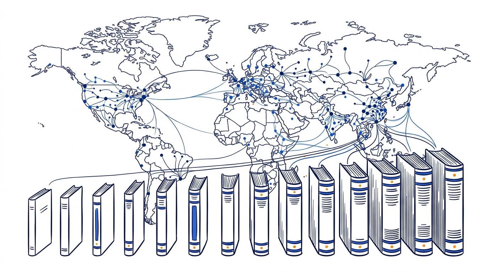
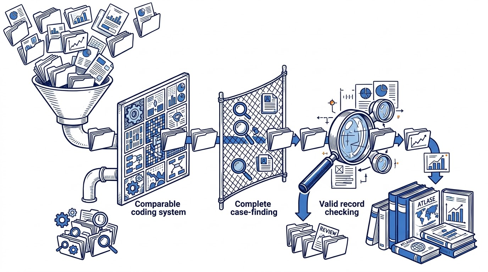
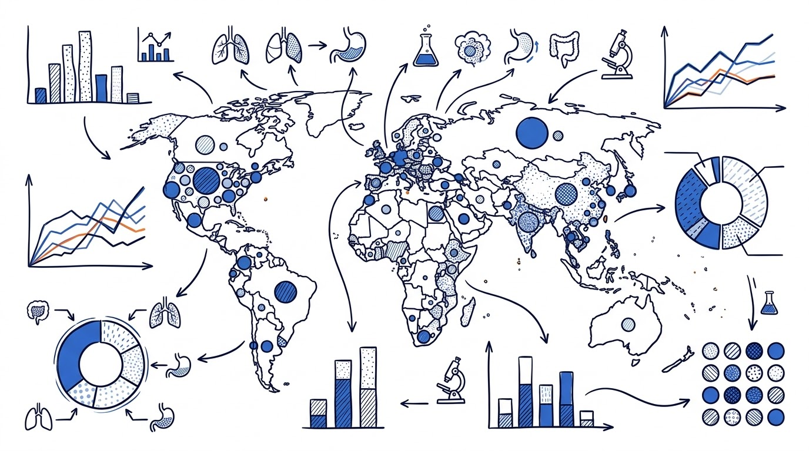
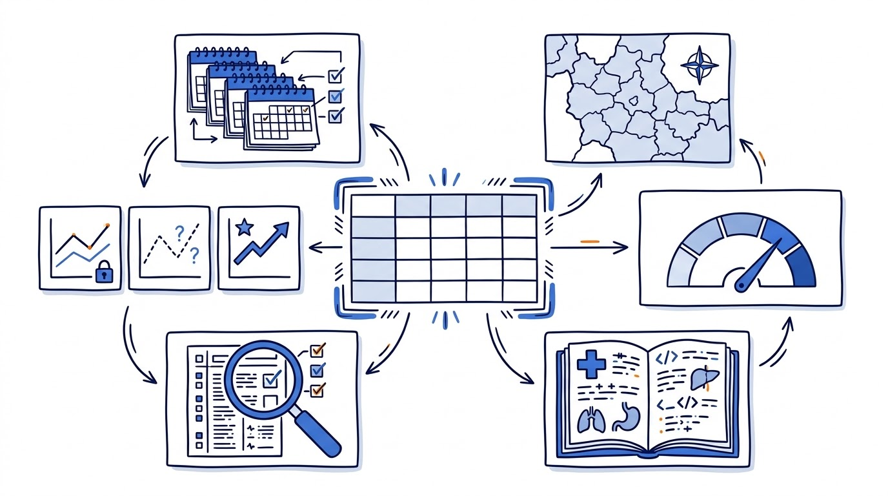

## 1966：先把“谁”和“多久”说清楚

CI5，即 *Cancer Incidence in Five Continents*，中文通常译作《五大洲癌症发病率》。第I卷由 Richard Doll、Peter Payne 和 John Waterhouse 编辑，1966年出版，纳入29个国家、32个登记处、35个登记人群。

它的起点不是一张世界排行榜，而是一个很严格的分母：在边界明确的人群中，连续记录规定时期内出现的癌症病例。分子是新发病例，分母是同一目标人群在这段时间内的人年。

这也是**人群肿瘤登记**与医院病例统计的根本差别。医院数据记录“谁到这家医院就诊”；人群登记尝试回答“这个地区的居民中，有多少人新发癌症”。

**没有定义清楚的人群分母，病例数再精确，也很难变成可比的发病率。**

## 书名没变，数据地图一直在长大

CI5大约每5年出版一卷。若只选几个节点，这条时间线是这样的：

- 1966年，第I卷：32个登记处。
- 1987年，第V卷：105个登记处。
- 2002年，第VIII卷：186个登记处。
- 第X卷：2003–2007年诊断数据，68个国家、290个登记处。
- 第XI卷：2008–2012年诊断数据，65个国家、343个登记处。
- 第XII卷：2013–2017年诊断数据，当前官方主页报告65个国家、460个登记处。

“五大洲”留在书名里，是一个延续至今的专有名称。当代CI5展示数据时，会把美洲分成北美和中南美，再与非洲、亚洲、欧洲和大洋洲并列。所以，不必用今天的统计分区数量去纠结这个历史书名。

但另一个数字必须纠结。Bray等对第X卷的分析显示，当时被纳入登记处覆盖约占全球人口14%。按洲看，北美约95%、大洋洲约78%、欧洲约42%；中南美约8%、亚洲约6%、非洲约2%。

**各洲都出现在书里，不等于各洲数据拥有相同的人口覆盖和代表性。**

## 中国的变化：从上海一处到157个大陆登记处

按CI5官方I–XII卷登记处清单逐行统计，并把中国大陆、香港、澳门和台湾分开，可以看到一条并不平滑、但扩张非常明显的轨迹。

| CI5卷 | 大致诊断期 | 中国大陆 | 香港 | 澳门 | 台湾 |
|---|---|---:|---:|---:|---:|
| IV | 1973–1977 | 1 | 1 | 0 | 0 |
| V | 1978–1982 | 2 | 1 | 0 | 0 |
| VI–VII | 1983–1992 | 每卷3 | 每卷1 | 0 | 0 |
| VIII | 1993–1997 | 8 | 1 | 0 | 1 |
| IX | 1998–2002 | 5 | 1 | 0 | 0 |
| X | 2003–2007 | 12 | 1 | 1 | 0 |
| XI | 2008–2012 | 35 | 1 | 0 | 0 |
| XII | 2013–2017 | 157 | 0 | 0 | 0 |

现行统一清单中，第I–III卷没有中国条目；第IV卷首次出现中国大陆数据，来自上海市1975年，同时收录香港1974–1977年数据。上海此后连续出现在第IV–XII卷，是观察长期变化时非常珍贵的连续序列。天津、启东等登记处则曾在部分卷次缺席，提醒我们：**比较历卷时，登记处集合本身也在变化**。

中国大陆的扩张在最近三卷明显加速：第X卷12个、第XI卷35个，到第XII卷达到157个。按同一官方清单计算，这157个约占第XII卷全球460个登记处的34%。它说明中国数据在CI5中的分量明显增加，**却不等于覆盖了全国34%的人口，更不等于形成了全国代表性样本**。

还有一组数字容易混淆：CI5第XII卷方法章节显示，中国提交的数据集由第X卷的30个增至第XI卷的103个、第XII卷的261个；这些是**提交数**，不是最终收录登记处数。提交后仍要经过可比性、完整性和有效性审查。

表中某一卷显示香港、澳门或台湾为0，只表示现行官方清单中该卷没有对应收录条目，不能据此判断当地是否存在肿瘤登记系统，更不能评价其质量。

## 从521个候选人群到424个纳入人群

覆盖范围扩大，并不意味着“收到什么就放进去什么”。CI5的可比性，很大程度来自纳入前的检查和取舍。

第X卷是一个很好的例子。2011年9月，数据征集通知发给591个IACR成员。到2012年初，编辑组收到80个国家、372个登记处、521个登记人群的数据。最终出现在第X卷的，是68个国家、290个登记处和424个人群。

中间发生了什么？核对编码，识别重复登记和不可能的代码组合，检查年龄别发病率和人口数，再结合显微镜证实、死亡证明书和死亡/发病比等指标审查数据。核心评价轴是**可比性、完整性和有效性**。

这也解释了一个看似反常的现象：相邻两卷的国家数或登记处数没有直线上升，不能直接读作全球登记工作“进步”或“退步”。数据提交、参考期、登记人群定义和纳入质量，都会影响这组数字。

## CI5画出的是差异，不会自动给出原因

CI5让不同登记人群的发病率，可以按尽量一致的年龄、性别、癌种和编码口径比较。地理图谱因此变得非常鲜明。

Bray等（2015）对第X卷2003–2007年数据的分析显示，女性乳腺癌在西欧、北美和澳大利亚/新西兰的部分登记人群中较高；宫颈癌在纳入的部分撒哈拉以南非洲人群中很高；胃癌和肝癌在亚洲不同登记人群之间也存在大幅差异。

注意，这些句子一直使用“部分登记人群”，而不是“整个洲”。即使在同一洲、同一国家，不同人群的发病图谱也可能相差很大。

地理差异能为病因和防控研究提供线索，却不能单独证明原因。筛查强度、诊断能力、病例发现完整性、分类更新、人口构成和真实危险暴露，都会改变观察到的发病率。

**“较低的登记发病率”，有时也可能混入诊断不足或漏报。**

## 从纸质卷册到CI5plus，“看趋势”变了

纸质时代的CI5，主要是隔几年将登记处数据汇成一卷。网络化之后，CI5 I–XII将历卷数据放进统一查询界面；CI5plus则为经选登记处提供年度发病时间序列。

这不只是介质的变化。真正研究长期趋势，应尽量跟踪同一登记处、口径稳定的连续序列。直接拿第V卷全部登记处的平均值，去减第XII卷全部登记处的平均值，看似比较了时间，其实还换了登记处集合、诊断实践和编码环境。

`CI5` 与 `GLOBOCAN` 也不能混用。CI5主要展示被纳入登记处的观测数据；GLOBOCAN为了得到国家层面的广泛覆盖，会按数据可用性使用趋势外推、地方登记处代表、死亡—发病比模型或邻国数据等方法生成国家估计。

**登记观测、国家估计、未来预测，应当始终分开标注。**

## 打开一张CI5表格时，先看这六项

1. 数据属于哪一卷，诊断期是哪几年？
2. 分析对象是国家、地区，还是具体登记人群？
3. 指标是粗率、年龄别率、世界年龄标化率，还是0–74岁累积率？
4. 癌种、组织学和多原发癌的编码口径是否可比？
5. 变化是否可能由筛查、诊断、登记覆盖或数据质量造成？
6. 这个数是登记观测值、模型估计值，还是未来预测？

IARC研究者Soerjomataram与Bray在2021年发表于 *Nature Reviews Clinical Oncology* 的模型前瞻预测，若主要癌种近期趋势延续，2070年全球新发癌症约为3400万例，约为2020年水平的两倍。这是建立在趋势和人口假设上的前瞻，不是CI5已经观测到2070年，更不是无法改变的结局。

CI5提供的是群体层面的流行病学证据，不能用来预测某个人是否会患癌，也不能替代面向个体的筛查、诊断或治疗建议。

CI5的这段历史，与其说是一部发病率排名史，不如说是一部全球登记数据基础设施的建设史。

**只有持续、可比、可追溯地记录人群中的新发病例，才有可能看清癌症负担在哪里改变，也才能检验防控是否真正改变了它。**

### 参考资料

- [IARC/IACR: Cancer Incidence in Five Continents](https://ci5.iarc.who.int/)
- [IARC: CI5 Volumes I–XII](https://ci5.iarc.who.int/previous/)
- [IARC: CI5 I–XII Registry list](https://ci5.iarc.who.int/previous/dictionary/registry-list/)
- [IARC: Cancer Incidence in Five Continents Volume XII](https://ci5.iarc.who.int/ci5-xii/)
- [IARC: CI5 Volume XII, Chapter 1](https://publications.iarc.who.int/_publications/media/download/7320/17f90383a6c90097a750b9437dfd5c23332965a6.pdf)
- [Bray F, et al. Cancer incidence in five continents: inclusion criteria, highlights from Volume X and the global status of cancer registration](https://doi.org/10.1002/ijc.29670)
- [IARC: Cancer Incidence in Five Continents Volume XI](https://publications.iarc.who.int/Book-And-Report-Series/Iarc-Scientific-Publications/Cancer-Incidence-In-Five-Continents%C2%A0Volume-XI-2021)
- [IARC: Update of CI5 websites and CI5plus](https://www.iarc.who.int/news-events/update-of-cancer-incidence-in-five-continents-ci5-websites/)
- [GLOBOCAN 2022: data sources and methods by country](https://gco.iarc.who.int/media/globocan/material/GLOBOCAN2022_annexes.pdf)
- [Soerjomataram I, Bray F. Planning for tomorrow: global cancer incidence and the role of prevention 2020–2070](https://doi.org/10.1038/s41571-021-00514-z)
