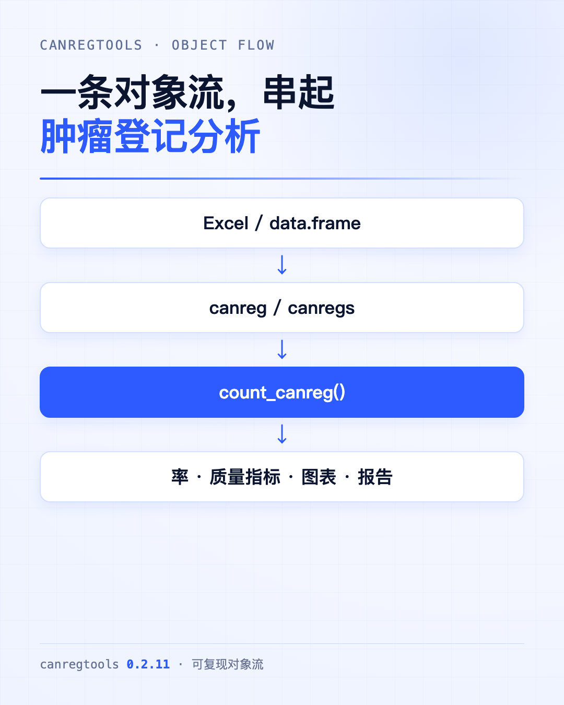
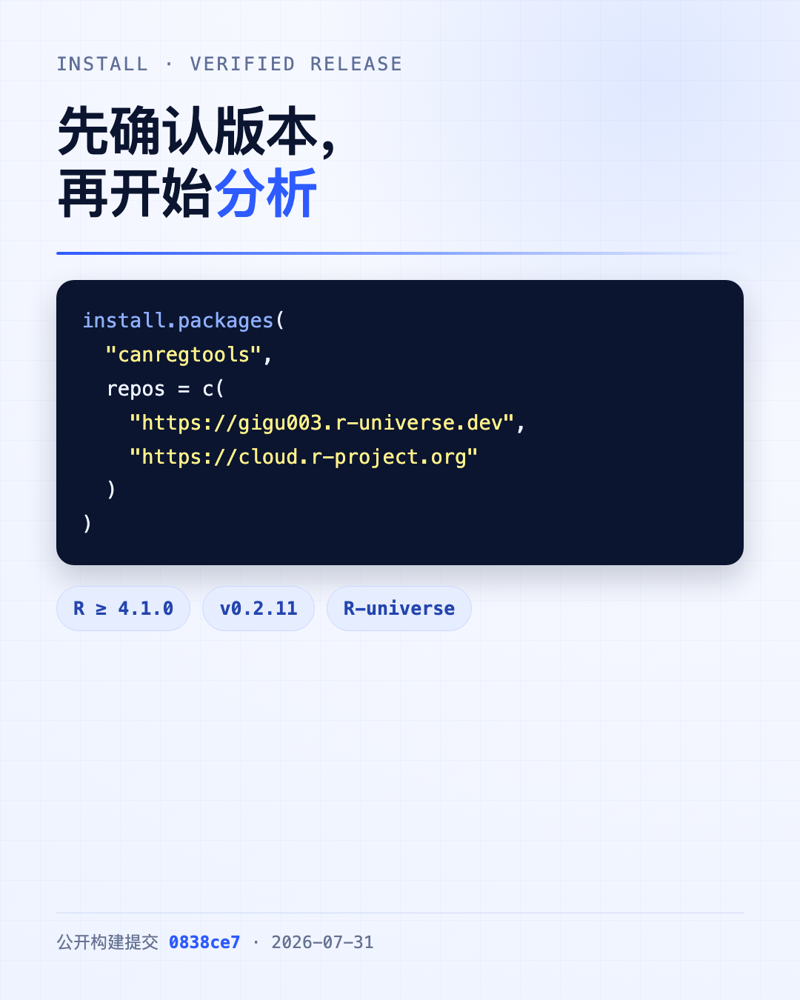
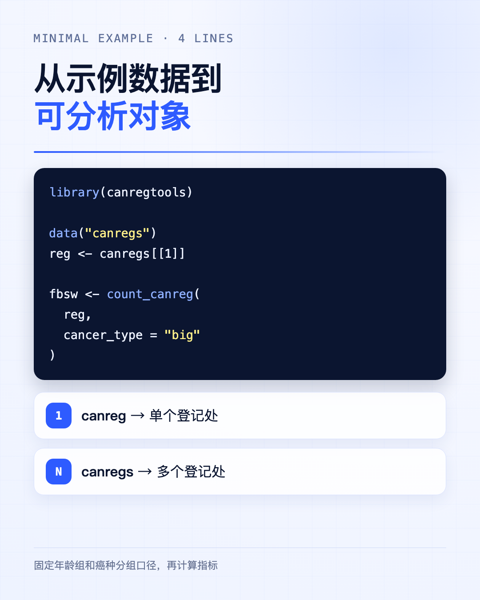

```text
Excel / data.frame
        ↓
canreg / canregs
        ↓
count_canreg()
        ↓
fbswicd / fbswicds
        ↓
率、质量指标、图表、报告
```

这条对象流，是我们编写 **canregtools** 时最想固定下来的东西。

肿瘤登记分析真正费时间的地方，往往不是某一个公式，而是公式前后的衔接：病例表和人口表怎样对应？癌种怎样分组？年龄组是否一致？单个登记处的代码，怎样复用到多个登记处？同一批数据重新分析时，能否得到同样的结果？

canregtools 不试图替代专业审核。它做的事情更具体：**把常用数据结构、分层变量和计算步骤约定清楚，让分析过程更容易复现、检查和复用。**



## 先确认版本，再安装

本文使用的公开版本是 **canregtools 0.2.11**，要求 R 4.1.0 或更高。截至 2026 年 8 月 25 日，该版本可从作者的 R-universe 安装，R-universe 构建记录对应公开提交 `0838ce7`。

```r
install.packages(
  "canregtools",
  repos = c(
    "https://gigu003.r-universe.dev",
    "https://cloud.r-project.org"
  )
)

library(canregtools)
packageVersion("canregtools")
# [1] '0.2.11'
```

目前它还不是 CRAN 包，因此只写 `install.packages("canregtools")`，R 可能提示找不到包。这里同时保留 CRAN 镜像，是为了安装 dplyr、tidyr、purrr 等依赖。



## 输入不是“一个表”，而是一个登记对象

单个登记处在包中表示为 `canreg` 对象。它至少包含四个部分：

| 组件 | 内容 | 关键字段 |
|---|---|---|
| `areacode` | 登记处或地区标识 | 字符型标识，不限于行政区划码 |
| `FBcases` | 发病病例 | `sex`、`birthda`、`inciden`、`basi`、`icd10`、`morp`、`topo` |
| `SWcases` | 死亡病例 | `sex`、`birthda`、`deathda`、`icd10` |
| `POP` | 分层人口 | `year`、`sex`、`agegrp`、`rks` |

这里有一个容易被忽略的细节：**`areacode` 应保留为字符型**。这样既能保存前导零，也能使用 `REG-A` 一类非行政区划标识。

如果数据已经在 R 中，可以用 `as_canreg()` 组装：

```r
reg <- as_canreg(
  incidence = incidence_df,
  mortality = mortality_df,
  population = population_df,
  areacode = "REG-A"
)
```

如果使用标准 Excel 工作簿，可以用 `read_canreg()`。工作簿需要包含 `FB`、`SW`、`POP` 工作表；读取 Excel 还要安装可选依赖 `readxl`。

```r
install.packages("readxl")

reg <- read_canreg(
  "REG-A.xlsx",
  pop_type = "long",
  age_var = "agegroup",
  pop_var = "popu",
  death_var = "death"
)
```

一个文件返回 `canreg`；传入多个文件或一个目录时，返回多个登记处组成的 `canregs`。**文件读进来不等于数据已经可分析**。日期先后、人口是否为负数、人口分层是否重复、病例和人口的年份及年龄组能否对齐，仍需要在计算前完成审核。


## 用内置数据跑通最短路径

包内数据 `canregs` 可以直接用于学习。它包含 3 个示例登记处。下面取第一个登记处，并把病例按年龄组和癌种归类计数。

```r
library(canregtools)

data("canregs")
reg <- canregs[[1]]

names(reg)
# [1] "areacode" "FBcases" "SWcases" "POP"

fbsw <- count_canreg(
  reg,
  cancer_type = "big"
)
```

`count_canreg()` 是对象流的中间站。输入单个 `canreg`，得到 `fbswicd`；输入多个登记处的 `canregs`，得到 `fbswicds`。

`cancer_type` 决定 ICD-10 的分组口径：

- `"big"`：26 个常用大类；
- `"small"`：59 个较细类别；
- `"system"`：按器官系统分组；
- `"gco"`：按 Global Cancer Observatory 使用的癌种分组。

这不是单纯的显示选项。**分组口径改变，病例数、排序和后续指标都会一起改变**。同一项目中应固定 `cancer_type`，并在方法部分写明。



## 三个函数，拿到三类常用结果

### 年龄标化率：`create_asr()`

```r
asr <- create_asr(
  fbsw,
  year, sex, cancer,
  event = "fbs",
  std = c("cn2000", "wld85"),
  show_ci = TRUE
) |>
  add_labels(lang = "cn")
```

`event = "fbs"` 计算发病，改成 `event = "sws"` 计算死亡。默认倍率为每 10 万人，默认保留两位小数。`std` 可以指定中国 2000 年标准人口、1985 年世界标准人口等；`show_ci = TRUE` 会同时返回区间估计。

在包内示例的首个登记处中，2021 年“口腔和咽（除外鼻咽）”有 38 例，粗率为 5.53/10万，中标率为 3.74/10万，世标率为 3.79/10万。这些数字只是演示输出结构，不代表某地区的最新疾病负担。

### 质量指标：`create_quality()`

```r
quality <- create_quality(
  fbsw,
  year, cancer
) |>
  add_labels(label_type = "abbr", lang = "cn")
```

结果包括发病数 `fbs`、发病率 `inci`、死亡数 `sws`、死亡率 `mort`、死亡发病比 `mi`、病理学诊断比例 `mv`、仅有死亡医学证明书比例 `dco` 等。

上面没有把 `sex` 传入分层变量，因此结果按男女合计输出。需要分性别时，把 `sex` 放进函数：

```r
quality_sex <- create_quality(
  fbsw,
  year, sex, cancer
)
```

在同一示例层级中，口腔和咽类发病 38 例、死亡 20 例，M:I 为 0.53，MV% 为 73.7。**这些指标是发现异常的线索，不是脱离癌种构成、登记流程和数据年份就能直接判定“合格或不合格”的分数。**

### 年龄别率：`create_age_rate()`

```r
age_rate <- create_age_rate(
  fbsw,
  year, sex, cancer,
  event = "fbs"
) |>
  add_labels(lang = "cn")
```

输出保留年龄组、病例数和率，适合检查年龄曲线，也可作为折线图的数据源。这里的分母来自 `POP`，所以病例与人口必须使用相同的年份、性别和年龄分组。

**分母为零时，不应把率解释成零。** 零表示“观察到的率就是零”，缺失则表示“这个率无法计算”，两者在质量判断中完全不同。


## 多个登记处，不必复制三遍代码

`canregtools` 的主要计算函数同时支持 `canreg` 和 `canregs`。因此，多登记处分析可以直接写：

```r
data("canregs")

all_asr <- create_asr(
  canregs,
  year, sex, cancer,
  cancer_type = "big"
)

all_quality <- create_quality(
  canregs,
  year, cancer,
  cancer_type = "big"
)
```

默认 `collapse = TRUE` 时，各登记处结果会整理到一张表中，并保留登记标识。需要保留列表结构，可设置 `collapse = FALSE`。配合 `cr_filter()`、`cr_select()`、`cr_reframe()`、`cr_rename()` 和 `cr_merge()`，可以在不拆散对象契约的前提下筛选、重构或合并结果。

不过，多个登记处放进同一分析前，要先确认四件事：编码口径是否一致，年份是否一致，人口年龄组是否一致，登记处标识是否唯一。**对象可以自动循环，口径不能自动统一。**

## 图表和报告放在分析结果之后

包内提供 `draw_linechart()`、`draw_barchart()`、`draw_dumbbell()`、`draw_pyramid()` 等绘图函数。更稳妥的做法是先检查数据表，再画图，而不是从图形开始排查问题。

报告也一样。`create_report()` 提供 `annual`、`quality` 和 `quality-list-city` 模板，但渲染模板需要额外包。以年度 HTML 报告为例：

```r
install.packages(c(
  "rmarkdown", "flextable", "showtext", "glue"
))

dir.create("reports", showWarnings = FALSE)

create_report(
  reg,
  template = "annual",
  title = "肿瘤登记年度报告",
  output_format = "html_document",
  output_dir = "reports"
)
```

我们在干净环境中实测时，如果没有安装 `showtext`，模板会在渲染阶段停止并提示缺少该包。这类错误属于报告环境依赖，不等同于率或质量指标计算失败。建议把流程拆开：先保存并审核分析表，再安装模板依赖、生成报告。


## 遇到问题，先查这六处

1. **安装后找不到包**：确认安装命令包含 R-universe 地址，并检查 `packageVersion("canregtools")`。
2. **Excel 读不进来**：确认已安装 `readxl`，工作表名为 `FB`、`SW`、`POP`，字段名称符合约定。
3. **对象构造失败**：分别核对发病、死亡和人口数据的必需字段，日期列应能转换为 `Date`。
4. **结果行数与预期不同**：检查传给 `...` 的分层变量，以及 `cancer_type` 使用的癌种口径。
5. **率异常或无法计算**：核对人口分母、年份、性别和年龄组是否能与病例表匹配。
6. **报告渲染失败**：先看错误是否来自 `showtext`、`flextable`、Pandoc 等渲染依赖，不要立刻怀疑统计结果。

如果要记住一条使用顺序，可以记成：

> 先把输入整理成可靠的 `canreg`，再用 `count_canreg()` 固定年龄与癌种口径；分析表检查通过以后，才进入图表和报告。

canregtools 0.2.11 的公开版本已经覆盖清理、重构、分类、率估计、年龄标化、质量评估、可视化和报告准备。它适合常规人群肿瘤登记分析，也适合把一次性的脚本改成可重复运行的流程。它不负责替代源数据核查、登记规则判断或结果解释；这些仍然需要登记专业人员完成。

### 参考资料

**1. canregtools 官方文档**  
网址：[https://​gigu003.​github.​io/​canregtools/](https://gigu003.github.io/canregtools/)

**2. canregtools R-universe 页面**  
网址：[https://​gigu003.​r-universe.​dev/​canregtools](https://gigu003.r-universe.dev/canregtools)

**3. canregtools GitHub 源码**  
网址：[https://​github.​com/​gigu003/​canregtools](https://github.com/gigu003/canregtools)

**4. create_asr() 函数文档**  
网址：[https://​gigu003.​github.​io/​canregtools/​reference/​create_asr.​html](https://gigu003.github.io/canregtools/reference/create_asr.html)

**5. create_quality() 函数文档**  
网址：[https://​gigu003.​github.​io/​canregtools/​reference/​create_quality.​html](https://gigu003.github.io/canregtools/reference/create_quality.html)
