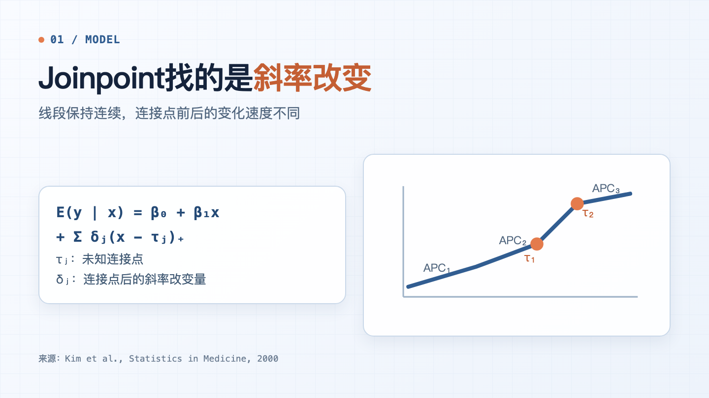
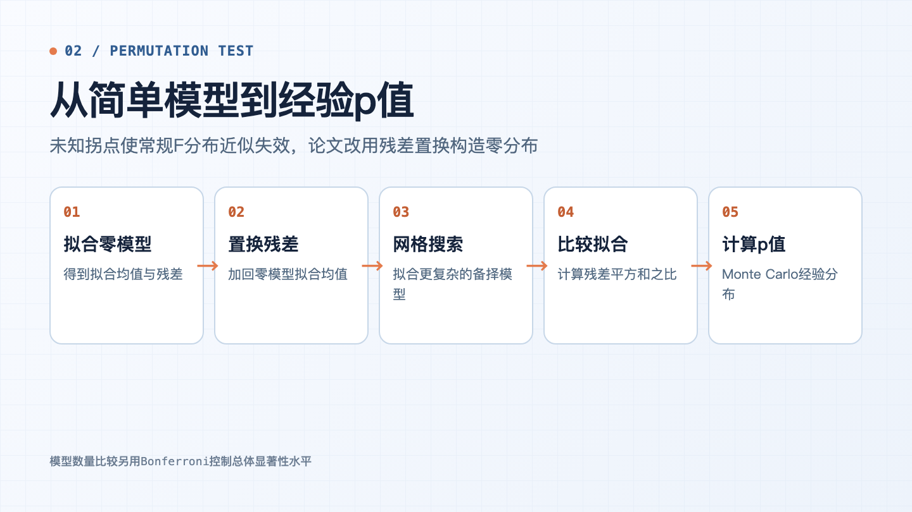
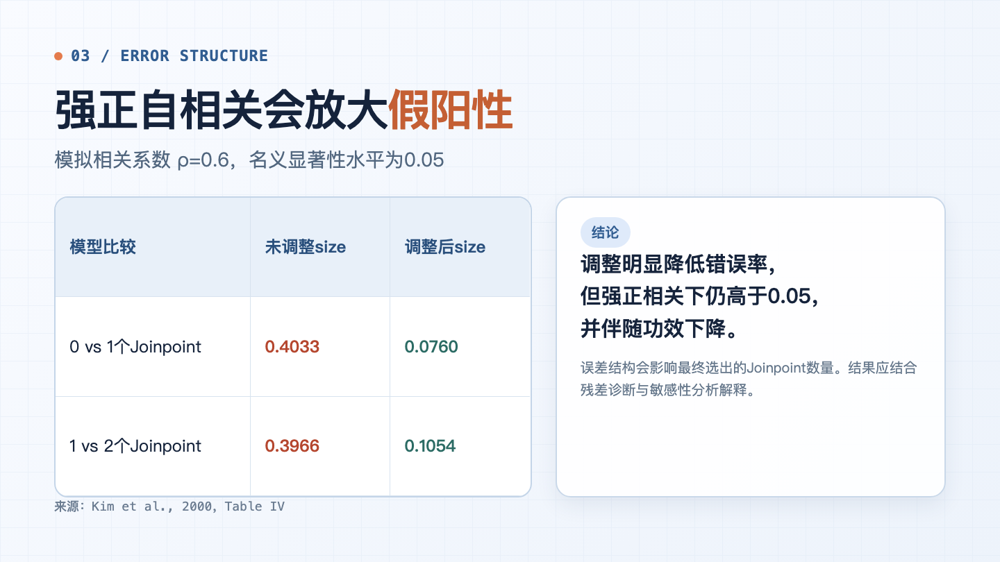

一条癌症发病率曲线先缓慢下降，几年后降幅变小。我们通常会问：趋势究竟在哪一年发生了变化？变化前后各自有多快？

Joinpoint回归就是为这类问题设计的。它把一条时间趋势分成若干连续线段，用“连接点”表示斜率改变的位置。问题在于，连接点的位置和数量都未知，不能把普通线性回归的检验方法原样搬过来。

2000年，Kim、Fay、Feuer和Midthune在《Statistics in Medicine》发表方法论文，系统说明了后来成为经典实现的一套方案：**网格搜索估计位置，Monte Carlo置换检验选择数量，再根据数据的方差和相关结构调整推断。**



## 先明确：Joinpoint找的是什么

这篇论文讨论的是**连续分段线性回归**。写成简化形式：

```text
E(y | x) = β₀ + β₁x + Σ δⱼ(x - τⱼ)₊
```

`τⱼ` 是未知的Joinpoint。`(x - τⱼ)₊` 在 `x≤τⱼ` 时为0，在 `x>τⱼ` 时等于 `x-τⱼ`。因此，曲线在连接点处保持连续，只改变斜率。

肿瘤登记趋势分析常对率取自然对数。此时，每一段的斜率可以换算为年度变化百分比，也就是常见的APC。Joinpoint回答的是：

- 是否存在斜率变化？
- 有几个变化点？
- 变化点位于哪里？
- 每个时间段的变化速度是多少？

它不直接回答“为什么变化”。编码调整、登记完整性、筛查、诊断技术、危险因素和真实疾病风险，都可能改变观察到的曲线。

## 为什么不能直接使用普通F检验

如果Joinpoint的位置事先确定，模型接近普通线性回归。但实际分析中，位置是从数据中搜索出来的。零假设下不存在拐点时，对应的拐点位置参数也没有通常意义，经典F分布近似不再自然成立。

论文采用残差置换构造经验零分布：

1. 拟合较简单的零假设模型；
2. 将零模型残差重新排列，再加回拟合均值；
3. 对每个置换数据集拟合更复杂的备择模型；
4. 比较两个模型的残差平方和；
5. 观察真实数据的统计量在置换分布中有多极端。

完整枚举通常需要 `n!` 种排列，所以程序随机抽取一定数量的排列，用Monte Carlo方法估计p值。



作者称它为“近似置换检验”。原因不只在于Monte Carlo抽样。拟合残差受到“和为零”等约束，有限样本中并不严格可交换；论文给出的理论依据是，在相应可识别条件下，残差随样本增加趋向可交换。

## 拐点数量怎样决定

程序先设定允许的最少和最多Joinpoint，再比较不同复杂度的模型。若一次模型选择需要完成多次检验，论文使用Bonferroni校正，把每次检验的显著性水平设为总体α除以检验次数。

这样做容易解释，也能控制总体错误率，但代价是偏保守。当候选模型较多或趋势变化较弱时，检验功效可能下降。

网格搜索也有类似的取舍。它实现直接，在Joinpoint较少时效率尚可；`k`个Joinpoint对应`k`维搜索，拐点增多后计算量迅速上升。2000年论文描述的程序最多拟合4个Joinpoint。

NCI后来继续发展模型选择方法。2023年发表的一项方法研究提出结合BIC与惩罚更强的BIC3，用partial R²确定两者权重，目的之一就是减少默认置换检验的计算成本。因此，理解这篇经典论文时，需要区分“方法基础”和“当前软件的全部选项”。

## 方差不齐，结果会怎样

癌症率不是方差恒定的普通连续变量。病例数较少时，率的波动通常更大；年龄标化率还涉及多个年龄组及其权重。

论文针对Poisson计数提出两步调整：

- 用估计方差的倒数进行加权最小二乘；
- 先按标准差缩放残差，再进行置换。

模拟使用27个年度点，每种报告设置重复10,000次。对于独立对数正态误差，零假设下的经验拒绝率为0.0467—0.0525，接近名义水平0.05。

Poisson模拟的差异更明显：

| 检验方式 | 经验Ⅰ类错误范围 |
|---|---:|
| 不校正异方差 | 0.0547—0.0643 |
| 加权并缩放残差 | 0.0446—0.0518 |

未经校正的检验更容易拒绝零假设。调整后，经验错误率更接近0.05，论文报告的成对情景中功效也有所改善。

原论文Table I(a)后来发布过勘误：部分情景中，APC组合 `(3, 2.4)` 与 `(3, 1.5)` 对应的平均Joinpoint估计和标准误需要互换。这里引用的零假设size范围，以及Poisson和自相关模拟结果，不受这项互换影响。使用原表中的拐点均值时，应同时查看官方勘误。

## 自相关比异方差更棘手

相邻年份的率可能相关。若正自相关存在，连续几年偏高或偏低的观测会聚集在一起，看起来更像一段新的趋势。

论文模拟了lag-1相关结构。在相关系数 `ρ=0.6` 时：

| 比较 | 未调整size | 调整后size |
|---|---:|---:|
| 0 vs 1个Joinpoint | 0.4033 | 0.0760 |
| 1 vs 2个Joinpoint | 0.3966 | 0.1054 |



调整大幅降低了错误率，但强正相关下仍高于0.05，同时功效下降。这组结果说明，自相关选项不是无关紧要的高级设置。误差模型选错后，最终Joinpoint数量可能改变。

较新的NCI方法允许复杂抽样的聚合估计纳入完整方差—协方差矩阵。这也提醒我们：如果数据来自重复抽样、共享调查单元或其他复杂设计，简单的独立误差或lag-1结构未必足够。

## 同一组发病率，为什么得到3个或2个拐点

论文分析了1973—1995年的SEER前列腺癌年龄标化发病率，以及1969—1995年的美国前列腺癌死亡率。实例使用0.1年网格、1,000次Monte Carlo置换和3次Bonferroni校正检验，总体α为0.05。

发病率分析出现了关键差异：

| 误差模型 | 最终Joinpoint |
|---|---|
| 异方差、无自相关 | 1985.4、1989.0、1992.0 |
| 异方差、有自相关 | 1988.4、1992.0 |

无自相关模型多识别出一个较轻微的早期变化。死亡率分析则较稳定，两种误差模型都选择1986.8和1991.4两个Joinpoint，不过具体检验路径和p值并不相同。

论文把这些变化放在PSA检测普及的历史背景下讨论，同时提出了其他解释：活检技术变化、TURP使用变化、过度诊断，以及死因归因偏差。时间上的吻合可以帮助提出解释，不能单独建立因果关系。

1,000次置换还带来一个数值解释问题。把真实统计量计入置换分布时，`p=0.001`已经接近这次计算能够表达的最小分辨率。它表示结果位于经验分布极端位置，不等于尾概率已经被精确估计到更多小数位。

## 实际分析前，至少核对这七项

在肿瘤登记数据中使用Joinpoint，建议把以下内容写进分析方案和结果报告：

1. 输入的是病例数、粗率、年龄标化率还是其他指标；
2. 是否取对数，以及APC/AAPC的定义；
3. 最少和最多允许多少个Joinpoint；
4. 每个线段和序列两端至少保留多少数据点；
5. 标准误、Poisson方差或其他权重从哪里得到；
6. 是否检查残差自相关，并进行误差模型敏感性分析；
7. 模型选择方法、置换次数、总体α和置信区间方法。

如果某一年发生编码规则或分类体系变化，还要判断曲线中是否存在不连续跳跃。标准Joinpoint模型要求线段连续，不能自动把编码造成的水平突变与真实斜率变化分开。

## 结果可以说明什么，不能说明什么

Joinpoint结果能说明的是：在设定的模型和误差结构下，某个时期前后的平均变化率不同。估计出的Joinpoint是斜率变化位置，不是现实中某项政策、筛查或诊疗措施发生作用的准确日期。因此，看到拐点与某个事件在时间上接近，只能据此提出解释，不能认定二者有因果关系。

2000年论文采用连续的分段线性模型。时间点太少、年度计数稀疏、残差相关较强或存在复杂的过度离散时，拐点的数量和位置可能随模型设定而改变。如果编码规则调整造成的是一次水平跳跃，这种变化也不符合标准Joinpoint模型的连续性假设。

报告结果时，可以写“模型在某年附近识别到趋势斜率变化”，并同时给出各段APC、置信区间、误差结构和敏感性分析。变化原因仍需结合登记口径、数据质量及同期筛查和诊疗资料判断。

## 参考资料

1. Kim HJ, Fay MP, Feuer EJ, Midthune DN. Permutation tests for joinpoint regression with applications to cancer rates. *Statistics in Medicine*. 2000;19(3):335-351. https://pubmed.ncbi.nlm.nih.gov/10649300/
2. National Cancer Institute. Joinpoint Trend Analysis Software. https://surveillance.cancer.gov/joinpoint/
3. National Cancer Institute. Corrected Table 1 of Kim et al. https://surveillance.cancer.gov/documents/joinpoint/table1.pdf
4. Kim HJ, Chen HS, Midthune D, et al. Data-driven choice of a model selection method in joinpoint regression. *Journal of Applied Statistics*. 2023;50(9):1992-2013. https://pubmed.ncbi.nlm.nih.gov/37378270/
5. National Cancer Institute. Joinpoint Methods for Complex Survey Data. https://surveillance.cancer.gov/joinpoint/survey.html
