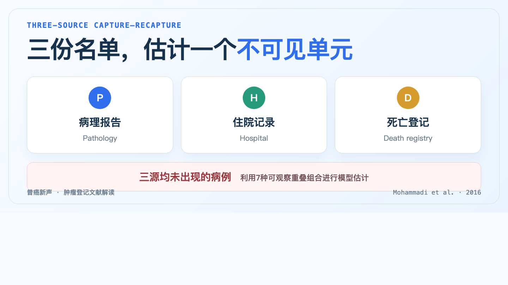
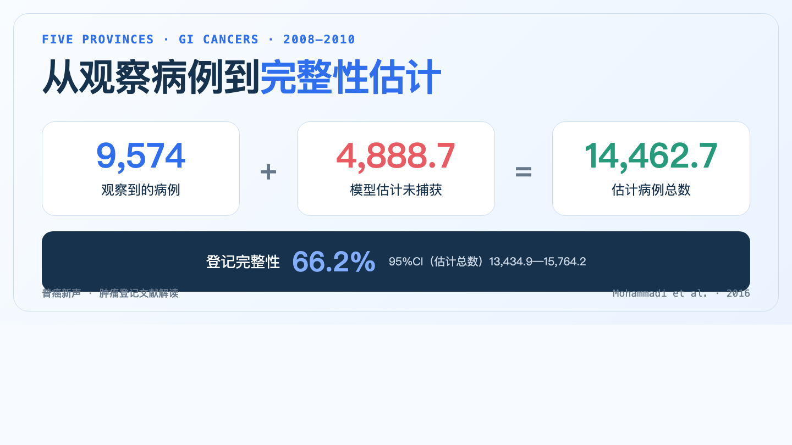
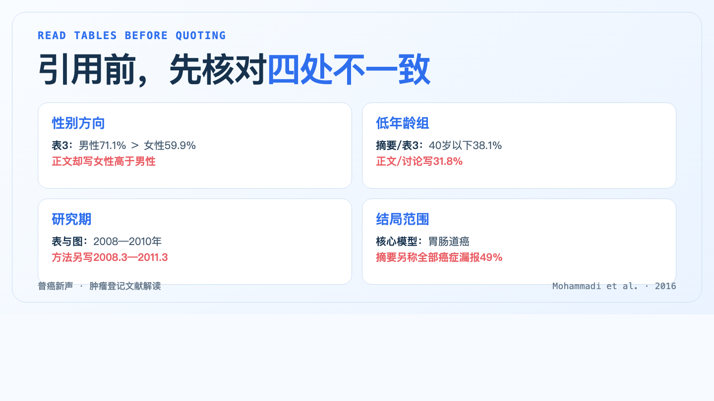

## 登记库看不见“从未被登记”的病例

肿瘤登记完整性，是目标人群中符合登记条件的新发病例被纳入登记系统的比例。已进入数据库的病例可以计数，真正困难的是估计那些没有出现在任何资料源中的病例。

2016年，Mohammadi等发表了一项伊朗5省研究。研究使用三个来源：国家病理数据库、国家医院出院数据库和国家死亡登记数据库。三个来源最初共有53,398条全癌种记录，连接并去重后得到35,643例，其中9,574例胃肠道癌进入主要分析。

如果只把三个来源合并去重，分析到这里就会停止。捕获-再捕获法继续追问：根据三个来源之间的重叠，能否估计一个病例都没有出现的那部分？

## 三个来源的重叠，怎样推算“零来源”病例

把病理、住院和死亡登记分别记为三份名单，一名患者可能只出现在一个来源，也可能同时出现在两个或三个来源。三份名单一共形成8种组合，其中7种可以观察，最后一种是“病理没有、住院没有、死亡登记也没有”。这正是需要估计的不可见单元。

最简单的模型假定三个来源彼此独立，实际登记流程通常不满足这一点。做过病理诊断的人更可能住院；住院患者的信息也可能进入死亡登记。来源之间的依赖如果处理不当，会改变未捕获病例数。

研究者因此拟合了8个对数线性模型，用不同的两两交互项表示来源依赖，再用G²、AIC和BIC选择模型。最终模型包含全部两两交互项；无法由现有数据识别的三阶交互项被设为0。

## 9,574例被观察到，模型估计为14,462.7例

选定模型估计，2008—2010年5省共有14,462.7例胃肠道癌，95%置信区间为13,434.9—15,764.2例。与观察到的9,574例相比，约4,888.7例没有被任何一个来源捕获。

由此得到的三年合计登记完整性为66.2%。换一种说法，在该研究的数据和模型设定下，三个来源合并后仍可能漏掉约三分之一的胃肠道癌病例。

表3还报告，男性完整性为71.1%，女性为59.9%；40岁以下、40—59岁、60岁及以上分别为38.1%、55.4%和76.6%。论文另称胃癌完整性为85.3%、结直肠癌为78.7%，肝癌漏报比例为43%。这些分层数字并不具有同样的可靠性，原因在后面。

## 66.2%不是脱离模型的“真实答案”

8个候选模型给出的胃肠道癌总数从11,533.1例到18,801.5例，相差超过7,000例。模型对来源依赖的描述不同，估计出的不可见单元也随之改变。

最终模型的拟合指标最低，只能说明它在候选模型中更贴合已观察到的7个单元。它不能验证被设为0的三阶交互，也不能证明14,462.7就是唯一正确的病例总数。论文报告的95%置信区间反映了选定模型内部的统计不确定性，没有包含模型选择带来的全部不确定性。

记录链接同样关键。论文列出了姓名、父名、出生日期、ICD编码和地址，并称使用Excel识别重复记录，但没有报告匹配规则、缺失字段处理、人工复核或链接准确性。把同一人误当成两人，或把两个人误并为一人，都会改变来源重叠，继而改变完整性估计。

## 引用这篇论文前，还要处理几处内部矛盾

全文核对发现，表格、摘要和正文并不完全一致。

- 表3显示男性完整性71.1%、女性59.9%，结果正文却写成女性高于男性；摘要中的男性值又写为71.2%。
- 40岁以下完整性在摘要和表3为38.1%，结果与讨论正文写成31.8%。
- 表2、表3和图2标注2008—2010年，方法与部分结果却使用“2008年3月至2011年3月”或“从2008年3月到2011年3月”的说法。
- 摘要和讨论写“全部癌症漏报49%”，核心模型表的标题和估计对象则是胃肠道癌。

这些问题不等于整项研究失去价值，但会降低精确分层结论的可信度。引用时应优先回到表格，同时明确报告冲突；年度变化和“全部癌症漏报49%”不宜作为稳固结论。

## 对肿瘤登记实践，哪些步骤可以迁移

IARC把完整性与可比性、有效性、及时性并列为肿瘤登记数据质量的四个维度。捕获-再捕获属于完整性的定量评价方法之一，不能替代其他质量指标。

若在登记实践中采用这套方法，至少需要完成以下核查：

1. **定义目标人群和病例口径。** 写清登记地区、诊断期、癌种编码、多个原发规则及纳入排除条件。
2. **说明每个来源怎样发现病例。** 病理、住院、门诊、医保和死亡资料的覆盖不同，来源之间还可能存在转诊关系。
3. **验证记录链接。** 报告确定性或概率匹配规则、缺失字段处理、阈值、人工复核和抽样准确性。
4. **列出来源重叠。** 公开各捕获组合的病例数，让模型输入可以复核。
5. **比较不同依赖模型。** 报告候选模型、选择依据、估计范围和敏感性，不只给出一个最终百分比。
6. **与其他质量指标并列解释。** MV%、DCO%、M/I、历史趋势和独立病例查找回答的是不同问题。

2025年一项纳入83项成人群体肿瘤登记研究的系统综述也显示，完整性评价没有一种方法适合所有登记处。独立病例查找最常见，捕获-再捕获用于其中15项；具体选择取决于可用资料源和数据质量。

## 这篇研究能说明什么，不能说明什么

研究支持的结论是：在当时伊朗5省、三个特定资料源和所选对数线性模型下，胃肠道癌登记完整性估计为66.2%，而且不同亚组可能存在差异。

它不能证明伊朗全国的登记完整性就是66.2%，也不能把这个比例直接套到中国登记处。身份标识质量、死亡登记覆盖、就医和转诊路径、癌种构成以及来源依赖结构不同，都会改变估计。

这篇论文更适合被当作一份方法案例：它说明了如何从多来源重叠走向漏报估计，也提供了一份反向检查清单——看到一个完整性百分比时，应继续问病例怎样连接、模型怎样选、假设能否检验、不同模型会把结果推到哪里。

## 参考资料

1. Mohammadi G, Akbari ME, Mehrabi Y, et al. Estimating Completeness of Cancer Registration in Iran with Capture-Recapture Methods. *Asian Pac J Cancer Prev*. 2016;17(S3):93-99. DOI: 10.7314/APJCP.2016.17.S3.93. PMID: 27165215. https://pubmed.ncbi.nlm.nih.gov/27165215/
2. International Agency for Research on Cancer. Quality control at the population-based cancer registry. In: *Planning and Developing Population-Based Cancer Registration in Low- and Middle-Income Settings*. https://publications.iarc.fr/_publications/media/download/3827/77466e390723d27d694a765d89ff095173fca104.pdf
3. Completeness Evaluation of Adult-Population-Based Cancer Registries: A Systematic Review. *Cancers*. 2025;17(7):1123. https://pmc.ncbi.nlm.nih.gov/articles/PMC11988001/

> 本文解读的是群体层面的肿瘤登记方法，不用于判断个体患癌风险或提供个体诊疗建议，也不构成针对具体登记系统的正式质量认证。
