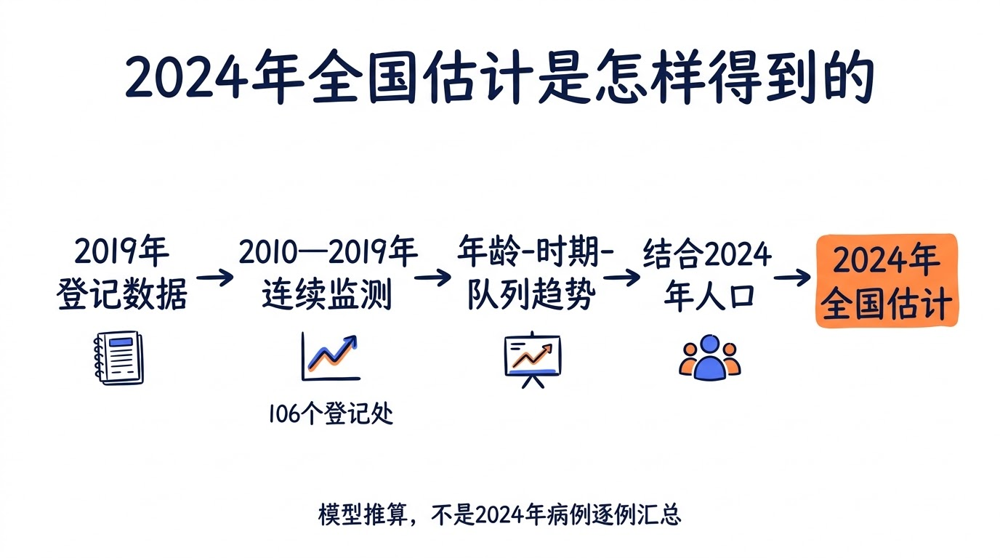
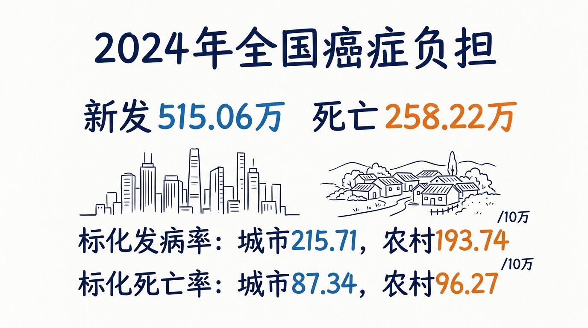
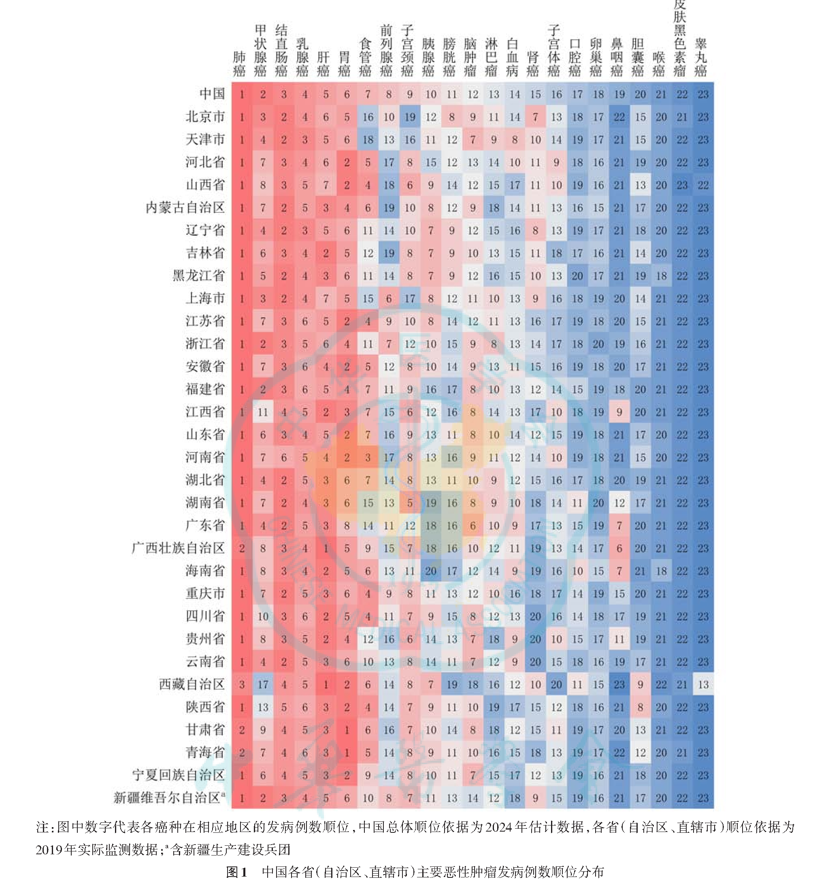
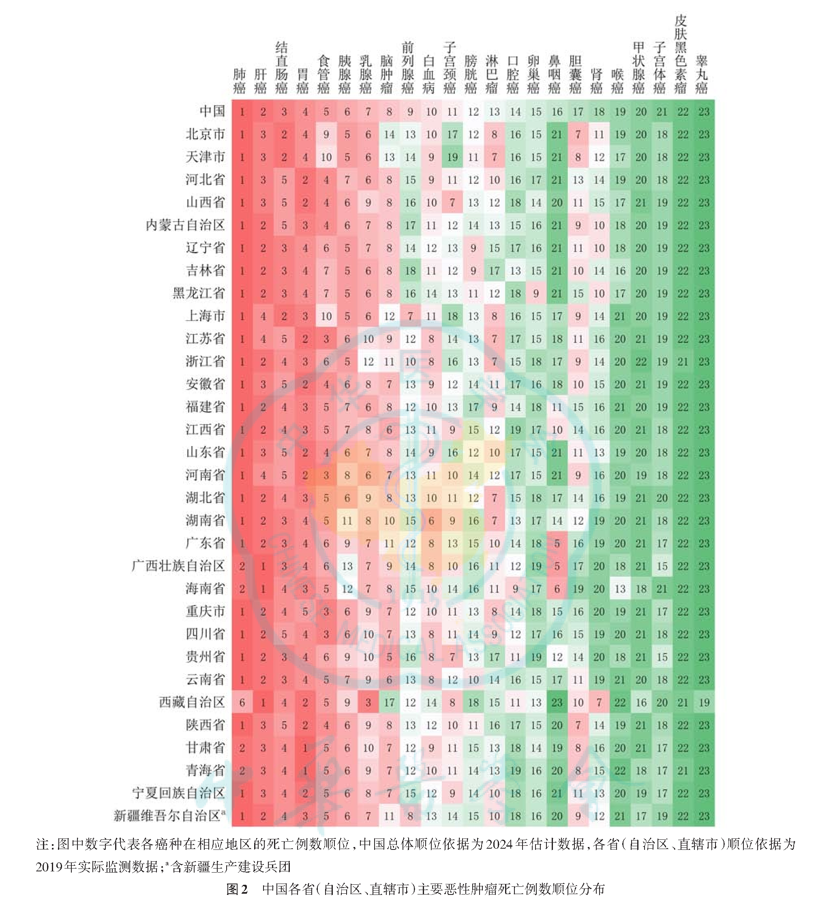
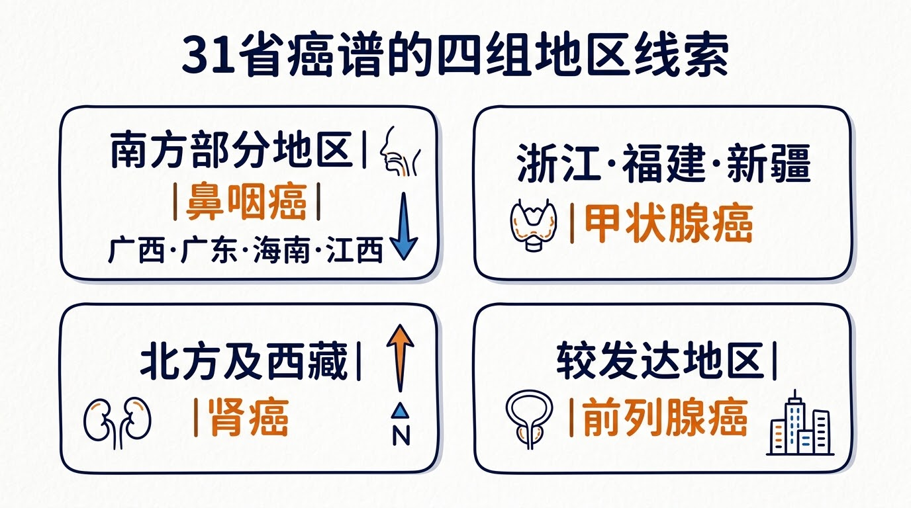

## 2024年中国癌症负担：新发515.06万，死亡258.22万

国家癌症中心研究估计，2024年中国恶性肿瘤新发515.06万例，死亡258.22万例。肺癌的发病和死亡均居首位，新发117.59万例、死亡74.33万例，分别占全部新发和死亡的22.8%与28.8%。

这些数字来自模型推算，并非2024年全国病例的逐例汇总。研究团队以919个登记处的2019年数据为基础，从其中106个连续监测登记处的2010—2019年资料拟合年龄—时期—队列趋势，再结合2024年人口数据作出估计。

## 城乡差异：城市标化发病率较高，农村标化死亡率较高

按2024年全国估计，城市世界人口标化发病率为215.71/10万，高于农村的193.74/10万；农村世界人口标化死亡率为96.27/10万，高于城市的87.34/10万。

农村粗发病率高于城市，年龄标化后却低于城市。这一反转说明年龄结构会明显影响粗率；比较城乡发病水平，先看年龄标化率更稳妥。

城乡癌谱也有差别。无论男女，农村的肝癌、胃癌和食管癌标化发病率、死亡率均高于城市；城市的结直肠癌高于农村。子宫颈癌负担更多见于农村，乳腺癌和前列腺癌则更多见于城市。

## 中国31省癌症负担图谱

省级部分采用919个登记处报告的2019年实际监测数据。图中的数字是各癌种在省内按发病或死亡例数排出的顺位，回答的是“本省哪些癌种病例更多”。所谓“31省癌症排名”，准确说是各省主要癌种的例数顺位，不是各省2024年年龄标化率，也不能据此排出省际癌症风险高低。

下面依次放出论文图1和图2原图。图表信息较密，点击图片可查看细节。

*图片来源：孙可欣、李荔、王少明等，《2024年中国分地区恶性肿瘤流行情况分析》，《中华肿瘤杂志》2026年第48卷第3期。*

这些登记处覆盖2019年人口6.28亿，占全国人口44.89%。各省纳入的登记处数量和分布并不均衡。论文特别提到，西藏、新疆等西部地区纳入的登记处相对较少，解读省级结果时还应考虑代表性。

## 多数省份肺癌居首，5个地区顺位不同

31个省级地区中，肺癌在27个地区的发病例数居首，在26个地区的死亡例数居首。多数地区的首要癌症负担集中在肺癌。

发病例数顺位中，肺癌在广西、甘肃、青海排第2，在西藏排第3；死亡例数顺位中，肺癌在广西、海南、甘肃、青海排第2，在西藏排第6。

肺癌当然是各地工作重点，但全国总顺位代替不了地方癌谱。广西、海南、甘肃、青海和西藏若只看全国排序，其他高顺位癌种的资源需求就容易被忽略。

## 省级差异主要落在几组癌谱上

论文呈现的地区差异，主要集中在下面几组癌谱。

### 南方部分地区：鼻咽癌顺位较高

鼻咽癌在广西、广东、海南、江西等地的发病顺位较高；广西、广东、海南的死亡顺位也相对靠前。这与既往对鼻咽癌地理分布的认识相符。

### 浙江、福建、新疆：甲状腺癌排到发病第2位

甲状腺癌在浙江、福建和新疆的发病例数顺位仅次于肺癌。城市地区甲状腺超声检查更容易获得，机会性筛查可能带来更多检出。省级顺位还会受人口结构、诊断能力和登记覆盖影响，较高顺位不等于居民真实患病风险以同样幅度上升。

### 北方及西藏：肾癌相对靠前

肾癌在北方地区的发病顺位相对较高，在北方和西藏的死亡顺位也较靠前。这里说的仍是省内癌种排序，不能推出这些地区的肾癌年龄标化率一定高于其他所有省份。

### 经济较发达地区：癌谱更偏向前列腺癌等癌种

前列腺癌在经济较发达地区的发病顺位相对靠前；北京、天津、上海和广东的食管癌、子宫颈癌发病顺位明显靠后。医疗服务可及性、机会性检查、人口年龄结构和危险因素分布都可能影响这些差异。

## 对肿瘤防控实践，顺位图应该怎样用

省内例数顺位最适合回答一个实务问题：**当地先关注哪些癌种？**登记质量复核、专病监测、健康教育和医疗资源讨论，都可以把它当作一项基础信息。

**例数与顺位**可以回答绝对服务需求和省内优先级；**年龄标化率**则看排除了人口结构差异影响后的癌症风险地区比较。肺癌是大多数省份的首要癌症负担。南方部分地区的鼻咽癌、浙江福建新疆的甲状腺癌、北方的肾癌等顺位差异，也能为当地监测和资源讨论提供线索。

## 参考资料

1. 孙可欣，李荔，王少明，等. 2024年中国分地区恶性肿瘤流行情况分析. 中华肿瘤杂志，2026，48(3): 400-412. DOI: 10.3760/cma.j.cn112152-20260205-00079.
2. PubMed. Cancer incidence and mortality across diverse geographical regions in China, 2024. PMID: 41876198. https://pubmed.ncbi.nlm.nih.gov/41876198/

