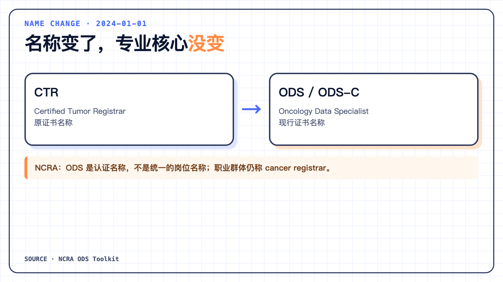
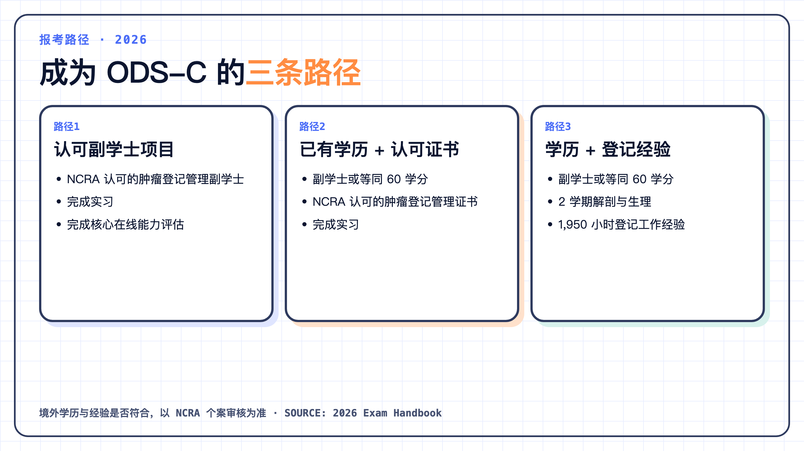
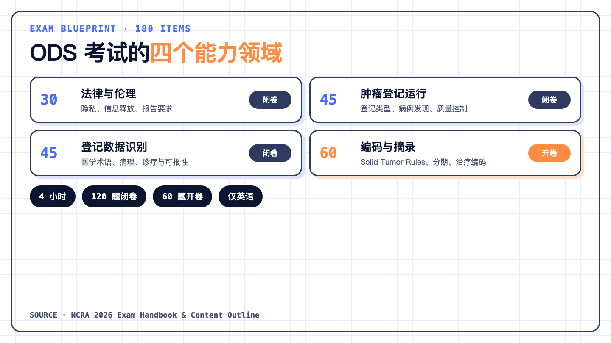

## 肿瘤数据专员（ODS）做什么？肿瘤登记工作内容

美国CDC对肿瘤登记流程的说明很具体：登记人员从病历中找到肿瘤及治疗信息，按专门规则编码，检查重要信息是否缺失，再将数据报送到中央登记系统。

放到实际工作中，核心任务通常包括：

- 病例发现（casefinding）与可报病例判定；
- 阅读病案、病理、影像、手术、放疗和药物治疗记录；
- 抽取原发部位、组织学、分期、治疗和随访信息；
- 按ICD-O、Solid Tumor Rules、Summary Stage、AJCC TNM和当年数据标准编码；
- 运行编辑规则、复核数据质量，处理重复、缺失和逻辑矛盾；
- 按机构和法规要求报送数据，并保护患者隐私。

所以，ODS的工作不只是把病历内容录入系统。登记人员要综合病理、影像、手术和治疗等记录，判断病例的肿瘤类型、原发部位、分期和治疗情况，再按照统一规则整理成标准化数据。这要求具备基本的肿瘤学、解剖生理和医学记录阅读能力。

## ODS相关岗位的薪资情况

ODS对应的是美国肿瘤登记岗位，以下数字不能直接换算为中国单位的工资。NCRA 2022年调查显示，受访全职年薪人员平均年薪为82,683美元，按小时计薪人员平均时薪为30.61美元；这不是2026年的实时招聘报价。

薪资会随经验和岗位层级变化：1—5年经验的全职年薪平均为62,106美元，20年以上为99,195美元；登记员或摘录员平均为60,644美元，管理岗位平均为75,627—98,230美元。

持有ODS更名前CTR证书者的平均时薪高于无证书者，但两组人的平均从业年限不同，因此不能据此断定考取ODS一定会带来固定幅度的加薪。实际收入还取决于学历、地区、雇主和工作形式。

## ODS-C是什么？它与CTR有什么区别

Oncology Data Specialist可直译为“肿瘤数据专员”。在NCRA的官方语境中，**ODS是认证名称，不是统一的岗位名称**。NCRA仍然使用 *cancer registrar* 描述肿瘤登记从业者。

获证者可以在姓名后使用ODS、ODS-C或ODS-Certified，三种写法在NCRA规则中同义。旧资料和招聘信息中出现的CTR，通常指向现在的ODS认证。

这个区分很重要。一个人可能从事肿瘤登记工作，但尚未获得ODS认证；某家医院的岗位名称也可能是Cancer Registrar、Tumor Registrar或其他名称。判断岗位时，应同时看工作职责与证书要求，不能只看职位名。

## 报考ODS-C需要什么条件？三个可选路径

以NCRA的2026年《ODS考试手册》为准，报考资格共有三条路径。

### 路径1：NCRA认可的副学士项目

完成NCRA认可的肿瘤登记管理副学士项目，并完成项目要求的实习。实习包括实际登记活动和NCRA核心在线能力评估。

### 路径2：已有大专层次学历，再读认可证书项目

需要副学士学位或等同的60个大学学分，再完成NCRA认可的肿瘤登记管理证书项目和实习。这条路径适合已有其他专业高等教育背景，但缺少系统肿瘤登记课程与实习的人。

### 路径3：学历加肿瘤登记工作经验

需要副学士学位或等同60个大学学分，包括或另外完成两学期人体解剖与生理学，成绩达到C或以上；同时具备1,950小时肿瘤登记领域工作经验，相当于一年全职工作量。工作经验需由了解情况的上级或人力资源人员核验。

中国申请人最容易卡住的不是“有没有本科或研究生学历”，而是课程、学分和工作内容能否被NCRA按该路径认定。手册接受境外申请和境外考试安排，并不意味着中国学历或登记经验会自动等同认定。

在报课、准备成绩单公证或缴纳考试费前，更稳妥的做法是向NCRA提交 **Eligibility Determination Form**。让认证机构明确你缺的是学分、解剖生理课程、实习还是可核验工作时数。

## 2026年ODS-C考试内容与题型

现行考试共180道选择题，总考试时4小时。

| 考试领域 | 题数 | 形式 |
|---|---:|---|
| 肿瘤登记专业的法律与伦理 | 30 | 闭卷 |
| 肿瘤登记运行 | 45 | 闭卷 |
| 肿瘤登记数据识别 | 45 | 闭卷 |
| 肿瘤登记编码与摘录 | 60 | 开卷 |

前120题闭卷2小时，中间强制休息15分钟；后60题开卷2小时。开卷不等于可以携带自己的书籍或笔记：可用文件会以可搜索PDF的形式嵌入考试平台。考试仅提供英语。

考试大纲的细项显示，ODS的能力要求横跨隐私与报告法规、登记类型、病例发现、质量控制、医学术语、解剖生理、病理与诊疗、统计基础、分期和编码规则。只背一本编码手册，不足以覆盖整个考试框架。

## ODS-C备考：先确认报考资格，再补知识

准备ODS的顺序不宜从买教材和刷题开始。

1. **明确目的。** 查看你所在机构或目标岗位是否认可或要求ODS。ODS是美国肿瘤登记认证，对中国单位的职称、招聘或薪酬并没有自动效力。
2. **建立资格清单。** 整理学位和成绩单、解剖生理课程、肿瘤登记工作起止时间、工作内容与可核验证明人。若存在疑问，先申请资格预审。
3. **用四个考试领域做差距分析。** 将现有能力分为法律与伦理、登记运行、数据识别、编码与摘录。中国登记人员对ICD-O可能很熟悉，却未必了解CoC、NAACCR、NPCR和SEER的分工与标准。
4. **训练“从病历到数据”的全过程。** 练习可报性判定、病例发现、多份病历摘录、原发部位与组织学、多原发规则、分期、治疗编码、随访和质量复核。
5. **按当年参考资料训练搜索。** 2026年清单涉及STORE、AJCC分期、Grade Manual、Solid Tumor Rules和Summary Stage等。备考时要练习在有限时间内找到对应规则，不只是收藏PDF。
6. **再安排申请与考试。** 所有资格条件必须在对应考试窗口的申请截止日前完成。手册要求申请人提交证明文件、正式申请并缴费，审批后再预约考位。

## 2026年ODS-C考试时间、费用与证书维持

以2026年8月31日的NCRA官方信息为准，本年尚未开始的考试窗口为10月23日至11月14日，申请截止日为10月7日。考试费为NCRA会员335美元、非会员435美元。境外申请人选择线上远程考试不收取额外国际考试费；在美国以外的考试中心参加线下考试，官方列出150美元附加费。

通过考试并不是资格管理的终点。NCRA 2026年手册要求：每两年提交20个继续教育学分，每四年提交8个 Continuing Education In-Person（CEIP）学分，并每年缴纳认证维持费。肿瘤登记标准会持续更新，证书也通过继续教育来要求持证人跟上变化。

## 中国肿瘤登记人员适合报考ODS-C吗？

ODS可以证明持证人通过了NCRA设定的入门级肿瘤登记能力考核。它对使用美国CoC、NAACCR、NPCR或SEER标准的岗位尤其相关，也可作为系统学习美国肿瘤登记体系的目标。

它不是中国的法定职业资格，不代替中国肿瘤登记制度、数据标准和个人信息保护要求；也不等于美国工作许可、医疗执业资格或通用数据科学能力证明。是否值得考，应回到你的目标岗位、学习成本和现有资格差距。

对已有肿瘤登记经验的人，第一步往往不是备考，而是确认自己能否走路径3。对没有登记经验的人，则需先评估路径1或路径2所需的认可教育和实习。路径一旦选对，后面的课程、经验累积和考试准备才有清楚顺序。

## 参考资料

1. National Cancer Registrars Association. ODS Toolkit: Human Resources
   https://www.ncra-usa.org/ODSToolkit/Human-Resources
2. National Cancer Registrars Association. 2026 ODS Exam Handbook & Candidate Application
   https://www.ncra-usa.org/handbook
3. National Cancer Registrars Association. ODS Exam Eligibility Routes
   https://www.ncra-usa.org/eligibilitychart
4. National Cancer Registrars Association. ODS Certification Exam Content Outline
   https://www.ncra-usa.org/blueprint
5. National Cancer Registrars Association. References for ODS Certification Examinations in 2026
   https://www.ncra-usa.org/examrefs
6. U.S. Centers for Disease Control and Prevention. How Cancer Registries Work
   https://www.cdc.gov/national-program-cancer-registries/about/how-cancer-registries-work.html
7. National Cancer Registrars Association. Salary Considerations
   https://www.ncra-usa.org/Advocacy/Workforce/Salary-Considerations
8. National Cancer Registrars Association. Salary Considerations for Cancer Registrars: 2022
   https://www.ncra-usa.org/Portals/68/Final%20NCRA%20Salary%20Considerations_2022.pdf
> 本文根据2026年9月5日可访问的NCRA与CDC资料整理。薪资数据来自NCRA 2022年调查，不代表2026年具体职位报价；考试资格、日期、费用、参考资料和继教要求可能调整，实际申请应以当年手册和NCRA个案审核为准。
