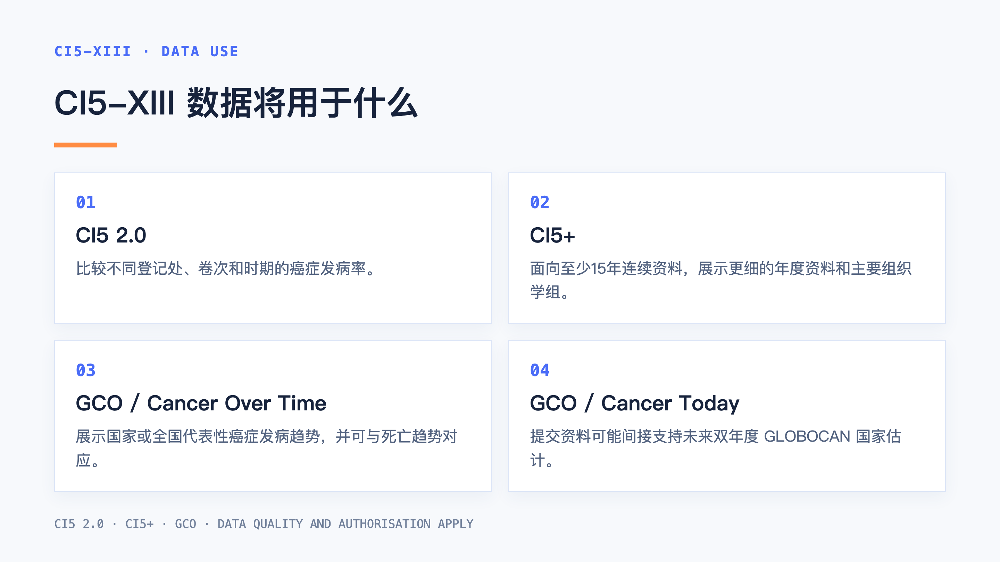
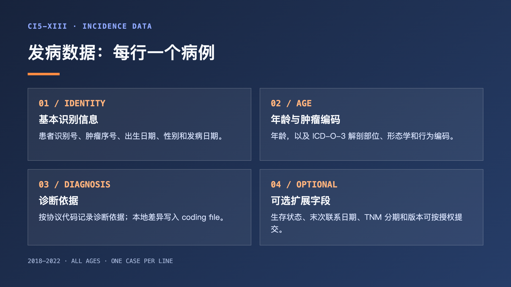
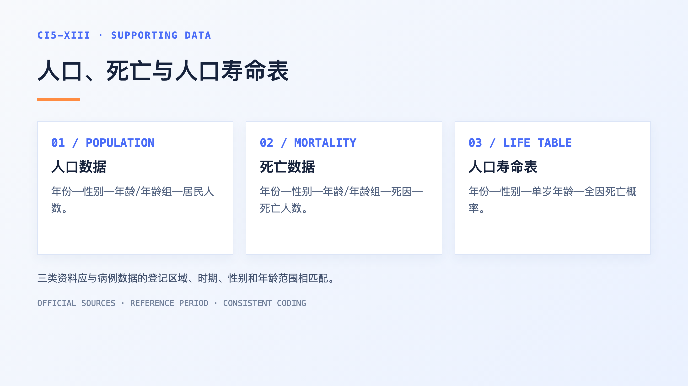
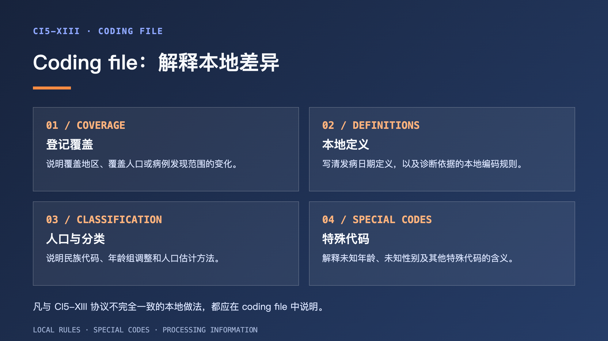
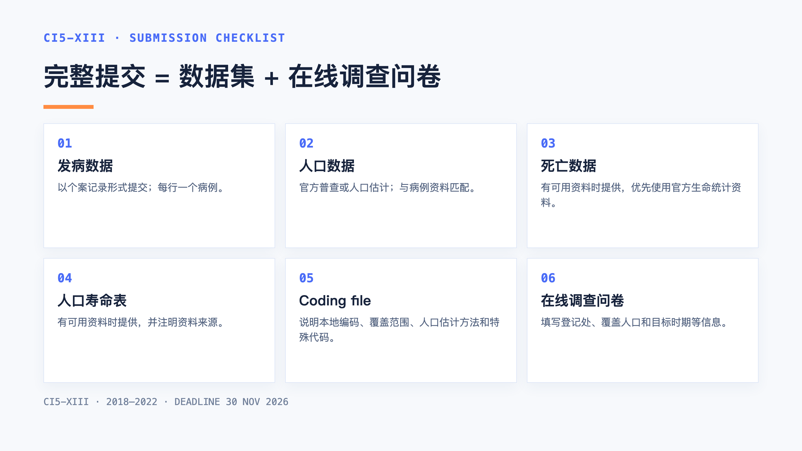
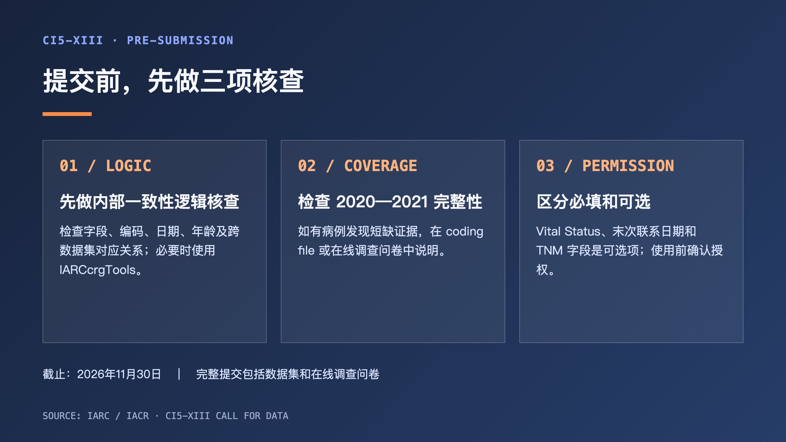

CI5 的核心任务，是汇集来自世界各地人群肿瘤登记处的高质量发病资料，并在尽可能一致的标准下呈现不同地区和登记时期的癌症发病情况。它既是肿瘤登记资料的国际交流平台，也是癌症流行病学研究和全球癌症监测的重要数据来源。

CI5-XIII 是第十三卷，正式评估的目标时期为 2018—2022 年，计划以在线版本和精简 PDF 形式发布。相关资料也将用于 IACR 网站的 CI5 2.0 等可视化工具。

IARC 与 IACR 于 2026 年 9 月 1 日发布 CI5-XIII 数据上报倡议书（call for data），倡议全球符合条件的人群肿瘤登记处提交 2018—2022 年肿瘤登记数据。倡议书对上报内容及具体上报流程进行了详细说明和指导。

## CI5-XIII 数据将用于什么

提交并通过评估的登记资料，还可能进入 IARC、IACR 和 Global Cancer Observatory（GCO）的数据展示与分析体系。不同工具的用途如下：

| 工具 | 主要用途 |
| --- | --- |
| CI5 2.0 | 基于 CI5 各卷登记发病资料，比较不同登记处、卷次和时期的发病率。CI5-XIII 将补充 2018—2022 年数据。 |
| CI5+ | 面向拥有至少15年连续资料的登记处，展示更细的年度资料、主要组织学组及180多个诊断单元；登记处可以选择不提供。 |
| GCO：Cancer Over Time | 展示国家或全国代表性的癌症发病趋势，并可与生命统计死亡趋势对应；通常要求至少15年连续资料。 |
| GCO：Cancer Today | 提供国家层面的癌症负担估计。CI5-XIII 资料可能间接用于未来双年度 GLOBOCAN 国家估计。 |

提交 CI5-XIII 数据有三层意义：

1. **接受正式评估。** 所有提交给 CI5-XIII 的数据集，都将由指定的内部编辑委员会认真评估其可比性、完整性和准确性。委员会成员包括 Freddie Bray、Aude Bardot、Murielle Colombet、Les Mery、Adalberto M. Filho、Isabelle Soerjomataram 和 Ariana Znaor。此外，CI5-XIII 还将邀请来自国际癌症登记协会（IACR）和全球肿瘤登记发展倡议（GICR）的区域专家担任编辑，为数据评估带来必要的区域视角。
2. **补充国际可视化数据。** 资料可用于 IACR/IARC 网站上的跨地区、跨时期发病率比较，以及登记处时间序列展示。
3. **支持全球癌症监测和估计。** 高质量人群资料可用于 GCO 的癌症趋势展示，并可能间接支持未来的 GLOBOCAN 国家估计。

能否收录、展示哪些变量及用于何种分析，取决于数据质量、完整性和登记处授权。

## 计划向 CI5-XIII 提交数据，请重点关注以下信息

| 项目 | 官方要求 |
| --- | --- |
| 数据提交截止 | 2026年11月30日 |
| 正式评估目标时期 | 2018—2022年 |
| 可被考虑的最低数据量 | 目标时期内连续3年 |
| 完整提交 | 数据集 + 在线调查问卷 |

连续 3 年只是最低考虑条件，不代表提交后一定收录。资料还要经过 CI5-XIII 编辑委员会评估，重点看可比性、完整性和准确性。官方建议尽早提交，以便留出沟通和补充时间。

倡议书特别提示：

1. **截止日期。** 本次数据提交的截止日期为 2026 年 11 月 30 日。官方鼓励尽早提交，不要把账号、资料核对和补充说明留到截止日前集中处理。
2. **新的登记处上报网站入口。** 该网站入口使用 REDCap。登记处将收到自动邮件，其中包含用户名和设置密码的链接。首次进入后，请在 “Registry contacts” 部分提供或更新登记处的联系人信息。完整网址为：

   https://csu.datacollect.iarc.who.int/redcap/

3. **2020—2021 年的病例发现变化。** COVID-19 期间如出现明确的病例短缺，CI5-XIII 审查时会用星号标记。
4. **生存和分期变量属于可选项。** Vital Status、Date of Last Contact、TNM Stage 和 TNM Edition 在发病数据提交中均为可选变量。若用于 IARC 特定研究，需事先取得登记处许可。
5. **个案记录数据与数据保护。** 如果因国家数据保护法规难以上报所要求的个案记录数据，应尽早联系编辑部讨论。
6. **咨询方式。** 关于提交材料或其他信息的问题，请联系 CI5 编辑部：`ci5@iarc.who.int`。

## 需要准备哪些资料

### 准备数据按照下面的清单逐项核对

☐ **发病数据**：以病例个案记录形式提交，每行一个病例；

☐ **人口数据**：来自官方人口普查或年间/年后人口估计，并与病例资料匹配；

☐ **死亡数据**：有可用资料时提供，优先使用官方生命统计资料；

☐ **人口寿命表数据**：有可用资料时提供，并注明资料来源；

☐ **Coding file**：本地编码规则、登记覆盖范围或人口估计方法与 CI5-XIII 数据上报要求不同，或存在特殊代码时提供；

☐ **在线调查问卷**：填写登记处、覆盖人口和目标时期等信息。完整提交必须同时包含数据集和问卷。

### 1. 发病数据：按病例逐条列出

发病数据应以个案记录的形式提交，每行一个病例。2018—2022 年间、所有年龄组的原发肿瘤都应纳入；如果登记处收集，还包括：

• 皮肤基底细胞癌和鳞状细胞癌；

• 中枢神经系统和膀胱的非恶性肿瘤。

CI5-XIII 数据上报要求中变量名前带 `*` 的为必填变量。

### 1.1 发病数据集变量

| 变量 | 是否必填 | 格式或编码 | 未知/缺失 | 中文解释 |
| --- | --- | --- | --- | --- |
| Ethnic group（民族/族群） | 否 | 登记处自定义 | 99 | 如登记资料允许按民族/族群分析，应在病例数据和人口数据中使用相同的亚群编码；有死亡数据时也应尽可能保持一致。 |
| *Patient ID（患者识别号） | 是 | 登记处内部唯一编号或字符 | 不允许 | 登记处内部用于识别记录的编号。 |
| Tumour sequence #（肿瘤序号） | 否 | 单个肿瘤=00；多个肿瘤从01开始编号 | 99 | 区分同一患者登记的不同肿瘤及其发生顺序。 |
| *Date of Birth（出生日期） | 是 | YYYYMMDD | 99999999 | 日期年份必须使用四位数；如只能得到出生年月，可使用类似 YYYYMM99 的形式。 |
| *Sex（性别） | 是 | 1=男性，2=女性 | 9 | 按 CI5-XIII 数据上报要求编码。 |
| *Date of Incidence（发病日期） | 是 | YYYYMMDD | 不允许 | 至少需要月份和年份。登记处应按本地发病日期定义和层级判定规则确定日期。 |
| *Age in Years（年龄，岁） | 是 | 周岁 | 999 | 使用最后一个已完成的年龄；不足1岁记为0，超过99岁记为100。未知年龄不能与99岁以上混用。 |
| *ICD-O-3 Topography（ICD-O-3解剖部位） | 是 | ICD-O-3定义，带字母C，如C531 | 不允许 | 原发肿瘤的解剖部位编码。 |
| *ICD-O-3 Morphology（ICD-O-3形态学） | 是 | ICD-O-3定义，如8170 | 不允许 | 肿瘤组织学/形态学编码。 |
| *ICD-O-3 Behaviour（ICD-O-3行为） | 是 | ICD-O-3定义，如3 | 不允许 | 肿瘤行为编码。 |
| ICD-O-3 version（ICD-O-3版本） | 否 | 0、1或2 | 依 CI5-XIII 数据上报要求 | 说明使用的 ICD-O-3 版本。 |
| *Basis of Diagnosis（诊断依据） | 是 | 见下表 | 9=未知 | 表示建立癌症诊断时所依据的证据程度。 |
| Vital Status（生存状态） | 可选 | 1=存活，2=死亡，3=失访 | 9=未知 | 截至最新联系日期或研究截止日的状态。邀请信明确将其列为发病数据提交中的可选字段。 |
| Date of Last Contact（末次联系日期） | 可选 | YYYYMMDD | 99999999 | 死者填写死亡日期；存活者填写最近一次已知生存状态对应的日期，不是无法确认状态时的尝试联系日期。 |
| IARC Flag（IARC标记） | 否 | 1=OK，2=已检查，0=失败 | 9 | 标记该条记录是否已经使用 IARCcrgTools 等工具检查。 |
| TNM Stage（TNM分期） | 可选 | 1=Ⅰ期，2=Ⅱ期，3=Ⅲ期，4=Ⅳ期 | 9 | 根据 TNM 各组成部分确定；在资料不完整时可结合临床和病理资料，M分量可能优先使用临床资料。 |
| TNM edition（TNM版本） | 可选 | 7=UICC第7版，8=UICC第8版，E=E TNM | 99 | 说明使用的 TNM 分期版本。 |

**诊断依据（Basis of Diagnosis）编码：**

| 编码 | 中文名称 | 解释 |
| --- | --- | --- |
| 0 | 仅有死亡证明 | 诊断信息来自死亡证明。 |
| 1 | 临床诊断 | 在患者死亡前作出诊断，但不符合代码 2—7。 |
| 2 | 临床检查 | 通过 X 线、内镜、影像、超声、探查手术或尸检等诊断技术获得信息，但没有组织学诊断。 |
| 4 | 特异性肿瘤标志物 | 包括对某一肿瘤部位具有特异性的生化或免疫学标志物。 |
| 5 | 细胞学 | 检查原发部位或继发部位的细胞，包括内镜或穿刺抽取的液体，也包括外周血和骨髓抽吸物的显微镜检查。 |
| 6 | 转移灶组织学 | 对转移灶组织进行组织学检查，包括尸检标本。 |
| 7 | 原发肿瘤组织学 | 对原发肿瘤组织进行组织学检查，包括各种切取技术、骨髓活检和原发肿瘤尸检标本。 |
| 9 | 未知 | 无法确定诊断依据。 |

**Notes：**CI5-XIII 数据上报要求将 0、1、2、4 归入非显微镜证据，将 5、6、7 归入显微镜证据；代码 9 表示诊断依据未知。

患者识别号用于关联同一患者的多条肿瘤记录，不得包含姓名等直接身份信息；提交前应确认脱敏方式符合数据保护要求。

### 2. 人口数据集变量

人口数据应优先来自官方人口普查，或来自人口登记和生命统计体系支持的年间/年后估计。普查资料应提供参考日期；官方估计最好按每个日历年提供，并尽可能使用 7 月 1 日的年中人口数。

| 变量 | 是否必填 | 格式或编码 | 未知/缺失 | 中文解释 |
| --- | --- | --- | --- | --- |
| *Year（年份） | 是 | 四位年份 YYYY | 不允许 | 居民人数对应的日历年。 |
| *Sex（性别） | 是 | 与发病数据集相同 | 不允许 | 与其他数据集使用同一性别编码。 |
| *Age / Age group（年龄/年龄组） | 是 | 尽可能使用单岁年龄；也可使用标准18个五岁年龄组 | 不允许 | 居民人数对应的年龄或年龄组。 |
| *Number of residents（居民人数） | 是 | 数值 | 不允许 | 某一年、某性别、某年龄或年龄组的居民人数。 |
| Ethnic group（民族/族群） | 否 | 与发病数据集相同 | 99 | 如提供，应使用与病例数据一致的亚群编码。 |

人口数据按“年份—性别—年龄/年龄组”逐行提供居民人数。年龄组少于标准18组或包含未知年龄时，应在 coding file 中说明。人口数据的民族、登记区域、时期、性别和年龄范围应与病例数据匹配，数据来源列入在线调查问卷。

### 3. 死亡数据集变量

死亡数据应包括登记区域居民在与发病数据相同期间内、经认证的癌症死亡。优先使用生命统计部门或同等官方机构根据死亡证明/死亡记录形成的资料。

| 变量 | 是否必填 | 格式或编码 | 未知/缺失 | 中文解释 |
| --- | --- | --- | --- | --- |
| *Year（年份） | 是 | 四位年份 | 不允许 | 死亡发生的日历年。 |
| *Sex（性别） | 是 | 与发病数据集相同 | 不允许 | 与其他数据集使用同一性别编码。 |
| *Age / Age group（年龄/年龄组） | 是 | 尽可能单岁；也可使用标准18个年龄组 | 不允许 | 死亡人数对应的年龄或年龄组。 |
| *Cause of death（死因） | 是 | ICD-10，适用时优先使用三位编码，如C61 | 不允许 | 按 ICD-10 编码的癌症死因。 |
| *Number of deaths（死亡人数） | 是 | 数值 | 不允许 | 对应组合的死亡人数。 |
| Ethnic group（民族/族群） | 否 | 与发病数据集相同 | 99 | 如提供，应使用与病例数据一致的亚群编码。 |

死亡数据按“年份—性别—年龄/年龄组—死因”逐行提供死亡人数。年龄尽可能使用单岁；没有年龄分组资料时，也可以提供死亡总数。国家肿瘤登记处不需要提交全国死亡统计，WHO 数据库可以提供这类资料；覆盖国家级以下行政区划的登记处，应提交该登记区域居民的死亡数据。死亡数据及其编码应与病例数据的民族、登记区域、时期、性别和年龄范围对应。

### 4. 人口寿命表（population life table）数据集变量

这里的寿命表不是“平均预期寿命”一项数字，而是登记区域居民在相应时期内的**全因死亡概率**。

| 变量 | 是否必填 | 格式或编码 | 未知/缺失 | 中文解释 |
| --- | --- | --- | --- | --- |
| *Year（年份） | 是 | YYYY | 不允许 | 寿命表对应的日历年。 |
| *Sex（性别） | 是 | 1=男性，2=女性 | 不允许 | 按 CI5-XIII 数据上报要求使用性别代码。 |
| *Age（年龄） | 是 | 数值，使用单岁年龄 | 不允许 | 使用单岁年龄。 |
| *Mortality probability（死亡概率） | 是 | 数值，保留6位小数 | 不允许 | 相应年份、性别和年龄的全因死亡概率。 |

提交时应提供寿命表资料来源；CI5-XIII 数据上报要求建议使用生命统计部门或同等官方机构、基于死亡证明/死亡记录形成的资料。如果有按社会经济组或民族/族群划分的附加寿命表，也可以按照病例数据中的相同编码提交。

### 5. Coding file：本地编码差异必须写清楚

Coding file 用于解释登记处本地编码规则和特殊代码。凡本地做法与 CI5-XIII 数据上报要求不同，或登记期间发生影响解释的变化，都应在其中说明。数据上报要求列出的内容包括：

• 登记覆盖范围的变化，例如覆盖地区、覆盖人口或病例发现范围在研究期间发生改变；

• 登记处采用的发病日期定义，以及确定发病日期的层级规则；

• 诊断依据的编码规则与 CI5-XIII 数据上报要求代码不同之处；

• 民族/族群代码及各代码对应的人群；如果病例、人口和死亡数据都提供该变量，应说明三者如何保持一致；

• 在没有公开人口数据时，人口数的推导方法、资料来源、参考区域和参考时期；

• 年龄组少于标准18组时的调整方法，未知年龄、未知性别或其他特殊代码的含义；

• 任何有助于 IARC 处理数据、理解登记资料或评价结果的信息。

例如，本地把未知年龄编码为 `9999`，或将病理确诊日期作为发病日期，都应在 coding file 中写明。这样编辑者才能判断本地代码与 CI5-XIII 规范的对应关系。

### 6. 在线调查问卷

在线调查问卷是完整提交的一部分，用于填写登记处信息、覆盖人口、目标时期的登记实践和人口数据来源。部分信息会用于发表后的表格或在线页面，帮助使用者解释登记结果。

## 提交前，建议做三项核查

### 先做内部一致性逻辑核查

官方建议在提交前使用 IARCcrgTools 等工具检查并纠正发病资料。已经核验过的记录，可以使用 IARC flag 标记，有助于减少后续核查往返。

### 再检查 2020—2021 年的完整性

不少人群肿瘤登记处在 COVID-19 大流行期间受到运行中断影响。如果 2020 年或 2021 年存在明确的病例短缺证据，CI5-XIII 审查时会用星号标记。

这属于给使用者的质量提示。提交前应把覆盖范围变化、病例发现流程变化和数据缺口写入 coding file 或在线调查问卷。

### 最后区分“必填”和“可选”

CI5-XIII 数据上报要求表格中带星号的变量是必填变量；不同字段对未知或缺失码的允许方式不同，应按 CI5-XIII 数据上报要求逐项检查。邀请信还说明，以下字段在发病数据提交中属于可选项：

• Vital Status；

• Date of Last Contact；

• TNM Stage；

• TNM Edition。

这些字段可能用于 IARC 协调的特定研究，但需要事先获得提交登记处的许可。可选不等于可以忽略数据保护要求；提交前仍需按本地法规、伦理和数据共享授权进行判断。

## 五大洲数据上报中的常见问题和被拒原因

根据以往上报经验，CI5 数据审核重点关注可比性、完整性和有效性。下面这些异常可能触发核查，或影响最终收录。

近年来，参与上报的登记处数量不断增加，评估和筛选可能更加严格。不要把提交后的补充和解释当作必然机会，首次上报前应尽量完成数据核查、编码核对和特殊情况说明。

| 常见问题 | 典型表现 | 上报前核查方向 |
| --- | --- | --- |
| 人口数据及结构异常 | 某一年人口数突然增减，或各年份年龄结构波动很大，进而造成标化率异常 | 重新核对官方来源、覆盖区域和估算方法；必要时采用合理的内插方法，并在 coding file 中解释。 |
| 发病数或发病率年度波动 | 连续年份突然快速增长、下降，或某一年病例数明显多于其他年份 | 核对是否存在漏报、重报、病例发现流程改变或行政区划变化；确认各年度口径一致。 |
| MV% 异常或波动过大 | 全部癌症或某一癌种的病理诊断比例明显过高、过低；肝癌 MV% 特别高或年度间变化很大 | 逐条核对诊断依据、ICD-O-3 形态学编码和病理资料获取流程，排除编码或分类错误。 |
| M:I 不合理或年度间不稳定 | 某癌种 M:I 明显大于1，或同一登记处不同年份差异很大 | 将发病数据与同期官方死亡数据匹配，核实发病漏报、死亡漏报、死亡日期错分及重复登记。 |
| DCO% 过低甚至为0 | 多数年份没有 DCO，或与同区域其他登记处差异明显 | 核查死亡医学证明书追溯流程，以及排除 DCO 病例的标准；不能仅因没有 DCO 就直接视为质量好。 |
| 年龄别曲线不符合预期 | 80/85岁及以上发病率明显下降，儿童病例过少，或儿童发病率超出参考范围 | 检查高龄和儿童病例是否漏报、年龄编码是否正确，同时核对人口年龄结构。 |
| 病例类型过于单一或癌种缺失 | 几乎所有白血病都是“未特指”类型，非霍奇金淋巴瘤无病例，或小癌种缺失 | 核实病例发现渠道、诊断依据、形态学编码及癌种纳入范围，确认并非收集或导出遗漏。 |

### 可能影响收录的情况

是否收录通常不由单项指标决定，主要看以下几方面：

1. **资料不完整或数据集不匹配。** 必需的数据集、年份、变量缺失，或发病、人口和死亡数据无法对应。
2. **可比性无法确认。** 覆盖范围、日期定义、编码规则等口径不清，且 coding file 或问卷缺少说明。
3. **多个指标共同提示质量问题。** 资料可能存在漏报、重报、编码错误或统计口径变化。
4. **核查后仍无法解释或修订。** 对异常趋势、人口估算或病例发现流程不能提供依据，也未完成必要更正。

因此，单项异常不等于自动拒绝；关键是尽早核查、说明并修订。

## 2018 年以前和 2022 年以后数据怎么处理

CI5-XIII 正式出版评估只针对 2018—2022 年。官方仍鼓励登记处提交可用的更早年份数据：这些资料可用于更新此前提供的数据集和评估质量问题。

如果登记处已经提交过 CI5-XII 数据，且目前对 2018 年以前的历史数据进行了较大更新，建议本次一并提交修订后的历史数据，便于更新既有资料并保持前后数据的一致性。

如果 2022 年以后的资料已经完整，也可以一并提供。它们不会进入 CI5-XIII 的正式数据评估，但可能用于 IARC/IACR 网站上的数据可视化工具，帮助展示较新的登记资料。

## 篇后语

预祝所有提交 CI5-XIII 数据的人群肿瘤登记处顺利通过审核，成功收录。

## 资料来源

1&#46; IACR. CI5 2.0. https://www.the-iacr.net/en/ci5-2.0/about

2&#46; IARC/IACR. *Call for Data: Cancer Incidence in Five Continents Volume XIII — Data Specification Protocol*. 1 September 2026. https://gco.iarc.who.int/media/iacr/docs/CI5-XIII_Call_for_Data_FINAL_EN.pdf

3&#46; IARC/IACR. *Call for Data: Cancer Incidence in Five Continents — Volume XIII, Invitation Letter*. 1 September 2026. https://gco.iarc.who.int/media/iacr/docs/CI5-XIII_Invitation_Letter_FINAL_EN.pdf

4&#46; CI5-XIII Registries Portal. https://csu.datacollect.iarc.who.int/redcap/
