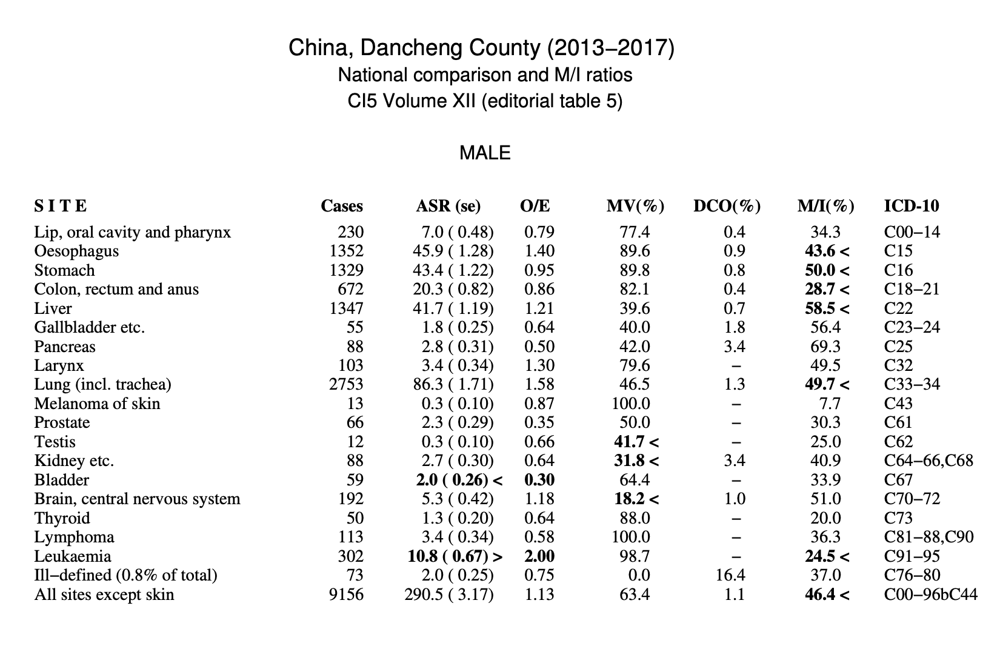
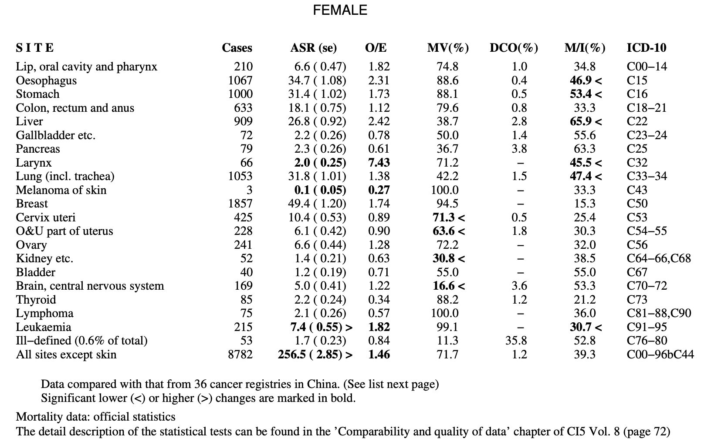
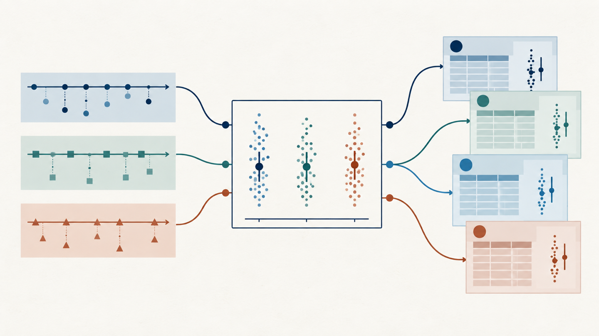

《五大洲癌症发病率》（Cancer Incidence in Five Continents，CI5）第13卷已发布 **Call for Data**，本次收集2018—2022年的资料。各地肿瘤登记处都在完善数据，希望资料能够被收录。CI5对资料收录有明确的质量要求，各卷方法章节也说明了相应的评价思路。

这些要求在肿瘤登记实践中并不陌生：发病率与历史趋势相比不应出现难以解释的波动；病理诊断比例（MV%）与可比地区或本地历史水平相比，也不应过度偏离。

问题是，发病率相差多少才算波动过大？MV%与区域参照值相差多少才值得警惕？这正是CI5质量评价中统计学检验要回答的问题。

向CI5提交数据后，CI5 XIII 的数据审核委员会通常会向登记处反馈质量报告。报告中可能将某个癌种、某个性别的年龄标化发病率（ASR）标为偏高（>）或偏低（<），也可能提示MV%过高（>）或过低（<）。审核人员会结合随数据提交的说明（通常是调查表）判断是否存在可解释的原因；解释充分时，这些标记本身并不等于资料不合格。

从下图的注释里可以看出，第十二卷 CI5 的数据质量评估在比较MV%、M:I以及ASR差异的时候，选的参照是CI5第11卷的36个登记处上报的2008-2012年数据。

这些标记不是直接给登记处指标贴上“合格”或“不合格”的标签，而是在提示：**目标值与可比资料之间的差异，是否已经大到难以用常见的随机波动和登记处间变异解释？**

## ASR、MV%和M:I：三个指标回答三类问题

ASR将不同年龄组的发病率按同一标准人口加权，用于减少人口年龄结构差异对地区或时期比较的影响。它适合识别整体发病水平的异常，但结果仍会受到人口分母、病例收集、诊断活动和真实疾病风险变化的影响。

MV%是经组织学、细胞学或血液学等形态学方法验证的病例占全部新发病例的比例，主要反映诊断信息的有效性。偏低需要检查诊断依据和病理资料收集；异常偏高也未必更好，它可能意味着登记过度依赖病理来源，漏掉了仅有临床诊断的病例。

M:I是同一时期、同一癌种死亡数与新发病例数之比，常作为登记完整性的半定量线索。M:I偏高可能提示新发病例漏报，但死亡资料质量、死因编码、发病趋势和生存差异也会改变这个比值。

## 先找可比参照，再看偏离有多大

判断差异通常有两个参照维度：一是**与历史资料比较**，例如同一登记处在CI5第12卷中已收录的数据；二是**与同一可比区域的参照水平比较**，例如其他可比登记处的汇总水平。无论采用哪一种参照，目标登记处与参照资料至少应在癌种定义、性别、年龄范围、时期、人口口径和病例纳入规则上保持一致。

在提交数据前，如果希望初步判断这些指标是否出现需要复核的偏离，省级登记处可以对省内多个登记处进行留一比较：每次选定一个目标登记处，用其余同层登记处估计参照水平和登记处间离散程度，再对目标值进行初步筛查。

## 发病率怎么检验：要区分两种比较

### 同一登记处，比较前后两个时期

设两个时期的ASR分别为 $R_1$、$R_2$，标准误分别为 $S_1$、$S_2$：

$$
x = \frac{R_1 - R_2}{\sqrt{S_1^2 + S_2^2}}
$$

如果关注比值 $\mathrm{RR} = R_1 / R_2$，可用Miettinen近似构造置信区间：

$$
\mathrm{RR}_{\text{下限}} = \mathrm{RR}^{1 - z/x}, \qquad
\mathrm{RR}_{\text{上限}} = \mathrm{RR}^{1 + z/x}
$$

95%置信区间取 $z = 1.96$。区间不包含1，说明两个时期的ASR差异具有统计学证据。但这项近似有一个重要前提：各年龄组的率比应大致稳定。如果变化主要集中在某几个年龄组，只比较两个ASR可能掩盖真实结构，应进一步检查年龄别发病率。

### 一个登记处，与同一可比区域的参照水平比较

设第 $i$ 个参照登记处的ASR为 $y_i$，标准误为 $s_i$，共有 $n$ 个参照登记处。先计算参照ASR的算术平均值：

$$
\bar{y} = \frac{\sum_{i=1}^{n} y_i}{n}
$$

再估计登记处间离散：

$$
\hat{\phi} = \frac{\sum_{i=1}^{n}\left(\frac{y_i - \bar{y}}{s_i}\right)^2}{n - 1}
$$

若 $\hat{\phi} < 1$，通常令其等于1，避免把参照组看得比单纯抽样波动还要一致。目标登记处 $j$ 的统计量为：

$$
Z^2 = \frac{(y_j - \bar{y})^2}{\hat{\phi}\,s_j^2}
$$

这里既利用目标ASR本身的标准误，也允许参照登记处之间存在额外差异。IARC 资料还提出一种先粗筛、再检验的实务思路：若目标 ASR 高于参照值的3倍或低于其0.3倍，可直接列为明显异常；偏离较小时再进入统计检验。

## MV%怎么检验：二项变异加上额外离散

设第 $i$ 个参照登记处的形态学验证病例数为 $y_i$，全部新发病例数为 $d_i$。共同MV%为：

$$
\hat{p} = \frac{\sum_{i=1}^{n} y_i}{\sum_{i=1}^{n} d_i}
$$

参照登记处间的离散参数为：

$$
\hat{\phi} = \frac{\sum_{i=1}^{n}\dfrac{(y_i - \hat{p}\,d_i)^2}{d_i\,\hat{p}\,(1 - \hat{p})}}{n - 1}
$$

目标登记处 $j$ 的统计量为：

$$
Z^2 = \frac{(y_j - \hat{p}\,d_j)^2}{\hat{\phi}\,\hat{p}\,(1 - \hat{p})\,d_j}
$$

这个模型以二项变异为基础，并通过 $\hat{\phi}$ 允许不同登记处之间存在额外离散。

## M:I怎么检验：比较死亡数与发病数的关系

设第 $i$ 个参照登记处的死亡数为 $m_i$，新发病例数为 $d_i$，并令 $n_i = m_i + d_i$。共同的M:I为：

$$
\hat{\theta} = \frac{\sum_{i=1}^{n} m_i}{\sum_{i=1}^{n} d_i}
$$

参照登记处间的离散参数为：

$$
\hat{\phi} = \frac{\sum_{i=1}^{n}\dfrac{(m_i - \hat{\theta}\,d_i)^2}{n_i\,\hat{\theta}}}{n - 1}
$$

目标登记处 $j$ 的统计量为：

$$
Z^2 = \frac{(m_j - \hat{\theta}\,d_j)^2}{\hat{\phi}\,n_j\,\hat{\theta}}
$$

这个检验识别的是M:I相对参照水平的异常，并不直接估计登记完整率。参照地区如果存在共同漏报，或死亡登记质量较差，统计结果也可能产生误导。

## 三种检验放在一起看

| 指标 | 主要输入 | 比较重点 | 需要特别检查的前提 |
|---|---|---|---|
| ASR | 年龄别病例数、人口数、标准人口；或ASR及标准误 | 发病水平是否异常 | 年龄结构已标化，定义和人口分母一致 |
| MV% | 形态学验证病例数、全部新发病例数 | 诊断信息来源是否异常 | 验证口径一致，非病理病例未被系统遗漏 |
| M:I | 死亡数、新发病例数 | 完整性线索是否异常 | 死亡资料可用，时期、癌种和辖区口径一致 |

$\hat{\phi}$越大，说明参照登记处之间越不一致；此时目标值需要出现更强的偏离才会被标记。$Z^2$描述偏离强度，$P$值描述在模型假设下观察到如此偏离的概率。两者都不能说明偏离由什么原因造成。

## 出现统计异常后，应该查什么

ASR异常时，先核对年度病例数和人口分母是否发生突变，再看年龄别发病曲线。还要核对辖区调整、癌种定义、筛查活动、病例去重及跨区就医。儿童肿瘤还可按0—4岁、5—9岁和10—14岁分别比较历史分布，因为总体ASR可能掩盖小年龄组的缺报。

MV%异常时，应回到分子与分母，核对诊断依据口径是否一致、病理和细胞学资料是否漏收、非病理来源病例是否被系统排除，以及编码是否批量缺失。小病例数下出现的极端比例尤其需要谨慎解释。

M:I异常时，要同时核对死亡与发病两套资料：死亡覆盖和死因编码是否稳定，死亡和发病是否采用同一癌种与时期口径，近期发病是否快速变化，生存差异和跨区就医是否降低了地区可比性。

如果一次比较很多癌种、年份、性别和登记处，偶然出现若干 $P < 0.05$ 并不意外。质量控制应将结果视为筛查清单，优先处理跨年份重复、多个相关指标同时出现或偏离幅度很大的信号；若用于正式推断，则应预先规定比较范围，并考虑多重检验校正。

## 参考资料

1. Bray F, Parkin DM. Evaluation of data quality in the cancer registry: Part I. https://pubmed.ncbi.nlm.nih.gov/19117750/
2. Parkin DM, Bray F. Evaluation of data quality in the cancer registry: Part II. https://pubmed.ncbi.nlm.nih.gov/19128954/
3. IARC. Cancer Incidence in Five Continents, Volume VIII, Chapter 5. https://publications.iarc.who.int/download/ci5v8-chap5.pdf
4. IARC. Cancer Incidence in Five Continents, Volume VIII. https://publications.iarc.who.int/Book-And-Report-Series/Iarc-Scientific-Publications/Cancer-Incidence-In-Five-Continents-Volume-VIII-2002
