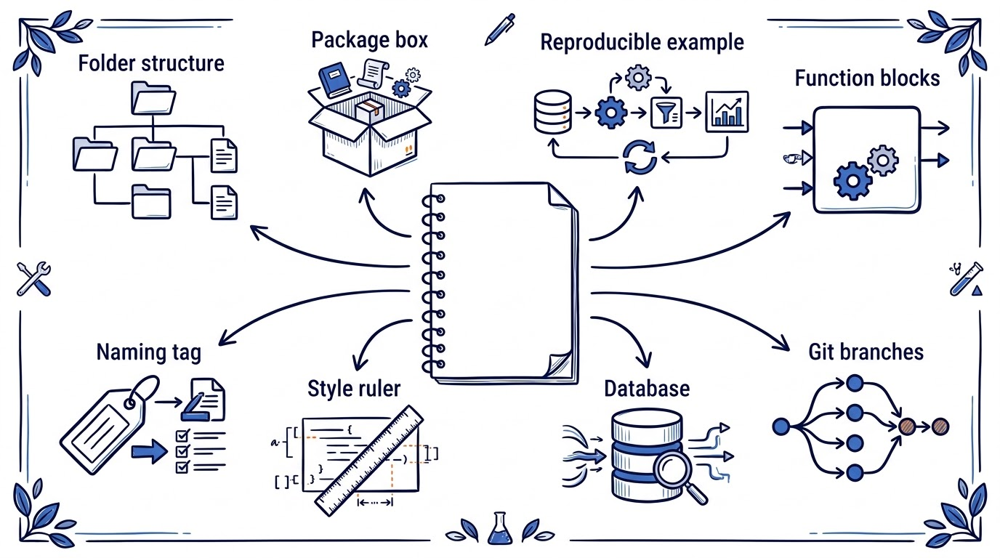
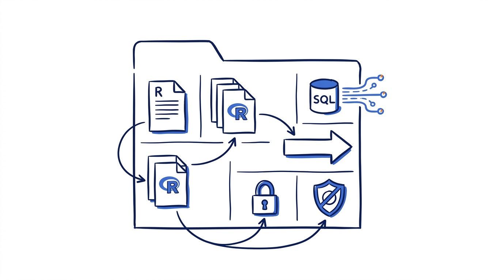
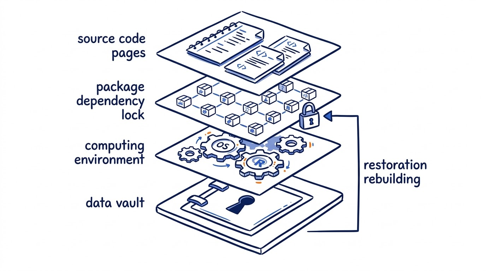
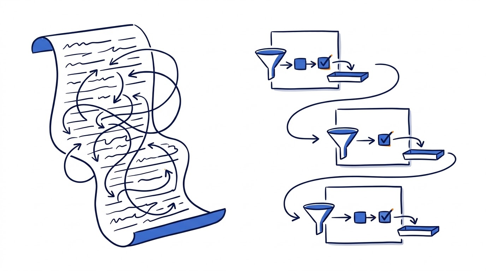
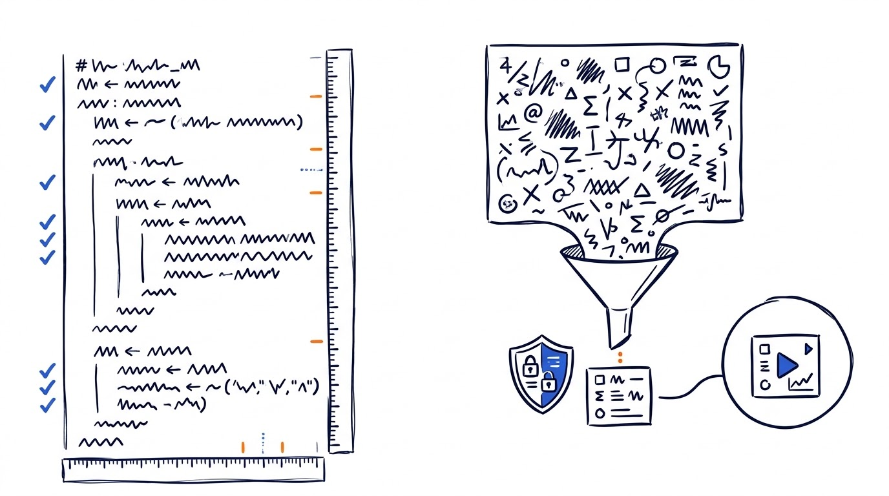
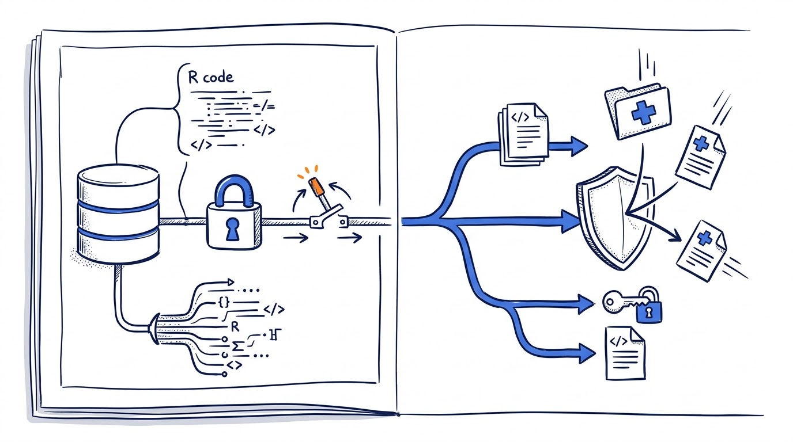

## 不妨先看一个项目目录

```text
analysis-project/
├── README.md
├── analysis-project.Rproj
├── R/
├── SQL/
├── run-all.R
├── renv.lock
└── .gitignore
```

这个目录并不花哨，但它回答了几个很要命的问题：说明在哪里？代码和 SQL 各放哪里？从哪个文件开始跑？依赖版本记在哪里？哪些文件不应进 Git？



Jacob Scott 的速查表其实一直在强调同一件事：**别让项目只存在于某个人的电脑和记忆里。**

`README.md` 说清数据来源、运行方法和输出位置；`run-all.R` 给出一条从原始输入到最终结果的路；`R/` 和 `SQL/` 把逻辑分开。项目内使用相对路径，也比在脚本开头硬写本机 `setwd()` 更容易交接。



这里不必迷信某个 IDE。RStudio 很好用，但项目边界、相对路径和统一入口，才是可交接的核心。

## renv 锁定的是 R 包，不是整个世界

项目半年前还能跑，今天却报错，很多时候不是代码自己变了，而是包版本变了。

对长期项目，`renv::snapshot()` 会把项目库中的包元数据写入 `renv.lock`；换一台机器后，可用 `renv::restore()` 尝试恢复同一组包版本。



注意这里的动词是“尝试恢复”。`renv.lock` 不会自动冻结 R 本身、操作系统、系统库、外部数据库和原始数据。

**锁文件是可复现的一层，不是全部。**

所以 README 里还要留下 R 版本、数据截止日期、外部工具、运行环境和必要的参数。更稳妥的做法，是真的在一个新环境里恢复一次，而不是看见 `renv.lock` 就默认项目可复现。

## 小函数的好处，是把“默认”摆到明面上

一段从头跑到尾的长脚本，当时往往很顺手；过两个月再看，就会冒出一堆问题：这两列长度不一样怎么办？人口数能不能为 0？返回的单位是什么？

拆成小函数，就能把这些默认条件写出来。下面是一个只依赖 base R 的最小例子：

```r
compute_rate <- function(cases, population, scale = 1e5) {
  stopifnot(
    length(cases) == length(population),
    all(population > 0)
  )

  cases / population * scale
}

compute_rate(
  cases = c(10, 25),
  population = c(50000, 100000)
)
#> [1] 20 25
```

这段代码已在 `R 4.5.2` 中执行。输入是两组病例数和人口数，预期输出与实际运行结果一致：每 10 万人率为 `20` 和 `25`。



它也有非常明确的边界：只算粗率，没有处理缺失值，没有标化、置信区间和数据质量审核。用到医学分析里时，这些都需要另行定义。

**可执行的代码很重要，但清楚写出它不做什么，同样重要。**

## 风格与 reprex，是两种不同的“让人看懂”

`lower_snake_case`、运算符两侧留空格、2 空格缩进、长调用换行，都不会改变计算结果。它们解决的是阅读成本。

这类约定没有必要手工挑错。`styler` 可以自动格式化，`lintr` 可以把风格问题放进检查流程。至于“每行不超过 80 个字符”，它是一个可读性约定，不是代码正确性标准。团队统一，比争论唯一正确的风格更有价值。

`reprex` 解决的是另一个问题：怎样把故障缩小到别人能够重现。删掉与问题无关的命令，提供小型或模拟数据，随机过程设置种子，必要时附上会话信息。



如果处理的是医学或登记数据，这里还有一条硬边界：**不要为了提问，把真实患者记录粘贴到公开 issue、论坛或 AI 对话里。** 请改用模拟数据，或经合规审查的彻底去标识数据。

## 连数据库和用 Git，先把边界画出来

DBI 提供 `dbConnect()`、`dbCanConnect()` 和 `dbDisconnect()` 等通用接口，具体的驱动和认证方式由后端决定。将建立连接的逻辑集中在辅助函数里，往往会比每份脚本各写一遍更稳定。

但“集中”不是把账号密码集中写进一个 R 文件。凭据应交给环境变量、系统凭据库或组织批准的密钥管理方案，不要写进脚本、`.Rprofile` 或 Git 仓库。用完连接，也应有明确的关闭机制。



Git 适合管代码、小型配置和不含敏感信息的文档。这不意味着项目中的所有文件都应进入 GitHub。患者级数据、账号密钥、未授权结果和大型中间数据，应由 `.gitignore`、权限系统和合规存储流程共同管理。

## 三条建议，需要加上注脚

第一，GitHub stars 不是包质量的证据。维护活跃度、许可证、自动测试、问题响应、依赖情况、CRAN 或 Bioconductor 状态，都比一个星标数更接近真正的风险评估。

第二，“把 `library()` 放在开头”要分场景。分析脚本可以集中加载依赖；R 包 `R/` 目录下的源码，则应通过 `DESCRIPTION`、`NAMESPACE` 和 `pkg::fun()` 管理依赖。

第三，速查表不是完整的软件工程清单。对长期、多人或高风险项目，还应考虑自动测试、持续集成、数据字典、备份、访问控制和定期复现检查。

## 如果明天就想开始

不用等一场完整的项目重构。可以先做下面几件小事：

1. 在项目根目录补一份能指导重跑的 README。
2. 用相对路径和项目入口，逐步替换本机 `setwd()` 和手工点击。
3. 为长期项目建立 `renv.lock`，再找一个新环境真正测试恢复。
4. 挑一段最常重复的逻辑，拆成输入、输出和错误条件清楚的函数。
5. 统一命名和格式，把能自动的风格检查交给工具。
6. 用模拟或合规去标识数据制作 reprex，不暴露真实患者信息。
7. 把数据库凭据移出代码，并写清连接关闭规则。
8. 用 Git 管代码，用合规系统管数据。

说到底，一页速查表的价值，不是让人多背几条规则。它更像一张地图，提醒团队去检查那些平时容易被默认的地方。

最后只需要用一个很朴素的标准检验：**换一台机器，换一个人，这个项目还能不能被读懂、运行和核对？**

### 参考资料

- [Jacob Scott: R Best Practice Cheat Sheet](https://github.com/wurli/r-best-practice)
- [renv: Introduction to renv](https://rstudio.github.io/renv/articles/renv)
- [reprex: Do's and don'ts](https://reprex.tidyverse.org/articles/reprex-dos-and-donts.html)
- [The tidyverse style guide](https://style.tidyverse.org/)
- [R Packages 2e: Dependencies in practice](https://r-pkgs.org/dependencies-in-practice.html)
- [DBI: Connect to a DBMS](https://dbi.r-dbi.org/reference/dbConnect.html)
- [GitHub: Best practices for repositories](https://docs.github.com/en/repositories/creating-and-managing-repositories/best-practices-for-repositories)
