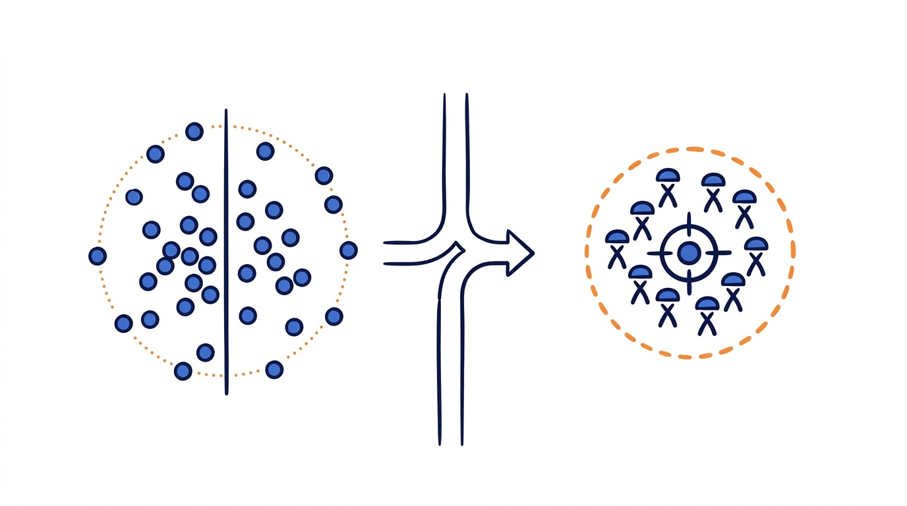
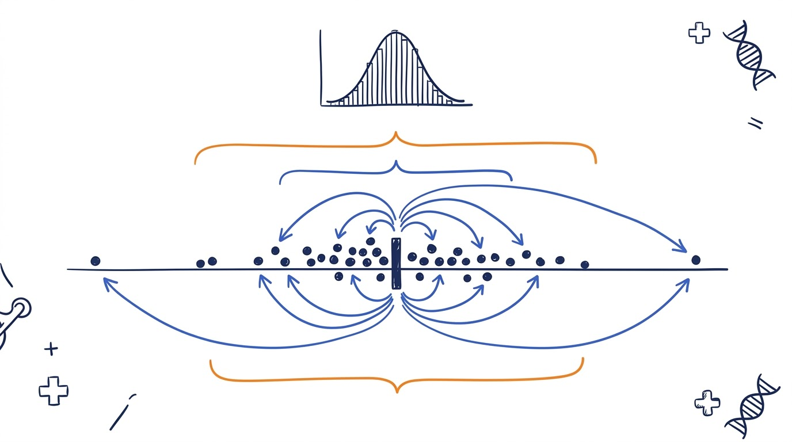
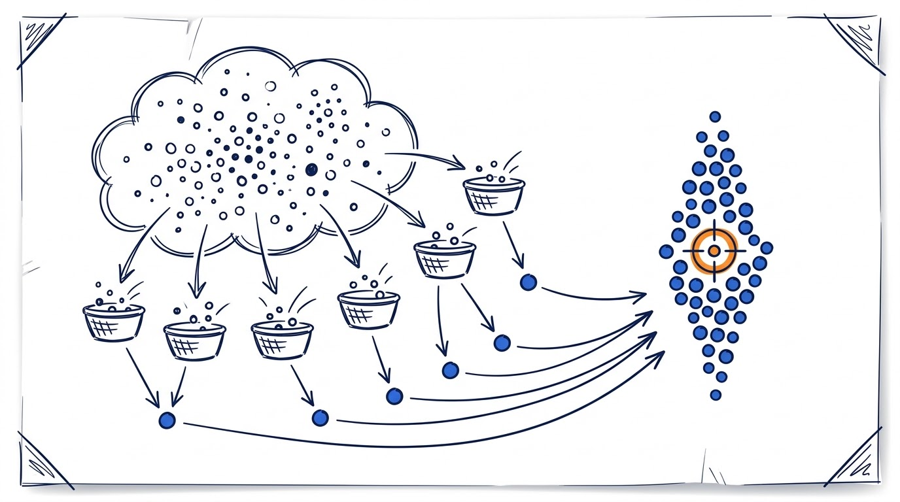
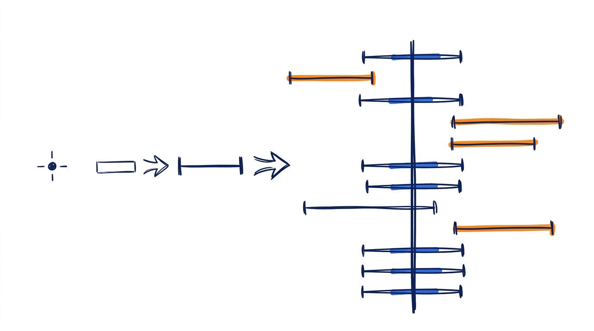
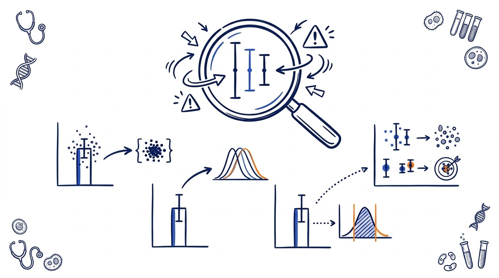
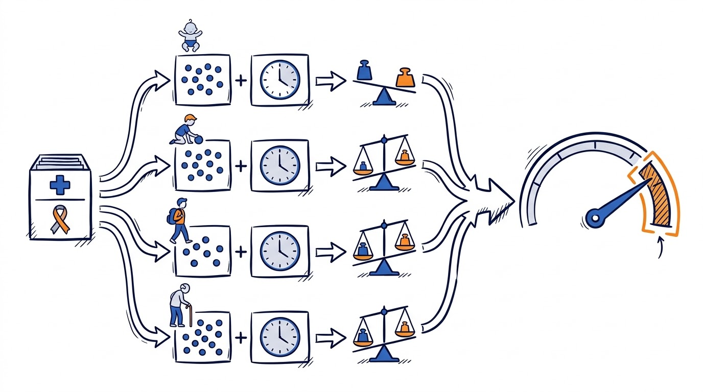
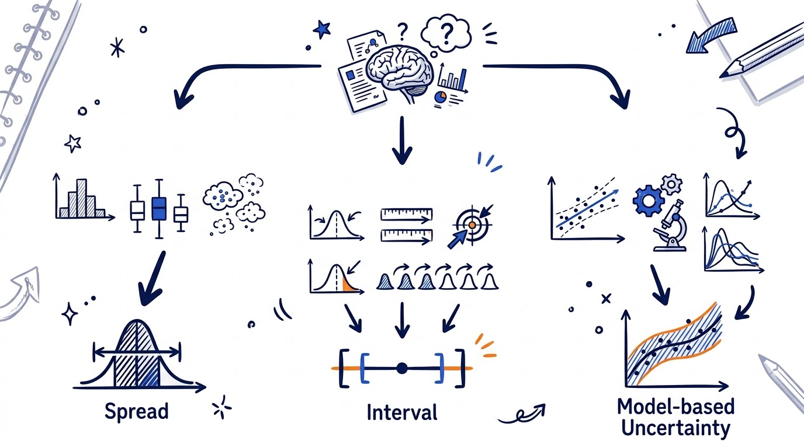

## 12和1.2，都对

看一份模拟的肿瘤登记资料：100名病例，诊断年龄均值62岁，样本标准差12岁。均值的标准误为：

`SE = 12 / √100 = 1.2岁`

12岁和1.2岁相差10倍。较小的1.2岁并不表示病例年龄很集中。它说的是另一件事：如果从同一总体反复抽取100人，**每次得到的样本均值会怎样波动**。

**标准差（standard deviation, SD）**回答：样本中的个体值离均值有多远？

**标准误（standard error, SE）**回答：如果重复抽样，某个统计量会波动多大？当这个统计量是均值时，常写作均值的标准误（standard error of the mean, SEM）。

**SD描述数据，SE描述估计。** 这就是两者最短、也最重要的分界线。

换成调查研究也一样。抽取1000人的收入资料时，SD描述这1000人的收入彼此相差多大；SE描述的是，如果按同一设计重新抽取1000人，得到的平均收入会在不同样本之间波动多大。前者看**样本内的个体差异**，后者看**样本之间的估计差异**。

这组对照很实用，但“SE描述估计的可靠性”还可以再精确一点：SE描述的是**估计的精度（precision）**。它不直接证明估计准确，更不能自动排除选择偏倚、测量偏倚或模型设定错误。

## 标准差看个体值有多散

样本标准差通常写成：

`s = √[Σ(xᵢ-x̄)²/(n-1)]`

它计算每个观测值与样本均值的距离，经过平方、求和和校正后再开平方。因此，标准差会回到原变量的单位：诊断年龄的SD仍以岁计，住院时长的SD仍以天计。

在这个模拟案例里，12岁描述的是100名病例年龄的离散程度。即使从同类总体再抽到400人，标准差也不会因此机械变成6岁。更多样本通常让总体SD的估计更稳定，**不会让人群中的个体差异凭空减半**。

还有一个常见误解：SD并非“只有正态分布才能计算”。只要方差存在，就可以算SD。真正需要正态近似的是另一句话——用“均值±约2SD”去粗略覆盖约95%的个体值。

数据严重偏态、重尾或带有明显离群值时，SD仍能算，却可能被少数极端值强烈牵动。此时应同时查看分布图，并考虑用**中位数和四分位距（IQR）**描述中心和离散。

## 标准误看估计值有多稳

标准误不是均值的专属名词。比例、发病率、回归系数、风险比、生存概率，都有各自的SE。统一的定义是：**某个统计量抽样分布的标准差**。

对于独立同分布、方差有限的简单样本，均值的估计标准误是：

`SE(x̄) = s/√n`

这条公式展示了样本量的作用。若总体SD相近，样本量增至原来的4倍，均值SE约减半：

| 样本量n | SD（岁） | 均值SE（岁） |
|---:|---:|---:|
| 25 | 12 | 2.4 |
| 100 | 12 | 1.2 |
| 400 | 12 | 0.6 |

变小的是均值估计的不确定性，不是病例年龄的个体差异。若在基线特征表里用SEM替代SD，数字确实更小，表格也显得更“整齐”；代价是读者看不到样本真正有多分散。

**标准误不是更漂亮的标准差，也不是仪器的测量误差。**

这里还要防止另一个跳跃：样本量越大，SE通常越小，但这只意味着随机抽样波动减少。假如抽样框漏掉某类人群，或者测量方法持续偏高，样本再大也可能得到一个SE很小、却偏离目标值的估计。**精确不等于准确，低SE不等于低偏倚。**

## 从SE到95%置信区间

SE像一把不确定性标尺，单独一个SE却没有直接说明覆盖水平。对总体均值的简单情形，总体方差未知时，95%置信区间写作：

`x̄ ± t(0.975,n−1) × SE`

回到模拟数据：n=100，自由度99的t临界值约为1.984，因此区间为：

`62 ± 1.984×1.2 = 59.6～64.4岁`

怎样解释这个95%？如果不断重复抽样，并且每次都按相同规则计算区间，长期约95%的区间会覆盖真实总体均值。置信水平属于**构造区间的方法**。它不是说，眼前这个已经算出的区间有95%概率包含一个固定不变的真实均值。

SAMPL生物医学统计报告指南建议，主要结果应给出估计值和通常为95%的置信区间，而不要只靠P值或SE。原因很实际：CI同时告诉读者估计落在哪里、精度如何，也比“均值±SEM”更不容易被误读成数据范围。

**描述样本时用SD；表达主要估计的不确定性时，优先报告95%CI。**

## 三种会把SE算得过小的做法

### 把记录数当作独立样本量

同一个患者的多次测量、同一地区内的病例、同一家医院的记录，往往彼此相关。若把全部记录条数直接当作n塞进 `s/√n`，标准误可能被压得过小。

配对数据、重复测量和多层数据，需要与研究设计匹配的分析，例如配对方法、混合模型、广义估计方程或聚类稳健方差。关键不在于选一个听起来高级的模型，而在于**让方差计算承认数据之间的相关性**。

### 忽略分层、聚类和抽样权重

复杂抽样的有效样本量未必等于数据行数。CDC的NHANES教程指出，忽略差异权重和聚类通常会低估标准误，继而得到过窄的置信区间并夸大显著性。调查数据需要使用能够识别分层、聚类和权重的方差估计。

### 画了误差线，却不说它是什么

一根误差线可能代表SD、SE、95%CI、IQR或全距。这些图形外表相似，统计含义完全不同。图注至少应写清误差线定义、样本量，以及什么才是独立实验单位。

也不要只看两组误差线是否重叠就判断P值。两均值的比较还取决于各组SE、样本量、相关结构及所用模型；误差线重叠没有一个可通吃所有设计的显著性规则。

## 肿瘤登记率的SE，不能拿患者SD来除

CI5的登记处表格会同时给出年龄标化发病率及其标准误。这里的SE描述**率的抽样变异**，不是患者年龄、肿瘤大小或住院天数的离散程度。

年龄标化率是各年龄别率按标准人口权重得到的加权和。CI5的方法在年龄别病例数采用Poisson分布假设时，用每个年龄组的病例数、人口人年和标准权重共同计算方差。

所以，这里的SE不能用患者层面某个变量的SD除以病例数平方根代替。率、比例、回归系数和生存概率的SE，都要从相应的概率模型或研究设计中得到。

病例很少、率接近零时，对称的“估计值±1.96×SE”还可能算出负下限。此时应考虑适用于计数率的精确区间或gamma区间，并同时报告病例数、人口人年、率的类型和标准人口。**公式不是越统一越好，匹配数据生成过程才重要。**

## 写表和画图时，按问题选择

| 你想回答什么 | 推荐呈现 | 容易误导的做法 |
|---|---|---|
| 个体数据有多分散 | 近似对称：mean (SD)；偏态：median (IQR) | 用SEM替代SD |
| 均值估计有多精确 | 均值及95%CI | 只写mean±SEM |
| 主要效应有多大 | 效应值、95%CI、样本量 | 只给P值 |
| 图中展示数据分布 | 原始点、箱线图或小提琴图，必要时加SD | 只有柱形图且不定义误差线 |
| 展示率或模型参数 | 方法匹配的SE或95%CI | 一律套用SD/√n |

交稿前可以核对四件事：描述对象是个体值还是估计量？误差线有没有写明SD、SE或CI？样本量指独立分析单位，还是仅仅等于记录条数？方差算法是否匹配抽样设计和统计模型？

**SD让读者看见数据有多散，SE与CI让读者看见估计有多稳。两者都重要，但不能互相顶替。**

### 参考资料

**1. NIST：Measures of Scale**  
网址：[https://​www.​itl.​nist.​gov/​div898/​handbook/​eda/​section3/​eda356.​htm](https://www.itl.nist.gov/div898/handbook/eda/section3/eda356.htm)

**2. NIST：Confidence Limits for the Mean**  
网址：[https://​www.​itl.​nist.​gov/​div898/​handbook/​eda/​section3/​eda352.​htm](https://www.itl.nist.gov/div898/handbook/eda/section3/eda352.htm)

**3. Altman DG, Bland JM. Standard deviations and standard errors**  
网址：[https://​doi.​org/​10.​1136/​bmj.​331.​7521.​903](https://doi.org/10.1136/bmj.331.7521.903)

**4. EQUATOR Network：SAMPL Guidelines**  
网址：[https://​www.​equator-network.​org/​reporting-guidelines/​sampl/](https://www.equator-network.org/reporting-guidelines/sampl/)

**5. Cochrane Handbook, Chapter 6**  
网址：[https://​www.​cochrane.​org/​authors/​handbooks-and-manuals/​handbook/​current/​chapter-06](https://www.cochrane.org/authors/handbooks-and-manuals/handbook/current/chapter-06)

**6. Cumming G, et al. Error bars in experimental biology**  
网址：[https://​doi.​org/​10.​1083/​jcb.​200611141](https://doi.org/10.1083/jcb.200611141)

**7. CDC/NCHS：NHANES Variance Estimation**  
网址：[https://​wwwn.​cdc.​gov/​nchs/​nhanes/​tutorials/​varianceestimation.​aspx/​SampleDesign.​aspx](https://wwwn.cdc.gov/nchs/nhanes/tutorials/varianceestimation.aspx/SampleDesign.aspx)

**8. IARC/IACR：CI5 XII About**  
网址：[https://​ci5.​iarc.​who.​int/​ci5-xii/​about/](https://ci5.iarc.who.int/ci5-xii/about/)
