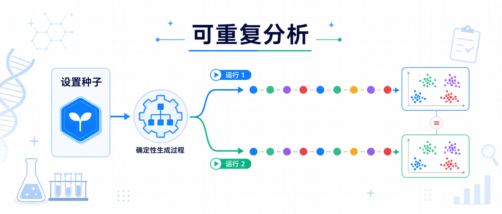
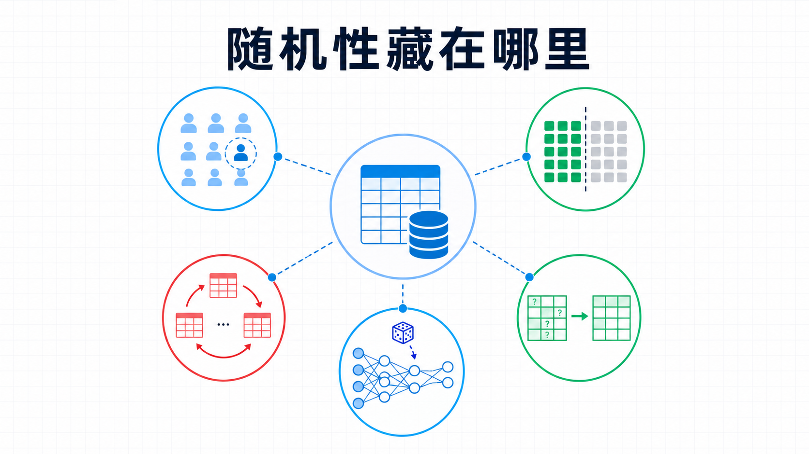
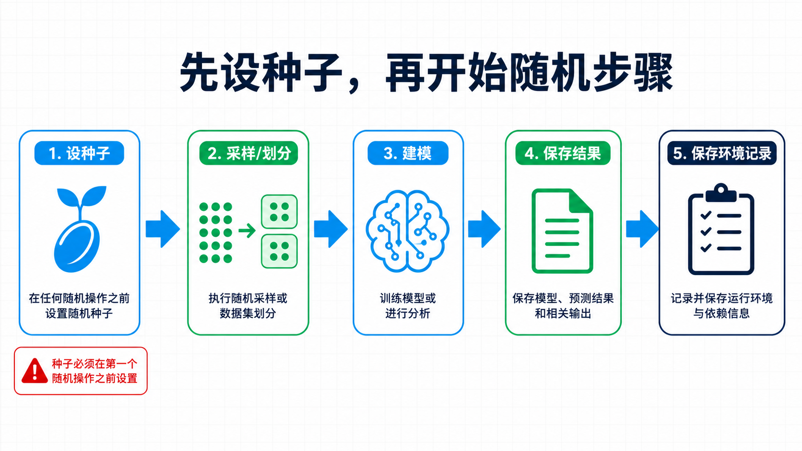
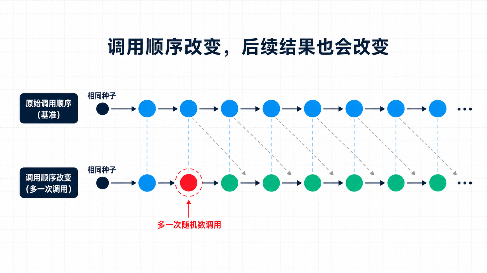
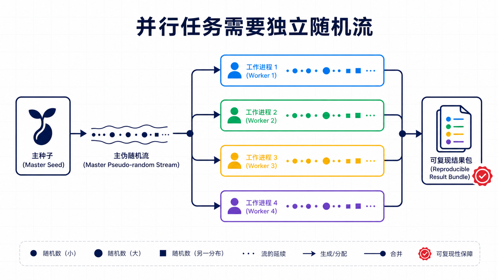
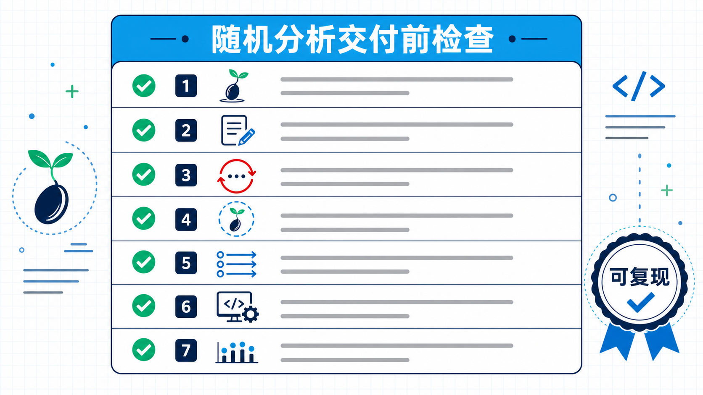

## 先看一段可复现的输出

以本文验证的 R 4.5.2 环境运行，预期输出如代码注释所示：

```r
set.seed(20260826)
sample(1:100, 5)
# [1] 27 67  9  8 66

set.seed(20260826)
sample(1:100, 5)
# [1] 27 67  9  8 66
```

这段代码在 R 4.5.2 的干净会话中已实际运行。两次抽样结果完全相同，原因并不神秘：每次抽样前，伪随机数生成器都回到了同一个起点。



**随机种子（random seed）**可以理解为伪随机序列的初始条件。它不是把分析“变得不随机”，而是让同样的算法从同一个状态出发。

**同一种子 + 同一随机数生成器 + 同一调用顺序，才能得到同一段随机序列。**

## 哪些分析步骤真的用到了随机性

不是只有 `runif()` 和 `rnorm()` 才需要种子。医学数据分析中，随机性经常藏在更熟悉的操作里：

- 随机抽取病例做质量复核；
- 划分训练集、验证集和测试集；
- bootstrap、置换检验和 Monte Carlo 模拟；
- 多重插补、随机初始值、随机搜索；
- 随机森林、随机梯度法以及部分近似算法。



如果这些步骤没有明确种子，重新运行后的样本划分、重抽样样本或模型初始值可能会变。最终的图、表、指标甚至结论也可能跟着变。

一个实用检查是：**凡是“从多个可能结果中抽一个”的步骤，都要查它如何控制 RNG。** 有的函数读取 R 的全局随机状态，有的函数则提供 `seed`、`random_state` 或类似参数。

## `set.seed()` 应该放在哪里

对一段完整的随机分析，最简单的做法是在第一次随机调用之前设置一次：

```r
set.seed(20260826)

train_id <- sample(seq_len(nrow(dat)), size = floor(0.7 * nrow(dat)))
train <- dat[train_id, ]
test  <- dat[-train_id, ]
```

种子值不需要有特殊寓意。`42` 不比 `20260826` 更“随机”。真正重要的是，**把整数种子写进脚本、配置文件或分析记录，不要只留在运行者的记忆里。**



如果只想让函数内的一小段代码使用固定种子，又不想污染函数外部的随机状态，可以用 `withr::with_seed()`：

```r
draw_review_sample <- function(ids) {
  withr::with_seed(
    20260826,
    sample(ids, size = min(20, length(ids)))
  )
}
```

`with_seed()` 执行完代码后会恢复之前的随机状态。对包函数、自动化测试和可重用分析模块，这种局部作用域通常更清楚。

如果一个项目有多个随机阶段，建议在分析开始时预先写出种子计划：

```r
seed_plan <- c(
  split = 20260826L,
  bootstrap = 20260827L
)

train_id <- withr::with_seed(
  seed_plan[["split"]],
  sample.int(nrow(dat), floor(0.7 * nrow(dat)))
)

boot_mean <- withr::with_seed(
  seed_plan[["bootstrap"]],
  mean(sample(dat$value, replace = TRUE))
)
```

这样，bootstrap 阶段增加一次随机调用，不会悄悄改变数据划分阶段的结果。种子列表应在看到结果之前确定，不能运行多个种子后只挑表现最好的一次。

## 设了种子，为什么结果还是变了

第一个常见原因是随机调用顺序变了。看这个本机实测：

```r
set.seed(20260826)
sample(1:100, 5)
round(rnorm(3), 4)
# [1]  1.3279 -1.2577  0.7592

set.seed(20260826)
sample(1:100, 5)
runif(1)                 # 中间多一次随机调用
round(rnorm(3), 4)
# [1] 1.1737 0.3936 0.6716
```



每次随机抽取都会推进 RNG 状态。即使开头的种子没变，中间多了一次 `runif()`，后面的 `rnorm()` 也会读到不同的位置。**“我明明设了种子”不能代替对整条随机调用链的检查。**

第二个原因是版本或算法变化。R 在 3.6.0 更改过 `sample()` 使用的默认抽样方法。R 官方因此提供 `RNGversion()`，用于在必要时采用某个旧 R 版本的默认 RNG 配置。

相同整数种子并不保证跨版本得到相同的随机序列。建议同时记录 `RNGkind()`、R 版本和包版本：

```r
analysis_seed <- 20260826L
run_record <- list(
  seed = analysis_seed,
  rng_kind = RNGkind(),
  r_version = R.version.string,
  packages = as.data.frame(installed.packages()[, c("Package", "Version")])
)
dir.create("results", showWarnings = FALSE)
saveRDS(run_record, "results/run-record.rds")
```

需要复核历史输出时，才考虑显式使用 `RNGversion()`，并把这一步写进专门的复核脚本。新项目不应为了追求表面上的稳定，默认锁定旧算法。数据、代码、环境和随机状态都要一起记录。

## 循环、并行和机器学习的三个坑

### 不要在循环里每次重置同一种子

```r
# 不推荐：每次都回到同一起点
for (i in 1:3) {
  set.seed(20260826)
  print(runif(1))
}
```

这样会重复产生同一个数，而不是三次可复现但相互不同的抽取。通常应把 `set.seed()` 放在循环外；如果每个任务必须有独立随机流，就事先生成并保存种子列表，或使用专门的 RNG stream 机制。

### 并行 worker 需要独立且可复现的随机流

R 的 `parallel` 包为 PSOCK 集群提供 `clusterSetRNGStream()`。把集群清理放进函数的 `on.exit()`，即使中途报错也能释放 worker：

```r
parallel_draws <- function(seed, workers = 2L) {
  cl <- parallel::makeCluster(workers)
  on.exit(parallel::stopCluster(cl), add = TRUE)

  parallel::clusterSetRNGStream(cl, iseed = seed)
  parallel::parLapply(cl, seq_len(4), function(i) runif(2))
}

ans <- parallel_draws(20260826L, workers = 2L)
```



这里使用的是 `L'Ecuyer-CMRG` 随机流机制。但还要记录 worker 数量、任务分块和调度方式。R 官方文档特别提醒：动态负载均衡会让任务分配到哪个 worker 变得不确定，某些绑定到 worker 随机流的模拟因此不再可复现。若需要逐任务复核，应固定任务划分，或为任务显式保存独立的种子/随机流。

### 一个种子可以复现结果，不能证明结果稳健

随机划分后的模型表现可能对种子很敏感。如果只试几个种子，然后报告指标最好的那一个，实际上已经把种子变成了一个隐形调参项。

**设置种子解决的是“能否重现这次运行”，不是“这次运行是否足够稳健”。**

对结果敏感的分析，应事先定义多个种子或多次重复运行，报告性能分布、不确定性或结论是否反转，而不是挑选一次最好看的输出。

## 种子不是可重复性的全部


要让另一个人、另一台电脑或未来的自己复核结果，至少需要保存以下信息：

| 需要记录的对象 | 为什么 |
|---|---|
| 输入数据及版本 | 数据改了，输出当然会变 |
| 完整代码与执行顺序 | 随机流会被每次调用推进 |
| 种子值 | 回到同一 RNG 初始状态 |
| R 版本与 RNG 类型 | 默认算法可能跨版本变化 |
| 包版本和系统环境 | 实现、默认参数和底层库可能不同 |
| 并行设置 | worker 数、分块和调度会影响随机流 |

在 R 项目中，可以用 `sessionInfo()` 或 `sessioninfo::session_info()` 记录运行环境，再用 `renv` 之类的工具锁定包版本。数据、代码、环境和随机状态都能对上，“可重复”才不只是一句声明。

## 一份可直接放进项目的检查清单



- 在第一个随机步骤前明确设置种子。
- 种子写在代码或配置中，不靠手工记忆。
- 多阶段分析预先写出种子计划，必要时使用 `withr::with_seed()` 隔离阶段。
- 不在循环内每次重置同一种子。
- 记录 `RNGkind()`、R 版本、包版本、系统环境和输入数据版本。
- 并行计算使用专门 RNG stream，并记录 worker 与调度设置。
- 保存 `sessionInfo()`、运行记录、输入数据版本和完整代码。
- 如果结论可能依赖某次随机划分，用多个事先指定的种子做稳健性评估。

**种子的价值，不在于让每个人都用同一个数，而在于让一次含随机性的分析可被追踪、复核和解释。**

### 参考资料

**1. R Core Team：Random Number Generation**  
网址：[https://​stat.​ethz.​ch/​R-manual/​R-devel/​library/​base/​help/​Random.​html](https://stat.ethz.ch/R-manual/R-devel/library/base/help/Random.html)

**2. withr：Random seed**  
网址：[https://​withr.​r-lib.​org/​reference/​with_seed.​html](https://withr.r-lib.org/reference/with_seed.html)

**3. R Core Team：parallel 包文档**  
网址：[https://​stat.​ethz.​ch/​R-manual/​R-devel/​library/​parallel/​html/​00Index.​html](https://stat.ethz.ch/R-manual/R-devel/library/parallel/html/00Index.html)

**4. Python：random — Generate pseudo-random numbers**  
网址：[https://​docs.​python.​org/​3/​library/​random.​html](https://docs.python.org/3/library/random.html)

**5. NumPy：Random Generator**  
网址：[https://​numpy.​org/​doc/​stable/​reference/​random/​generator.​html](https://numpy.org/doc/stable/reference/random/generator.html)
