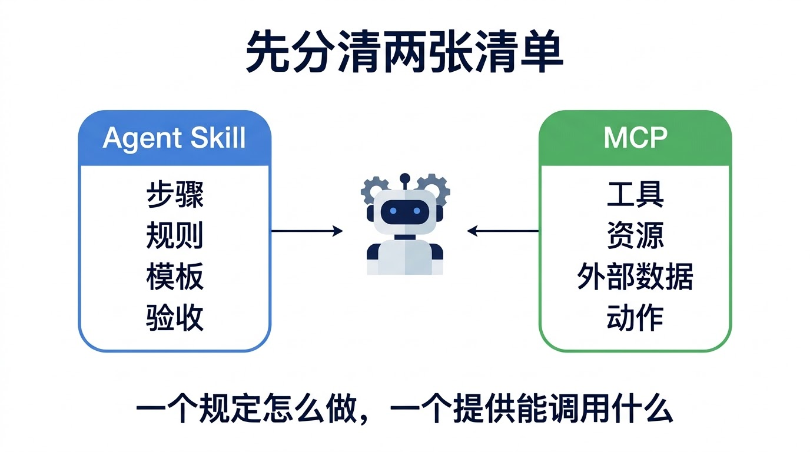
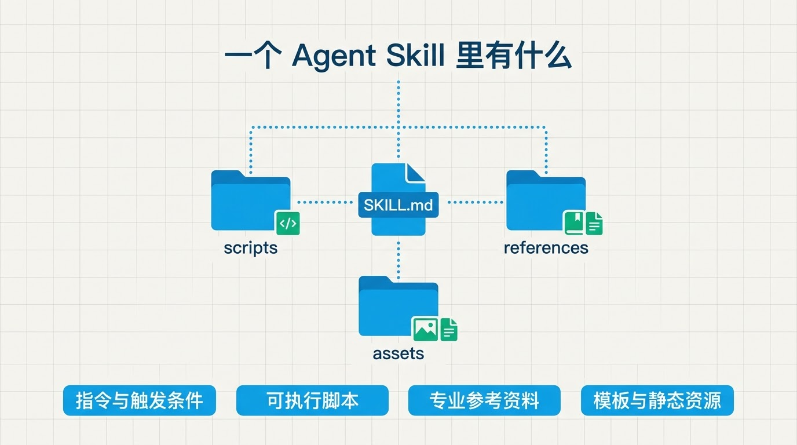
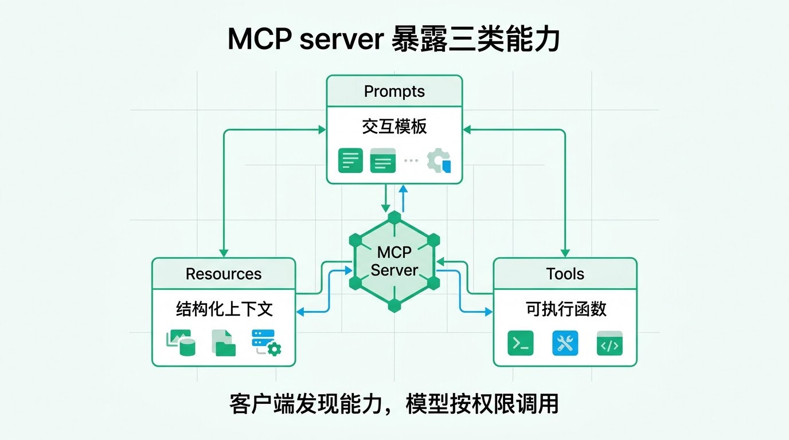
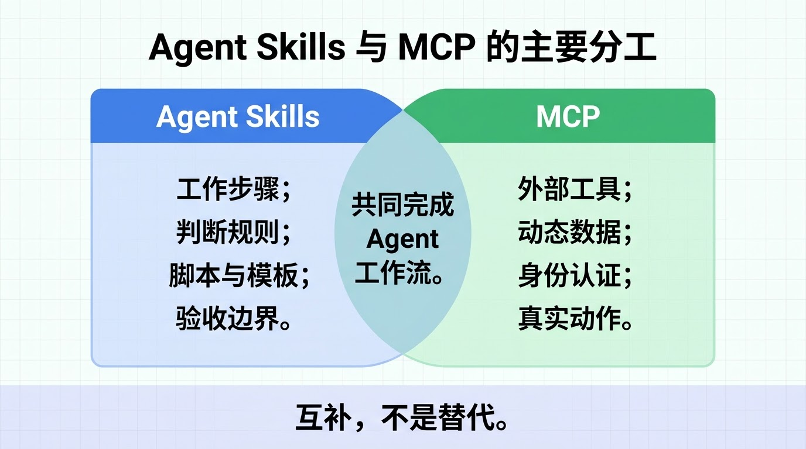
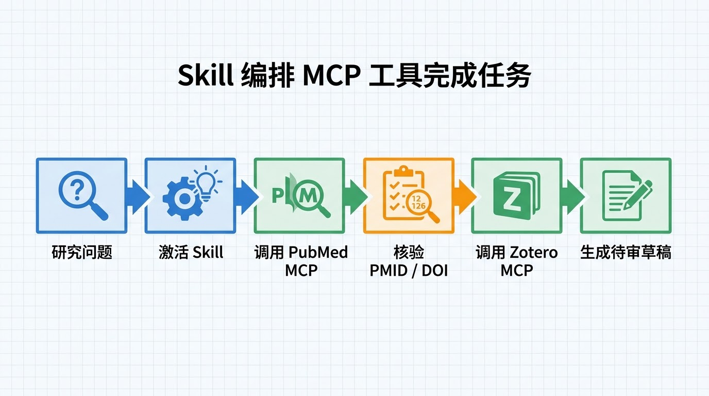
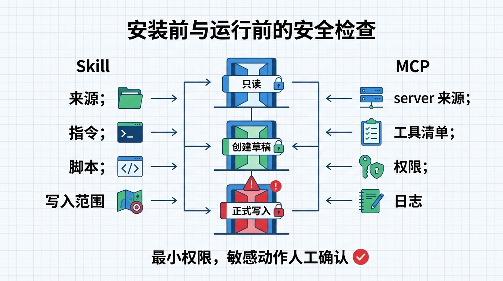

同一个 AI Agent 面前，可以同时出现两张清单。

第一张写着：

```text
先明确研究问题
再检索文献
逐条核对 PMID 和 DOI
区分摘要支持与全文支持
最后按固定模板输出
```

第二张写着：

```text
search_pubmed
get_zotero_item
query_registry_database
create_report_draft
```

第一张告诉 Agent **这件事应该怎样做**；第二张告诉它 **现在有哪些外部工具可以调用**。前者更接近 **Agent Skill**，后者通常由 **MCP server** 提供。

Version：本文依据 2026-08-27 获取的 Agent Skills 开放规范快照，以及 MCP 2026-07-28 tools specification 说明概念。不同客户端对可选字段、安装方式和权限界面的支持可能不同。



这两个概念经常一起出现，也很容易被混为一谈。有人把 MCP 当成 Agent 的全部能力，也有人把 Skill 理解成一段更长的提示词。两种理解都漏掉了关键部分。

**Skill 保存方法，MCP 连接环境。一个成熟工作流往往同时需要两者。**

## Agent Skill：把“怎么做”变成可复用工作包

Agent Skills 是一种开放的工作流打包格式。按照当前规范，一个 Skill 至少是一个包含 `SKILL.md` 的目录；还可以附带脚本、参考资料、模板和其他资产。

```text
literature-review/
├── SKILL.md
├── scripts/
│   └── validate_ids.py
├── references/
│   └── screening-rules.md
└── assets/
    └── report-template.md
```

其中，`SKILL.md` 至少包含 `name` 和 `description`，正文再写任务步骤、输入输出、判断规则、常见错误与停止条件。

```markdown
---
name: literature-review
description: 检索和核验医学文献。用户要求查找、筛选或引用论文时使用。
---

# 工作流程

1. 把研究问题拆成可检索概念。
2. 保存完整查询式和检索日期。
3. 每条记录核对 PMID、DOI、题名和年份。
4. 没有全文时，不把摘要解读成完整证据。
5. 输出纳入、排除及无法判断的记录。
```

预期结果不是“模型变聪明了”，而是同类任务开始遵守同一套步骤。换一个对话、换一位同事，流程仍然可以复用和审查。



Agent Skills 规范还强调渐进加载。客户端通常先看到 Skill 的名称和描述；任务匹配后才读取完整 `SKILL.md`；脚本、参考资料和模板则在需要时加载。这样可以把复杂知识拆开，避免所有说明一次性挤进上下文。

所以，Skill 不只是“超级提示词”。它可以同时保存：

- **流程**：先做什么，后做什么，何时停止；
- **判断规则**：什么可以自动完成，什么必须人工复核；
- **脚本**：把容易出错的机械步骤交给确定性程序；
- **参考资料**：字段定义、方法说明、机构规范；
- **模板**：报告、表格、邮件或代码骨架；
- **验收标准**：什么结果算通过，什么情况必须返回修改。

不过，Skill 本身不等于权限。它可以写“去查询 PubMed”，但如果当前 Agent 没有可用的检索工具，这句话仍然无法变成真实查询。

## MCP：把外部数据和工具接到 Agent 面前

MCP 的全称是 Model Context Protocol，模型上下文协议。它规定客户端怎样发现和使用 MCP server 暴露的能力。

官方规范把 server 能力分成三类：

- `prompts`：预先定义的交互模板；
- `resources`：供客户端或模型读取的结构化上下文；
- `tools`：可以查询数据、调用 API、计算或执行动作的函数。



以工具为例，客户端可以通过 `tools/list` 获取工具名称、说明和输入 schema。一个简化后的文献搜索工具可能长这样：

```json
{
  "name": "search_pubmed",
  "description": "Search PubMed and return verified records",
  "inputSchema": {
    "type": "object",
    "properties": {
      "query": {"type": "string"},
      "limit": {"type": "integer"}
    },
    "required": ["query"]
  }
}
```

输入：

```json
{"query":"cancer registry artificial intelligence","limit":5}
```

预期输出应是结构化记录，例如题名、PMID、DOI、年份和检索来源，而不是由模型凭记忆补出一串文献。

MCP 解决的是“怎样连接”。同一类客户端可以接 PubMed、Zotero、数据库、GitHub、文件服务或内部业务系统；具体能做什么，取决于 server 暴露的工具和当前凭证允许的范围。

但 MCP 不会替使用者设计专业流程。一个 `query_registry_database` 工具可以执行查询，却不知道肿瘤登记数据质控应该先检查重复病例，还是先检查诊断日期与出生日期的逻辑关系。**能调用工具，不等于知道怎样正确使用工具。**

## 两者不是替代关系



| 问题 | Agent Skill 更关注 | MCP 更关注 |
|---|---|---|
| Agent 应该怎样完成任务 | 步骤、规则、模板、边界 | 不负责设计完整业务方法 |
| Agent 能访问哪些外部能力 | 可以声明需要哪些工具 | 暴露工具、资源与提示 |
| 动态数据从哪里来 | 规定应查什么、怎样核验 | 连接数据库、API或本地服务 |
| 权限怎样控制 | 写明审批点与禁止动作 | 由客户端、server和源系统共同执行 |
| 怎样复用 | 复制、安装或版本管理 Skill 目录 | 更换兼容客户端或连接不同 server |

这张表描述的是主要职责，不是绝对隔离。MCP 自己也有 prompts；Skill 也可以运行脚本、调用工具。真正有用的区分是：

> Skill 负责把经验写成程序化工作方法，MCP 负责把外部世界变成可调用接口。

只装 Skill，Agent 可能“知道该查什么”，却没有渠道取得实时数据。只接 MCP，Agent 拿到很多工具，却可能不知道先调用哪个、怎样核验结果、何时需要停下来让人确认。

## 一个医学科研任务怎样同时用上两者

以“根据真实文献写一段研究背景”为例。

Skill 可以规定：

1. 把研究问题拆成主题词、同义词和限定条件；
2. 保存数据库、查询式和检索日期；
3. 只使用工具实际返回的记录；
4. 每篇核对题名、作者、年份、PMID 和 DOI；
5. 将“摘要支持”和“摘要不能支持”分开；
6. 未获得全文时，不作需要全文才能判断的结论。

MCP 则提供实际能力：

- PubMed MCP 搜索新的生物医学文献；
- Zotero MCP 搜索本机已经筛选和保存的文献；
- 文件或文档 MCP 读取研究方案与既有笔记；
- 报告系统 MCP 创建草稿，但不直接正式提交。



组合后的过程可以写成：

```text
用户提出研究问题
  ↓
Agent 激活 literature-review Skill
  ↓
Skill 要求记录查询式并调用 PubMed MCP
  ↓
MCP 返回实时文献记录
  ↓
Skill 要求核验标识符与证据边界
  ↓
需要已有文献时调用 Zotero MCP
  ↓
按模板生成可审查草稿
```

肿瘤登记数据质控也类似。Skill 保存字段口径、检查顺序、错误分级和报告模板；MCP 连接数据库、文件系统或问题跟踪平台。对于自动修正、删除记录或提交正式报告，Skill 应明确设置人工确认点，MCP 客户端则执行真实的权限和确认机制。

## 哪些内容该写进 Skill，哪些交给 MCP

一个简单判断方法是看它“稳定不稳定”。

适合写进 Skill 的内容：

- 多次任务都要遵守的步骤；
- 专业定义、纳排条件和质量标准；
- 固定输出格式和验收清单；
- 常见错误及失败后的处理方法；
- 需要确定性执行的本地脚本；
- 哪些动作必须由人确认。

适合通过 MCP 获取的内容：

- 会随时间变化的数据库记录；
- 需要身份认证的外部服务；
- 当前项目文件、文献库、代码仓库或业务系统；
- 查询、创建、更新、发送等真实动作；
- 由源系统权限控制的数据。

**稳定的方法放进 Skill，动态的数据和动作留在 MCP。** 这样更容易更新，也更容易知道问题出在流程、工具还是数据源。

## 三个容易踩的坑

### 把 Skill 当成模型训练

安装 Skill 通常不会修改模型权重。它是在任务匹配时加载指令和资源，让 Agent 按既定方法工作。Skill 写得含糊、规则互相冲突，模型仍可能执行不稳。

### 把 MCP 当成“自动正确”

MCP server 只是能力提供方。工具描述可能写错，返回值可能缺失，外部网页和文档还可能包含不可信指令。**工具输出仍然是输入材料，不是最终事实。**

### 一次开放太多权限

官方 MCP 工具规范建议保留人在回路，让用户看见暴露了哪些工具、何时发生调用，并能拒绝操作。读取文献、创建草稿、修改数据库、删除记录和对外发送，不应共享同一级授权。



第三方 Skill 也要按代码和依赖来审查。`SKILL.md` 可能要求读取本机文件，附带脚本可能访问网络或写入数据。平台扫描可以提供帮助，但不能替代来源审查和最小权限原则。

## 最小可行组合

如果准备为一个科研团队搭建 Agent 工作流，可以从很小的范围开始：

1. 选一个重复频率高、规则相对稳定的任务；
2. 把输入、步骤、输出、错误处理和人工确认写进一个 Skill；
3. 只接入完成任务必需的一个 MCP server；
4. 用只读工具跑通，再开放创建草稿等可恢复动作；
5. 保存工具调用记录，检查结果能否复现；
6. 当规则或外部接口变化时，分别更新 Skill 和 MCP server。

例如，第一版可以只做“检索 PubMed 并生成待审核文献清单”，不要直接导入文献库、修改研究方案或发送报告。等查询式、标识符核验和输出模板稳定后，再增加 Zotero 或文档系统连接。

Agent Skills 与 MCP 的价值，不在于让 Agent 获得更多按钮，而在于把“方法”和“能力”分开管理：方法可复用，连接可替换，权限可收紧，结果也更容易追踪。

## 参考资料

1. Agent Skills. [Specification](https://github.com/agentskills/agentskills/blob/main/docs/specification.mdx).
2. Agent Skills. [Specification and documentation repository](https://github.com/agentskills/agentskills).
3. Model Context Protocol. [Server overview](https://modelcontextprotocol.io/specification/2025-06-18/server/index).
4. Model Context Protocol. [Tools specification, 2026-07-28](https://github.com/modelcontextprotocol/modelcontextprotocol/blob/main/docs/specification/2026-07-28/server/tools.mdx).
5. OpenAI Help Center. [Skills in ChatGPT](https://help.openai.com/en/articles/20001066).
6. OpenAI Help Center. [Plugins in ChatGPT and Codex](https://help.openai.com/en/articles/20001256-plugins-in-codex/).
