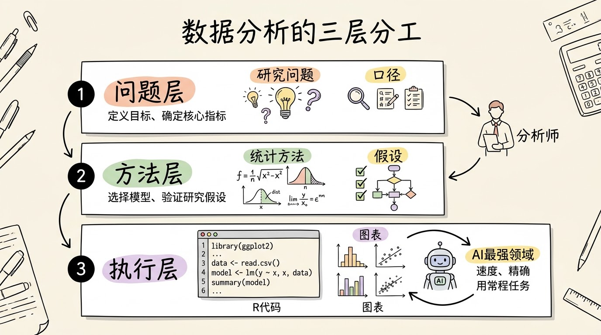
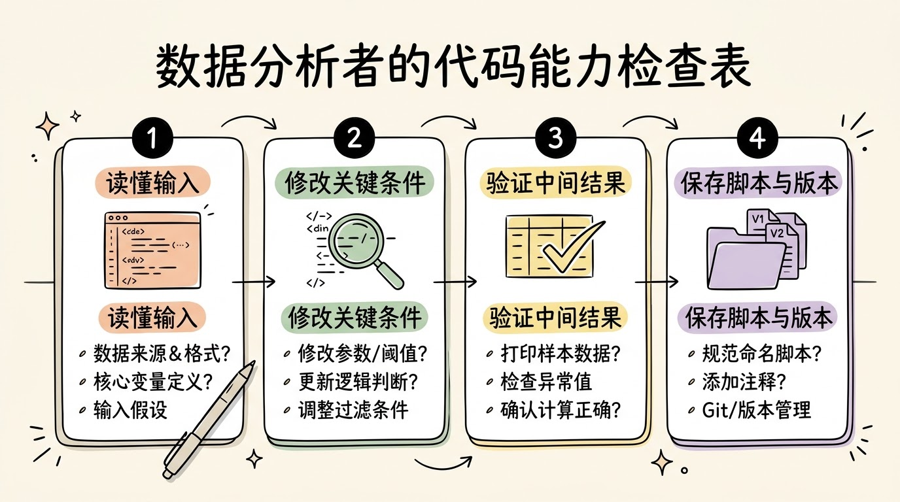
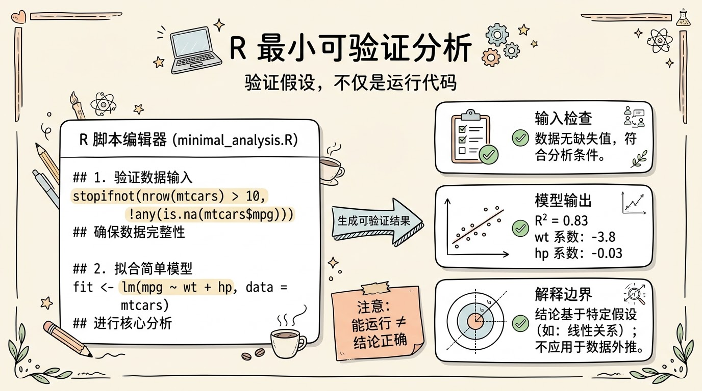
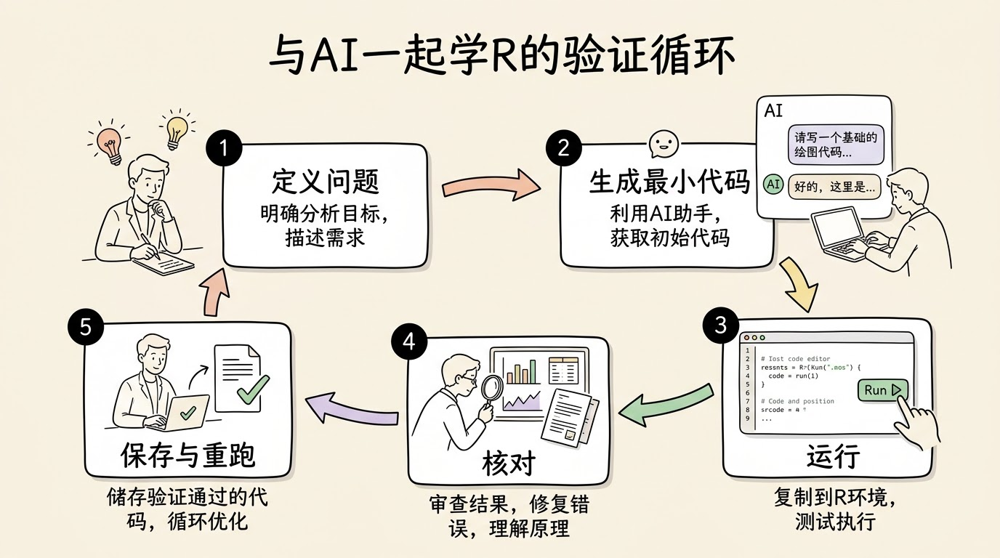
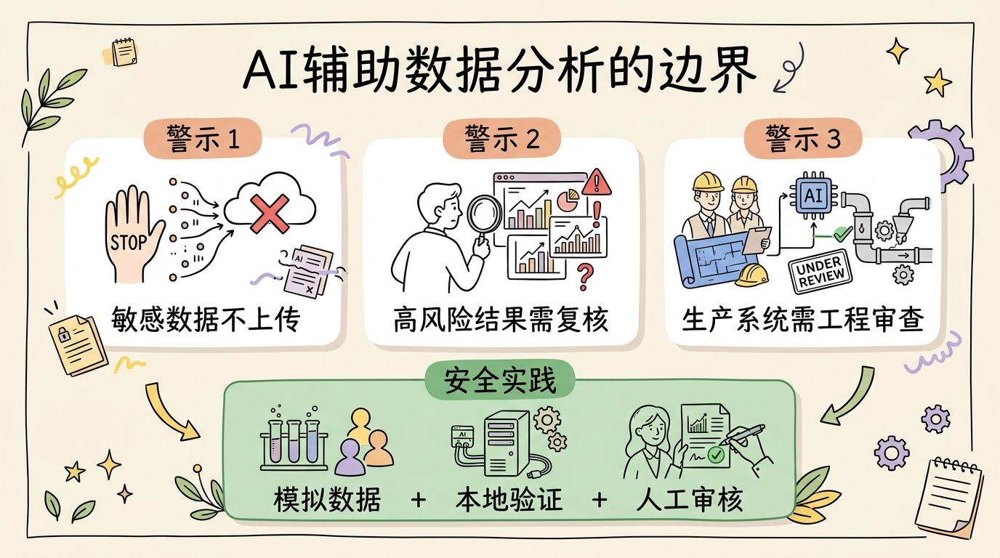

## 先给结论：不必从背语法开始

今天打开一个 AI 工具，用自然语言描述“读取表格、清理缺失值、分组统计、画图”，几分钟内就能拿到一段 R 或 Python 代码。那么，初学数据分析，还要从变量、循环和函数一行行学起吗？

**不一定要按传统编程课的顺序开始，但不能跳过“理解与验证”这一层。**


这里的区别很重要。过去的入门路径常是“先学语法，再做项目”；更适合当下的路径可以是“先用一个真问题启动，让 AI 帮忙生成最小代码，然后逐行查证”。

**编程不再只是“从空白页写出代码”**。它还包括把分析问题译成明确指令，看懂关键步骤，发现输入与输出的异常，以及保留一份别人能重新运行的记录。

---

## AI 能代写语句，不能替你决定口径

一个分析任务至少有三层。

- **问题层**：究竟想回答什么？观察单位是人、事件还是人年？
- **方法层**：指标如何定义，缺失怎么处理，应该比较哪些组？
- **执行层**：如何读取文件、转换变量、拟合模型并输出图表？



AI 当前最容易接手的是执行层。它可以生成数据清理语句，说明一个函数的参数，把重复步骤包成函数，还能根据错误信息提供调试方向。这些工作不需要分析者默写每个函数名。

但是，“按性别计算率”这句话还不是可执行的研究定义。分子是新发病例数还是现患人数？分母是年中人口还是人年？是粗率、年龄别率，还是标化率？同一个自然语言要求，可以对应多种合法代码，却只有其中一种符合当前数据口径。

**如果问题没有定义清楚，AI 只会更快地完成一个含糊的分析。**

## 为什么还要学会读代码

UC Berkeley 的 Data 8 入门课程把推断思维、计算思维和真实问题放在一起，同时教授编程与统计推断。ACM 的数据科学计算能力框架也把编程列为组成部分。这些资料成形于不同时期，它们不能直接规定 AI 时代的学习顺序，但指向同一件事：数据分析从来不是单纯点击软件得到答案。

2026 年一项有 52 名主要为初级软件工程师参与的随机试验，让参与者学习新的 Python 库。使用 AI 的一组，随后理解测试的平均成绩低了 **17%**。研究者同时观察到，把 AI 用来追问解释、建立理解的参与者，学得更好。


这个数字不应被扩大解读。试验的样本不大，测量的是短期理解，任务也不是医学数据分析；研究还来自 AI 供应商。它能支持的较窄结论是：**当学习目标是形成理解时，只让 AI 交付成品代码，可能不够。**

NIST 将生成式 AI 自信地给出错误或虚假内容的现象称为“虚构”（confabulation），并提醒这类风险在需要高度上下文和领域专业知识的场景中更值得监测。对分析代码而言，输出能运行，只能证明没有立即报错；它不保证变量选对了、分母用对了、统计方法适合，更不保证解释成立。

---

## 把“会编程”改成一个可检查的目标

与其问“要不要学 R”，不如问得更具体：面对 AI 生成的一段 R 代码，能否完成下列动作？

1. 说清每个输入文件和关键变量的含义。
2. 看出代码在筛选哪些记录、如何处理缺失值。
3. 修改一个变量名、分组条件或模型公式，并知道结果会怎样变。
4. 为行数、唯一性、缺失和取值范围加检查。
5. 说出结果能支持什么，又不能推出什么。
6. 保存脚本、软件版本、运行记录和输出文件。



能做到这些，已经比默写函数名更接近真实的分析能力。对日常分析者，目标可以先定在“读得懂、改得动、验得出”；需要开发 R 包、构建大型流水线或维护生产系统时，再继续补齐测试、性能、接口设计和软件工程。

## 一个只有几行的 R 练习

下面的代码使用 R 4.5.2 和内置数据 `mtcars`，不需要安装扩展包。它的目的不是教会线性回归，而是演示一个小而完整的检查回路。代码注释中列出了本机实测的预期输出。

```r
# 环境：R 4.5.2；输入：内置 mtcars（32 行）
vars <- c("mpg", "wt", "hp")

stopifnot(nrow(mtcars) == 32)
stopifnot(all(vars %in% names(mtcars)))
sum(is.na(mtcars[vars]))
# [1] 0

fit <- lm(mpg ~ wt + hp, data = mtcars)
round(coef(fit), 3)
# (Intercept)          wt          hp
#      37.227      -3.878      -0.032

nobs(fit)
# [1] 32

round(summary(fit)$r.squared, 3)
# [1] 0.827
```



这段代码已在干净的本机会话中实际运行。`stopifnot()` 没有输出，表示行数和变量名检查通过；三个变量中没有缺失值。回归使用了 32 条记录。

但还不能停在“成功跑出 0.827”。需要继续问：`mpg`、`wt` 和 `hp` 各是什么单位？线性关系假设是否合理？是否检查残差和异常值？样本来源允许把结果推到哪些车辆？

**R² 较高不等于模型正确，系数也不能直接解释为因果效应。** `mtcars` 只是教学数据，这个例子不用于医学决策。

---

## 与 AI 一起学 R，可以按这个顺序

先选一个小任务。例如：“检查一张模拟登记表的重复 ID、缺失值和诊断日期范围，只输出汇总，不改动原数据。”把输入字段、规则口径和期望输出写清楚，再让 AI 生成最短的可运行代码。

不要让它一次交付几百行“完整系统”。小步骤才容易看清中间结果。要求 AI 为每个关键动作解释“输入是什么、这行改了什么、如何证明它没有误删记录”。



运行后不只看最后一张图。查行数、列名、缺失数、唯一值和极值；选几条记录手工核对；为关键规则写一个 `stopifnot()` 或测试。如果不能解释某行代码，先让 AI 拆成更小的步骤，而不是直接信任结果。

任务完成后，**保存 `.R` 脚本、原始输入的只读副本或哈希、生成的输出、`sessionInfo()` 和必要的提示词记录。** 下一次从空白会话重跑，这比“当时在聊天窗口里得到过一个答案”可靠得多。

## 哪些情况不适合“边问 AI 边学”

涉及真实病例、可识别个人信息或未公开研究数据时，不应把数据直接粘贴到未经机构批准的公共 AI 服务。可以使用模拟数据说明字段和规则，或在合规环境中运行工具。

需要生产部署、处理大规模敏感数据、构建复杂包或处理严格审计的分析时，只具备“能让 AI 写出代码”的能力还不够。需要系统学习语言、调试、测试、版本控制、权限与数据治理，并由具备相应责任的人审核。



还有一个容易被忽略的边界：不要把某个效率研究推广到所有人。2025 年 METR 对 16 名资深开源开发者和 246 项真实任务做了随机试验，在那个特定设置下，允许使用早期 2025 AI 工具后，完成时间增加了 19%。这不能推出“AI 一定让人变慢”；它提醒我们，**主观上觉得更快，不代表总用时和错误率真的下降。**

> AI 把“写出第一版代码”变得很便宜；数据分析者的重心，应该随之移到问题定义、代码审核和结果边界。

所以，回到标题的问题：还要学写代码吗？要学，但入口可以换了。不用等到语法全部学完才碰数据；从一个真实、小而可验证的问题开始，让 AI 写初稿，自己负责读、改、验、存。这条路绕过了无目的的背诵，没有绕过对分析结果的责任。

## 参考来源

1. UC Berkeley, Data 8: Foundations of Data Science: https://data8.org/
2. ACM Data Science Task Force, *Computing Competencies for Undergraduate Data Science Curricula*: https://dstf.acm.org/DSReportInitialFull.pdf
3. Anthropic Research, *How AI assistance impacts the formation of coding skills*, 2026-01-29: https://www.anthropic.com/research/AI-assistance-coding-skills
4. METR, *Measuring the Impact of Early-2025 AI on Experienced Open-Source Developer Productivity*, 2025-07: https://metr.org/Early_2025_AI_Experienced_OS_Devs_Study-paper.pdf
5. NIST, *Artificial Intelligence Risk Management Framework: Generative Artificial Intelligence Profile*, NIST AI 600-1: https://nvlpubs.nist.gov/nistpubs/ai/NIST.AI.600-1.pdf
6. Anthropic Research, *Agentic coding and persistent returns to expertise*, 2026-06-16: https://www.anthropic.com/research/claude-code-expertise

本文的 R 示例使用 R 4.5.2 本机运行。文中引用的 AI 研究场景、样本和工具时点并不相同，不宜直接比较效应大小，也不宜外推到所有数据分析任务。
