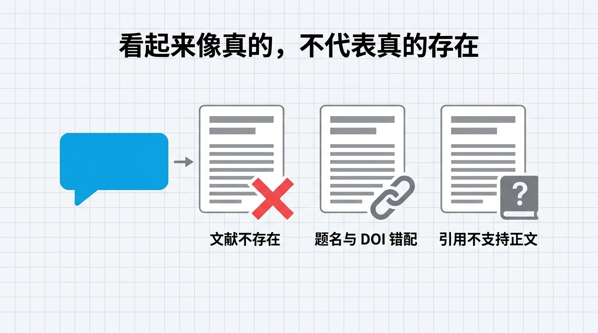
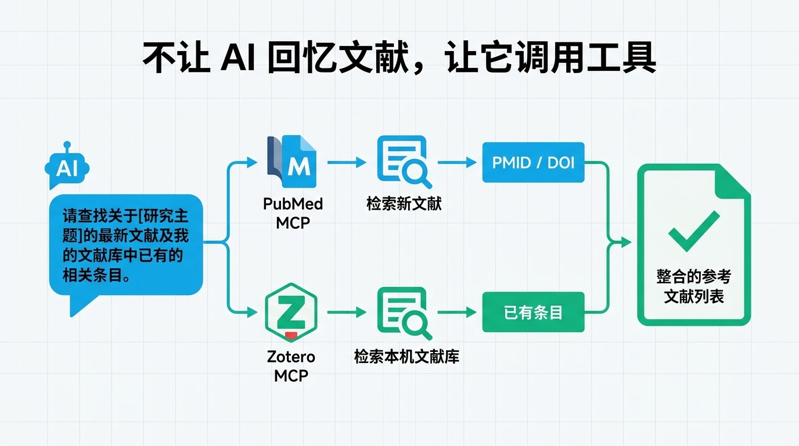
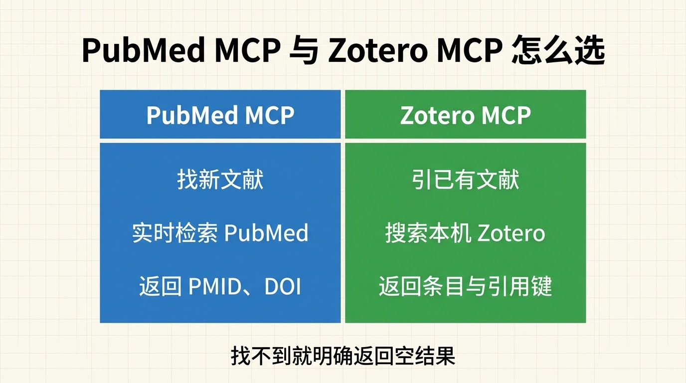
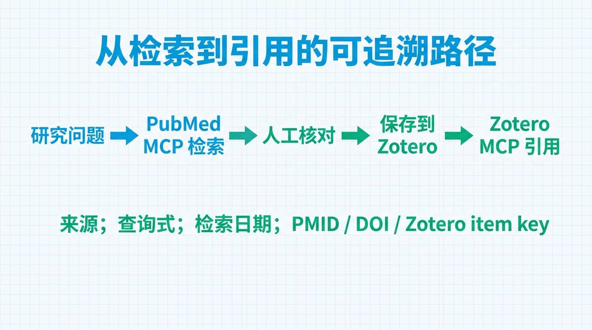
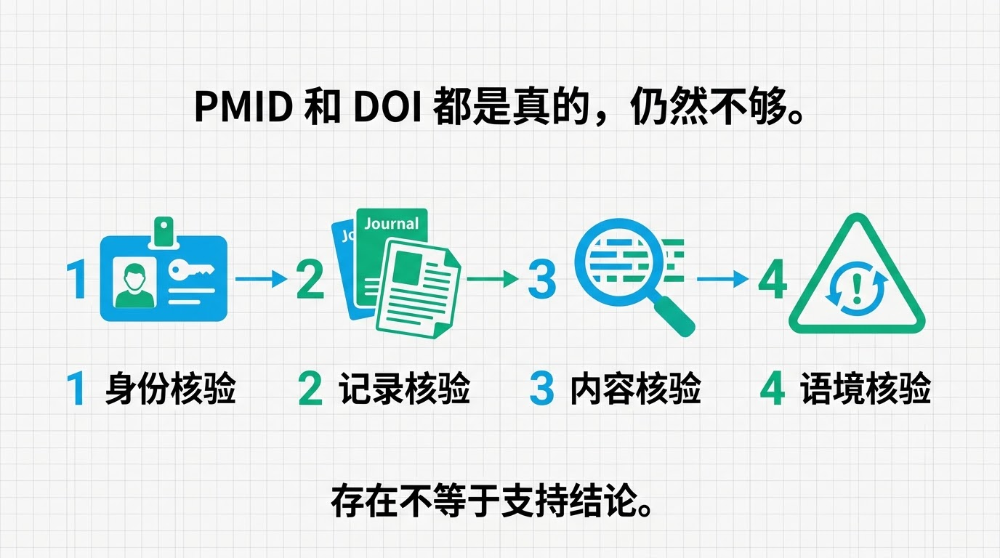
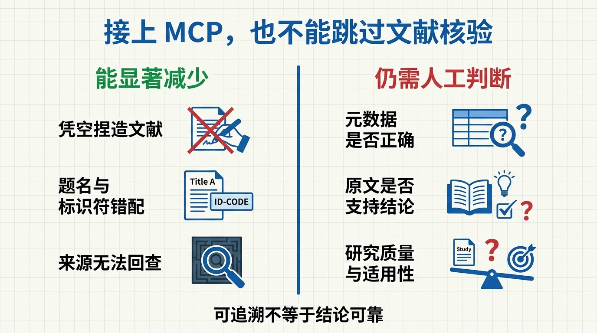

把一段研究背景交给 AI，再补一句“请附上 5 篇参考文献”，很快就能得到格式完整的作者、题名、期刊、年份和 DOI。

麻烦在于：**这些文献看起来像真的，不代表它们真的存在。** 有的题名是模型拼出来的；有的论文确实存在，却被配上了错误作者或 DOI；还有的文献记录完全正确，但原文根本不能支持正文中的判断。



这不是把提示词改成“绝对不要编造”就能彻底解决的问题。更稳妥的办法，是不让模型凭记忆列文献，而是要求它先调用检索工具，再引用工具实际返回的记录。

对医学科研写作，常用的入口可以分成两条：

- 需要寻找新的生物医学文献：用 **PubMed MCP** 实时检索 PubMed；
- 已经在 Zotero 中保存、整理过文献：用 **Zotero MCP** 检索本机文献库。

**一个负责“去外部数据库找”，一个负责“从自己的文献库取”。**

## AI 为什么会捏造参考文献

语言模型的核心任务是预测下一段最可能出现的文字，而不是维护一张经过核验的书目数据库。只要作者名、题名、期刊和 DOI 在语言形式上足够协调，模型就可能把它们组合成一条非常像真的引文。

2023 年一项针对当时 GPT-3.5 和 GPT-4 的研究发现，模型生成的引文中既有完全虚构的记录，也有真实文献被配错题名、作者或 DOI 的情况（PMID: 37679503）。另一项同期研究也报告了类似问题（PMID: 37337480）。

这些比例来自特定模型、特定时间和特定任务，不能直接当作今天所有 AI 系统的固定错误率。真正值得保留的结论是：**只要回答没有连接可查询的数据源，格式再完整，也不能替代文献核验。**

常见错误至少有三层：

1. **文献不存在**：题名、作者和 DOI 都是生成的；
2. **记录对不上**：论文存在，但题名、作者、年份、期刊或标识符互相错配；
3. **引用不支持正文**：记录是真的，论文却没有研究正文声称的问题。

前两层可以依靠 PubMed 或 Zotero 的真实记录大幅减少。第三层仍然需要阅读摘要或全文。

## 不让 AI“回忆文献”，让它调用工具

MCP（Model Context Protocol，模型上下文协议）可以把搜索数据库、读取记录等能力暴露成 AI 能调用的工具。模型不再直接回答“我记得有哪些论文”，而是先执行搜索，再根据返回结果组织文字。



这两条路径适用的任务不同。

| 写作任务 | 更合适的入口 | 文献从哪里来 | 主要标识 |
|---|---|---|---|
| 围绕新问题查找生物医学研究 | PubMed MCP | PubMed 实时检索结果 | PMID、DOI |
| 引用自己已经收集和筛选的文献 | Zotero MCP | 本机 Zotero 文献库 | Zotero item key、citation key、DOI |
| 先检索新文献，再形成长期资料库 | 两者串联 | PubMed 检索后人工筛选，再保存到 Zotero | PMID、DOI、Zotero item key |

MCP 只是连接层。PubMed 的记录仍来自 NCBI，Zotero 的记录仍来自你的本地库。**接上 MCP 不等于数据自动正确，更不等于研究结论自动成立。**

## 路径一：用 PubMed MCP 找新文献

PubMed MCP 适合这样的要求：

> 检索近 5 年有关“大语言模型生成医学参考文献准确性”的研究，返回查询式、PMID、DOI、题名和摘要能支持的结论。未检索到的内容不要补写。

其底层通常调用 NCBI E-utilities。最简流程是：

1. `ESearch` 根据主题词、DOI 或字段查询找到 PMID；
2. `EFetch` 或 `ESummary` 根据 PMID 取回正式记录；
3. MCP server 把结构化结果交给 AI；
4. AI 只能从这些结果中选择和归纳。



例如，把 DOI `10.1038/s41598-023-41032-5` 交给 PubMed 搜索接口：

```bash
curl -G 'https://eutils.ncbi.nlm.nih.gov/entrez/eutils/esearch.fcgi' \
  --data-urlencode 'db=pubmed' \
  --data-urlencode 'term=10.1038/s41598-023-41032-5[DOI]' \
  --data-urlencode 'retmode=json' \
  --data-urlencode 'tool=puai_xinsheng_demo' \
  --data-urlencode 'email=you@example.com'
```

预期输出中应出现：

```json
{
  "esearchresult": {
    "count": "1",
    "idlist": ["37679503"]
  }
}
```

再用 PMID `37679503` 获取记录，可以核到：

- 题名：*Fabrication and errors in the bibliographic citations generated by ChatGPT*
- PMID：37679503
- DOI：10.1038/s41598-023-41032-5
- PMCID：PMC10484980

这一步把“像一篇论文”变成了“PubMed 中确有这条记录”。

PubMed MCP 多为社区项目，不等于 NCBI 官方产品。使用前应检查代码来源、维护状态、实际暴露的工具、返回是否截断，以及 NCBI API key 和邮箱怎样保存。NCBI 还要求控制程序化请求频率：无 API key 时通常不超过每秒 3 次；使用 key 后默认可提高到每秒 10 次。

## 路径二：用 Zotero MCP 引用本机文献

如果需要引用的论文已经保存在 Zotero 中，再去全网重新搜索未必是最佳路线。Zotero MCP 可以把“搜索本机文献库、读取条目元数据、导出引用”等操作交给 AI 调用。

Zotero 官方提供 Local API。近期版本的 Zotero Desktop 可以在 `localhost:23119/api/` 暴露本地文献库；启用“允许本机其他应用与 Zotero 通信”后，程序可在不读取 SQLite 文件的情况下搜索条目。官方文档说明，本地读取可以离线工作，也没有 Web API 的请求频率限制。

本文核验环境为 Zotero 10.0.1，Local API 与 Connector 均返回正常状态。不同版本和不同 Zotero MCP 项目提供的工具名称会有差异，常见能力包括：

- 搜索题名、作者、标签或集合；
- 读取题名、作者、年份、期刊、DOI 等元数据；
- 返回 Zotero item key 或导出的 citation key；
- 部分实现可以生成 CSL 格式引文、读取笔记或已索引全文。

一个社区实现的本机模式配置可能类似：

```json
{
  "mcpServers": {
    "zotero": {
      "command": "npx",
      "args": ["-y", "zotero-mcp"],
      "env": {
        "ZOTERO_LOCAL": "true"
      }
    }
  }
}
```

这是特定社区项目的配置示例，不是 Zotero 官方统一格式。实际使用时应固定经过审查的版本，先以只读方式连接，再决定是否开放写入权限。

更重要的规则是：**只允许引用 Zotero 搜索实际返回的条目**。可以这样要求 AI：

> 只检索本机 Zotero 文献库。每条引用必须返回 Zotero item key、题名、作者、年份和 DOI；没有 DOI 就明确留空。若库中没有匹配条目，直接回答“本机 Zotero 未找到”，不要根据记忆补充文献。正文结论必须标记来自元数据、摘要还是全文。

在本次核验中，用前述论文的完整题名搜索本机 Zotero，返回结果为空。正确行为不是生成一条相似引文，而是明确告诉用户：**这篇论文尚不在本机库中，需要改用 PubMed 检索，或经人工确认后再保存到 Zotero。**

## 两条路径怎样配合



如果只写一篇短文，两条路径可以二选一：

- 需要发现新文献，用 PubMed MCP；
- 只引用已经筛选过的材料，用 Zotero MCP。

对于需要长期维护的研究主题，更稳的做法是串联：

```text
研究问题
  ↓
PubMed MCP 检索候选文献
  ↓
人工核对题名、PMID、DOI、摘要与纳入理由
  ↓
将确认后的文献保存到 Zotero 指定集合
  ↓
Zotero MCP 从本机库检索、引用和生成参考文献表
```

这里不能省略“人工核对后再保存”。如果把 PubMed 搜到的所有结果自动塞进 Zotero，只是把筛选问题从一个工具搬到了另一个工具。

无论走哪条路径，都建议让 AI 返回同一组审计字段：

```json
{
  "source": "pubmed | zotero",
  "query": "实际查询式",
  "retrieved_at": "YYYY-MM-DD",
  "records": [
    {
      "pmid": null,
      "doi": null,
      "zotero_item_key": null,
      "citation_key": null,
      "title": "",
      "supports": [],
      "does_not_support": []
    }
  ]
}
```

`source` 和标识符让人知道记录从哪里取得；`does_not_support` 则提醒模型，不要把论文没有回答的问题塞进引用。

## 有真实记录，仍要做四道核验



PubMed MCP 和 Zotero MCP 能减少“凭空造一篇论文”的机会，但“这样就不会有虚假参考文献”仍然说得太满。至少还要检查四件事：

1. **身份核验**：PMID、DOI 或 Zotero item key 是否真实存在；
2. **记录核验**：题名、作者、年份、期刊和标识符是否属于同一篇文章；
3. **内容核验**：摘要或全文是否真的支持正文中的结论；
4. **语境核验**：研究设计是否适用，是否存在更正、撤稿或更新版本。

Zotero 中的条目也可能来自抓取不完整的网页、手工录入或旧版元数据；重复条目、缺失 DOI 和错误题名并不会因为它被保存在本地就自动消失。PubMed 收录同样不代表研究质量已经得到保证。

**工具解决的是来源可追溯，研究者仍要判断证据是否可靠、是否适用。**

## 一份可以直接交给 AI 的约束



> 你可以使用 PubMed MCP 或 Zotero MCP，但禁止凭模型记忆生成参考文献。查找新文献时使用 PubMed，并返回完整查询式、检索日期、PMID 和 DOI；引用已有资料时先搜索本机 Zotero，并返回 Zotero item key 或 citation key。任何工具未返回的标识符都必须留空，不得猜测。每条结论说明来自题名、摘要还是全文；仅凭摘要不足以判断时，要明确写出。最终输出前核对题名、作者、年份、期刊和标识符是否对应同一条记录。

这份约束不能替代阅读论文，却能改变错误发生的位置：模型不再被允许“想出一篇文献”，而必须展示它从 PubMed 或 Zotero 取到了什么。

## 参考资料

1. NCBI. [APIs](https://www.ncbi.nlm.nih.gov/home/develop/api/).
2. NCBI Bookshelf. [The E-utilities In-Depth](https://www.ncbi.nlm.nih.gov/books/NBK25499/)；[E-utilities Reference Guide](https://www.ncbi.nlm.nih.gov/books/NBK25501/).
3. PubMed. [User Guide](https://pubmed.ncbi.nlm.nih.gov/help/).
4. Zotero. [Local API](https://www.zotero.org/support/dev/web_api/v3/local_api).
5. Model Context Protocol. [Tools specification](https://modelcontextprotocol.io/specification/2025-06-18/server/tools).
6. Walters WH, Wilder EI. [Fabrication and errors in the bibliographic citations generated by ChatGPT](https://pubmed.ncbi.nlm.nih.gov/37679503/). *Scientific Reports*. 2023. PMID: 37679503. DOI: 10.1038/s41598-023-41032-5.
7. Bhattacharyya M, et al. [High Rates of Fabricated and Inaccurate References in ChatGPT-Generated Medical Content](https://pubmed.ncbi.nlm.nih.gov/37337480/). *Cureus*. 2023. PMID: 37337480. DOI: 10.7759/cureus.39238.
8. Augmented-Nature. [PubMed MCP Server](https://github.com/Augmented-Nature/PubMed-MCP-Server)（社区项目示例，非 NCBI 官方产品）。
9. isezen. [zotero-mcp](https://github.com/isezen/zotero-mcp)（社区项目示例，非 Zotero 官方产品）。
