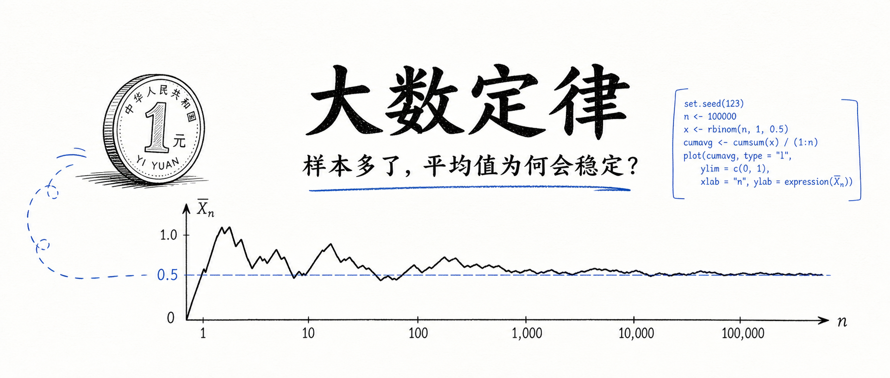
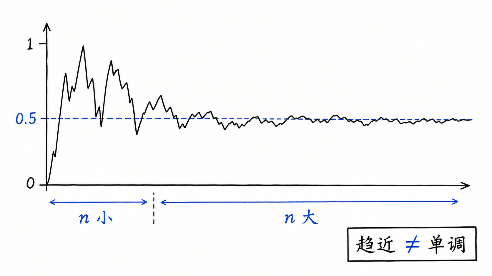
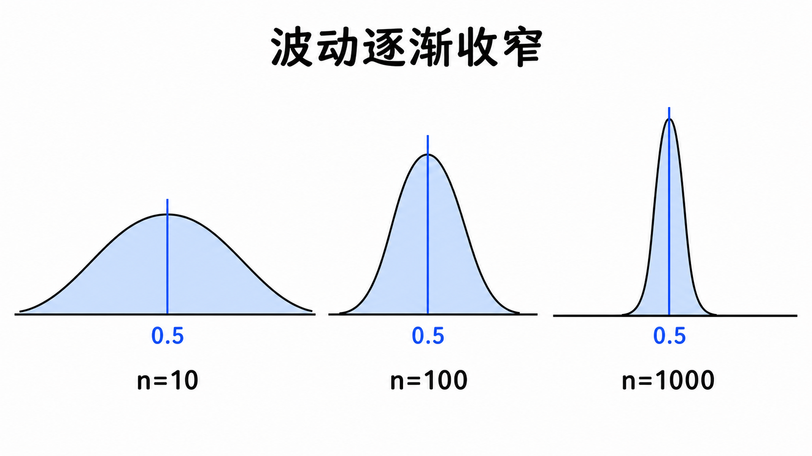
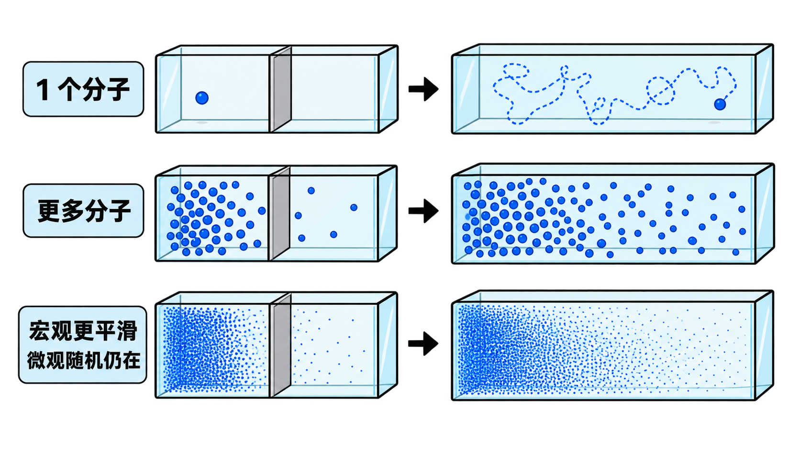
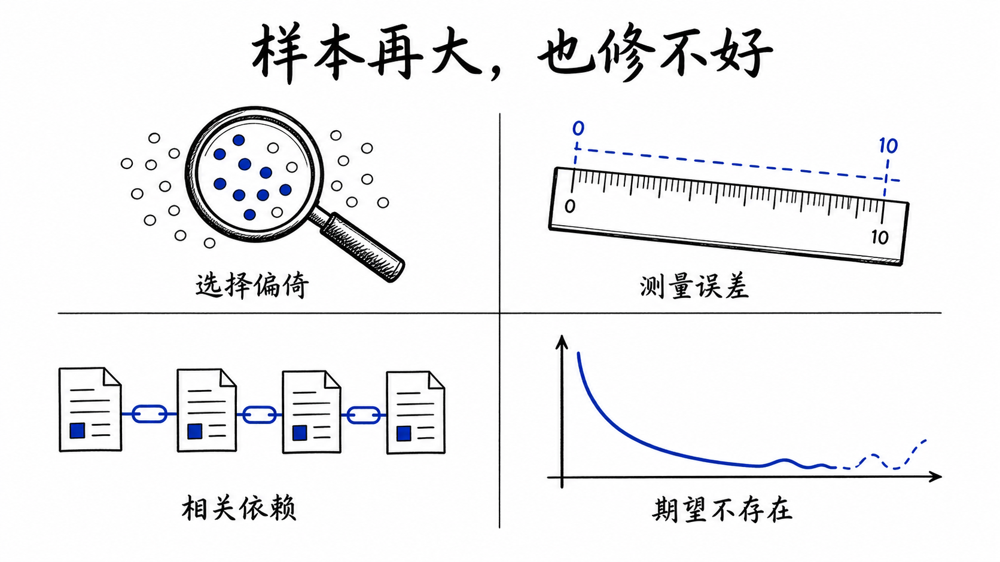
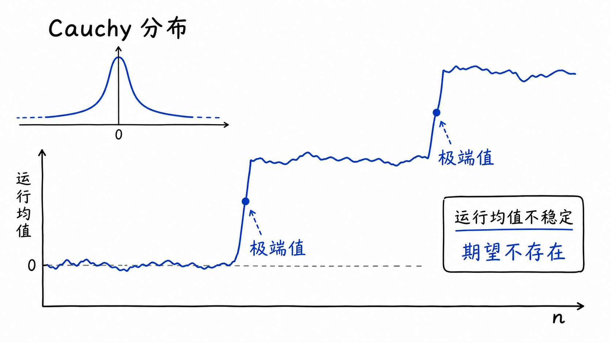
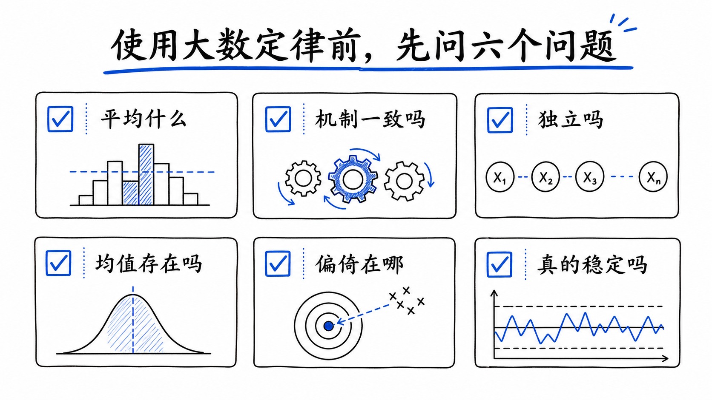

## 先认识大数定律

大数定律（Law of Large Numbers，LLN）是概率论中解释“随机为何能产生稳定”的基本定律。单次观测可能难以预测，但把许多观测汇总起来，平均结果往往会显现出稳定方向。

以一枚公平硬币为例。每次投掷仍然可能是正面或反面，无法事先确定；投掷次数足够多时，正面所占比例通常会靠近 0.5。公平六面骰子也一样：单次点数仍在 1—6 之间跳动，多次点数的平均值则趋向 3.5。

经典版本通常从这样一组条件出发：

- X₁、X₂、……、Xₙ 来自同一种概率分布；
- 各次观测相互独立；
- 每个观测的期望值 μ 存在且有限。

前 n 次观测的样本均值可以写成：

> 样本均值 X̄ₙ =（X₁ + X₂ + …… + Xₙ）÷ n

大数定律的核心结论是：

> 当 n 持续增大时，样本均值 X̄ₙ → 期望值 μ

这里的箭头表示“逐渐趋近”，不表示有限样本的结果已经等于期望值，也不表示误差会一步接一步地缩小。

“趋近”有不同的严格表达。**弱大数定律**通常说，对任意给定误差范围，样本均值跑到范围外的概率趋近于 0；**强大数定律**则用“几乎必然收敛”描述整条无限序列的长期行为。两者的数学表述不同，日常数据分析最需要抓住的共同核心是：

**在条件成立时，很多随机观测的平均能够抵消一部分方向不定的波动，使总体规律逐渐显现。**



## 一段 R 实测：趋近不等于单调

下面是在 R 4.5.2 中实际运行的结果。模拟一枚正面概率为 0.5 的硬币，记录同一条序列的累计正面比例：

```r
set.seed(20260827)

n <- 10000
x <- rbinom(n, size = 1, prob = 0.5)
checkpoints <- c(10, 100, 1000, 10000)

data.frame(
  n = checkpoints,
  heads = cumsum(x)[checkpoints],
  proportion = round(cumsum(x)[checkpoints] / checkpoints, 4)
)
```

```text
    n heads proportion
   10     4     0.4000
  100    38     0.3800
 1000   465     0.4650
10000  4987     0.4987
```

从 10 次到 100 次，正面比例由 0.4000 变为 0.3800，离理论值 0.5 更远；继续增加到 10000 次，它才来到 0.4987。

**大数定律说的是长期的收敛趋势，不是样本量每增加一次，误差就必须单调缩小。**



大数定律管理的是**聚合后的平均行为**，并没有取消单次观测的随机性。

## “更稳定”可以有多直观

只看一条模拟路径，容易把偶然的平滑或反复当成规律。于是再做 10000 次独立实验，每次分别掷 10、100、1000 次硬币，观察每次实验的正面比例。

```r
set.seed(20260827)

B <- 10000
for (n in c(10, 100, 1000)) {
  p_hat <- rowMeans(
    matrix(rbinom(B * n, 1, 0.5), nrow = B)
  )

  cat(
    n,
    round(sd(p_hat), 4),
    round(mean(abs(p_hat - 0.5) <= 0.1), 4),
    "\n"
  )
}
```

实测结果如下：

| 每次实验的样本量 | 正面比例的标准差 | 落在 0.4—0.6 内的实验比例 |
|---:|---:|---:|
| 10 | 0.1580 | 0.6519 |
| 100 | 0.0502 | 0.9654 |
| 1000 | 0.0160 | 1.0000* |

\* 按四位小数显示；它不是对所有未来实验“绝不越界”的保证。



样本量增加 10 倍，正面比例在重复实验间的标准差大约缩小到原来的 1／√10，也就是约 31.6%。这里既能看到大数定律的稳定趋势，也能看到有限样本仍然有波动。

**单次路径回答“这一次走到了哪里”，重复实验的分布回答“这种波动通常有多大”。**

这也提醒我们不要把大数定律和中心极限定理混在一起。大数定律主要回答“样本均值会走向哪里”；中心极限定理进一步描述经过适当标准化后，样本均值的分布在什么条件下近似正态。一个讲位置趋向，一个讲波动形状和尺度。

## 从分子扩散看“微观随机，宏观稳定”

用户提供的参考材料采用了一个很有画面感的例子：隔板一侧放有溶质分子，移开隔板后，分子逐渐扩散到整个容器。

- 只有一个分子时，轨迹看起来十分随机；
- 分子增多后，局部仍有起伏，但从高浓度区向低浓度区铺开的趋势更清楚；
- 分子数量极大时，相对波动很小，宏观浓度变化看起来平滑而稳定。



这个图景适合帮助理解：**许多随机个体叠加后，聚合量可以呈现稳定规律。** 但边界也要说清楚。**随机性并没有从微观层面消失；完整的扩散方程还依赖粒子运动、空间结构和物理假设，不能只凭一句“大数定律”推导出来。**

## 大样本修不好这四类问题

“样本越多越接近期望”常被简化成“数据越多，结论越正确”。后一句危险得多，因为大数定律不会自动清理数据生产过程中的系统问题。



### 1. 选择偏倚

如果样本始终来自一个不能代表目标人群的渠道，增加样本只会让我们更精确地估计这个偏倚样本的平均值。肿瘤登记资料若存在稳定的漏报机制，病例数增加并不会自动让漏报消失。

### 2. 测量误差与口径漂移

仪器系统性偏高、编码规则前后改变、字段含义被不同机构理解为不同概念，都会让平均值稳定在错误目标附近。此时最需要的是校准、质控和统一定义。

### 3. 观测并非可交换或相互独立

同一患者的重复记录、同一家机构内高度相关的病例、时间序列中的连续观测，都可能具有依赖性。某些依赖过程也有相应的大数定律，但不能把独立同分布版本原样套用。

### 4. 期望本身不存在

标准 Cauchy 分布是一个经典反例。它有对称的钟形外观，却没有有限期望。下面的一次模拟中，运行均值先接近 0，后来又被极端值拉到 -1.5702：

```text
    n running_mean
   10       0.9095
  100       0.7867
 1000       0.0216
10000      -1.5702
```



这条模拟路径不是数学证明；真正的原因是 Cauchy 分布的期望不存在，因此不能套用“独立同分布且有限均值”的经典结论。

**样本量减少的是某些随机误差，不会自动消除偏倚，也不会替我们检查定理条件。**

## 分析数据前，先问六个问题

没有一个普适的“样本量超过 30 就够大”。尾部分布、依赖强度、目标精度和研究设计不同，所需样本量也不同。与其背一个神奇阈值，不如在分析前逐项检查：



1. **平均的是什么？** 明确随机变量、目标人群和期望量。
2. **观测来自同一机制吗？** 检查纳入标准、时间变化与数据口径。
3. **独立性是否合理？** 识别聚类、重复测量和时间相关。
4. **均值是否存在且有意义？** 对重尾数据查看分布、极端值和稳健统计量。
5. **偏倚可能来自哪里？** 把随机误差与选择、测量、混杂等系统误差分开。
6. **稳定性是否真的出现？** 画运行均值、做重复抽样，并报告不确定性，而不是只展示最终平均值。

R 或 Python 都可以完成这些检查。工具的价值不在于替我们“调用一个大数定律函数”，而在于让假设、模拟、图形和结果可复核。

大数定律最值得记住的，不是“数据越多越好”，而是一个带条件的判断：

**当观测机制合适、期望存在、依赖结构得到处理时，更多信息可以压低平均值中的随机波动；条件不成立时，再大的样本也可能只是更稳定地回答了错误的问题。**

### 参考资料

1. MIT OpenCourseWare, *Introduction to Probability and Statistics*  
   https://ocw.mit.edu/courses/18-05-introduction-to-probability-and-statistics-spring-2022/mit18_05_s22_probability.pdf
2. Encyclopedia of Mathematics, *Law of large numbers*  
   https://encyclopediaofmath.org/wiki/Law_of_large_numbers
3. Wikipedia, *Law of large numbers*  
   https://en.wikipedia.org/wiki/Law_of_large_numbers
4. Statistics Globe, *Law of Large Numbers*  
   https://statisticsglobe.com/law-of-large-numbers
5. R Core Team, `sample()`、`cumsum()` 与 Random Number Generation 文档  
   https://search.r-project.org/R/refmans/base/html/Random.html
