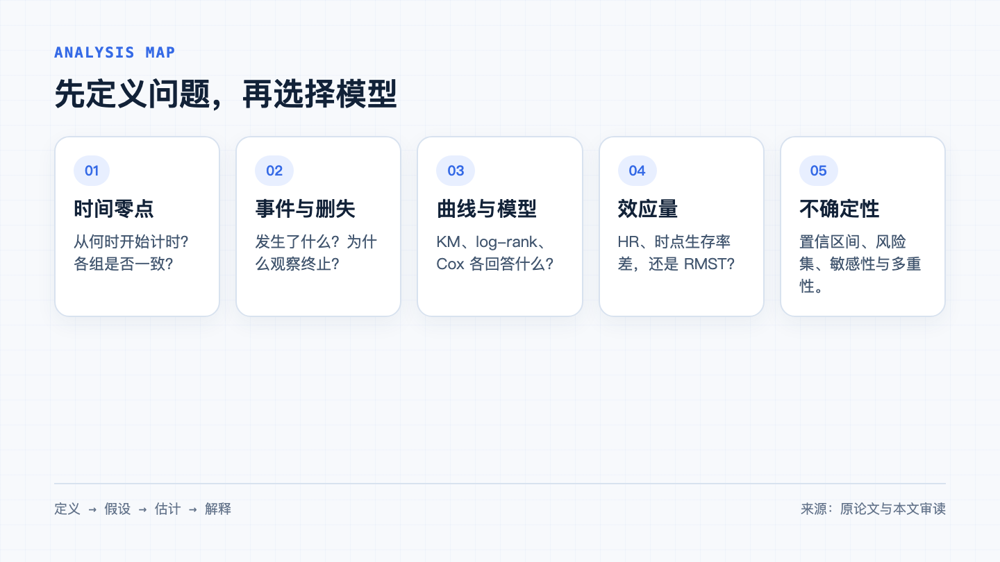
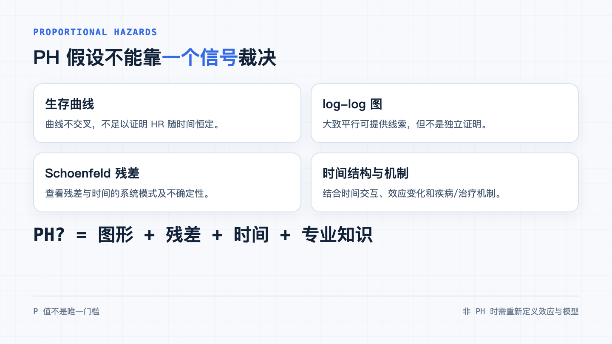
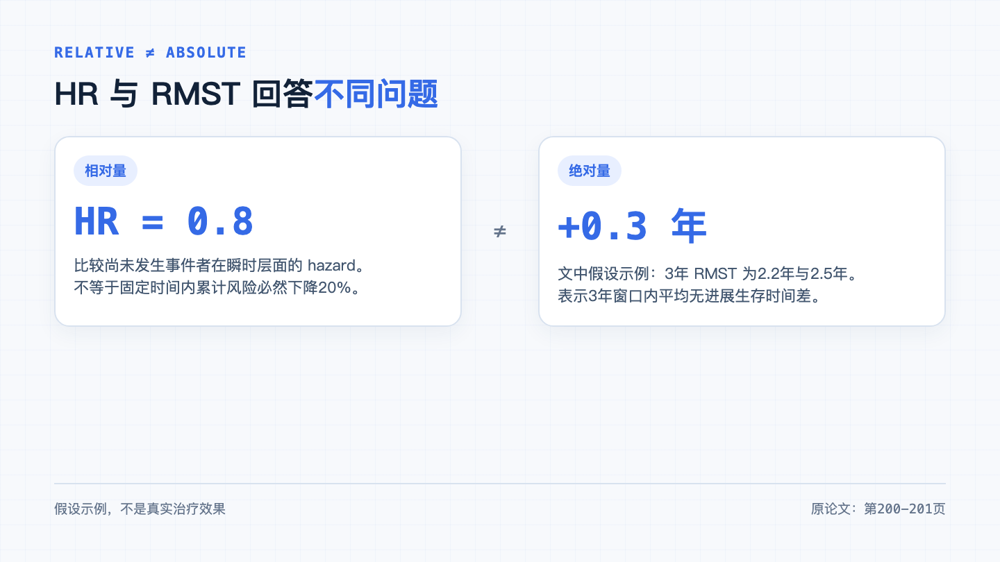
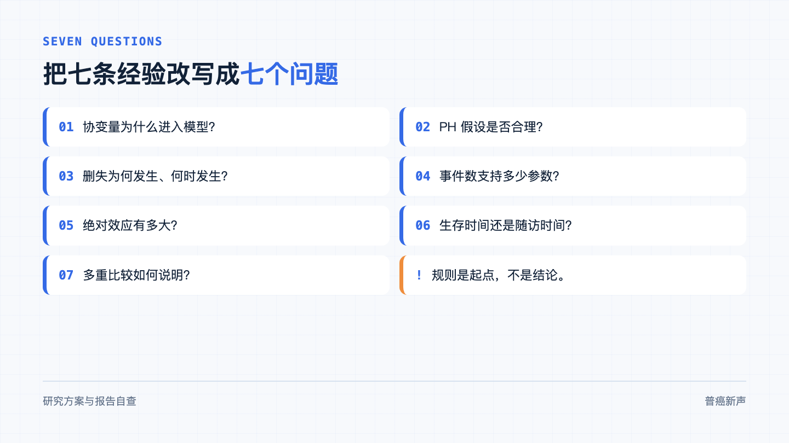

这三个问题都出现在生存分析的日常解读里。吴昊天、刘莉发表于《中华肿瘤杂志》的专题综论《肿瘤临床研究中生存分析的常用方法与误区解读》，把 Kaplan-Meier 法、对数秩检验、Cox 比例风险模型、加速失效时间模型，以及七类常见问题放进了一条完整流程。

文章很适合当入门地图。真正用于研究方案、统计分析计划或论文审稿时，还要把其中几条经验建议再问深一步。

## 先说这篇文章是什么

这是**叙述性方法综述**，不是一项临床试验，也不是系统综述。作者没有报告数据库、检索日期、纳入排除标准或证据质量评价，因此它的主要价值是整理概念、流程和常见错误，不能用来证明某种方法在所有场景中都优于另一种方法。

文章的框架很实用：先定义生存时间、结局事件和删失；再做数据核查、描述分析、单因素分析和多因素分析；随后讨论协变量选择、比例风险假设、删失、事件数、绝对效应、中位时间和多重比较。

把它压缩成一句话：**先明确要估计什么，再决定用什么模型；先检查假设，再解释结果。**

## Kaplan-Meier、log-rank 和 Cox，不是同一道题的三种算法

Kaplan-Meier 曲线描述随时间变化的未调整生存概率，并显示事件发生与删失。对数秩检验回答组间整条生存曲线是否存在统计学差异，却不给出一个具体的组间效应估计。

Cox 比例风险模型可以同时纳入主变量和协变量，给出风险比（hazard ratio，HR）。它依赖一个关键前提：在比例风险（proportional hazards，PH）假设下，协变量对应的 HR 在时间上保持相对稳定。

这三者应组合使用，却不能互相顶替：

- 曲线帮助看差异何时出现、风险集何时变薄；
- log-rank 提供整体差异检验；
- Cox 给出模型条件下的相对效应估计；
- 某时点生存率差或限制平均生存时间（restricted mean survival time，RMST）则回答绝对差异。

同一份数据可以同时报告这些量，因为它们回答的问题不同。

## 误区一：协变量进入模型，只看单因素 P 值

原文明确反对把单因素分析中达到某个 P 值门槛的变量不加思考地塞进多因素模型。这一点非常重要。

但文中随后又建议调整“统计学检验显著”的混杂因素，或优先纳入组间分布存在统计学差异的变量。这里需要更谨慎。

**本文审读判断：** 混杂因素不是由 P 值定义的。变量是否需要调整，应先看研究要回答的因果或预测问题、变量发生的时间顺序、专业知识和预先制定的分析方案。只按单因素 P 值或基线差异筛选，可能漏掉真正的混杂因素，也可能误调中介变量或碰撞变量。

如果目标是因果解释，变量选择应围绕目标效应和因果结构；如果目标是预测，则还要考虑过拟合、验证、校准和泛化能力。两类目标不能用同一套自动筛选规则混在一起。

## 误区二：两条曲线不交叉，就算满足 PH 假设

文章介绍了三类常见检查：观察 Kaplan-Meier 曲线与 log-log 曲线，查看 Schoenfeld 残差，或在模型中加入协变量与时间的交互项。这套组合思路值得保留。

需要修正的是一个过强判断：**生存曲线不交叉，并不足以证明比例风险成立。** 两条曲线可以始终分开，但距离和相对 hazard 仍随时间变化。

PH 假设也不应只靠一个检验的 `P=0.049` 或 `P=0.051` 来裁决。样本很大时，轻微偏离也可能显著；样本较小时，实质性偏离又可能检不出来。更稳妥的做法是把图形、Schoenfeld 残差、时间交互、效应随时间的变化形式，以及疾病与治疗机制放在一起判断。

若 PH 明显不合理，可根据研究问题考虑时间变化效应、分时段 Cox、分层 Cox、AFT、RMST 或其他模型。换模型并不等于假设消失，只是换了一组需要说明的假设。

## 误区三：`P＞0.05` 就是“没有影响”

原文在 AFT 模型一段写到：若 `P＞0.05`，则认为协变量对生存时间无影响。这种表述容易把“没有足够证据拒绝零假设”改写成“已经证明没有效应”。

两者并不相同。`P＞0.05` 可能对应效应很小，也可能来自事件数不足、估计不精确、模型设定不合适或测量误差。结果解读至少还要看效应值、置信区间、研究效能与模型诊断。

准确的写法通常是：当前数据未显示明确关联，估计仍有多大不确定性；而不是直接写“无影响”。

## 误区四：HR 可以直接翻译成累计风险下降

原文用一个假设例子说明：新化疗方案相对传统方案的 `HR=0.8`，并表述为疾病进展风险降低20%。这是一种常见简写，也是一处常见误读。

HR 比较的是：在某一时刻、仍未发生事件者中，两组的**瞬时 hazard** 之比。它不是某个固定时间点的累计风险比，也不能单独告诉我们患者平均多获得了多少无进展时间。若风险不成比例，一个覆盖全程的 HR 更难代表真实变化。

文章紧接着给出 RMST 示例，反而把问题说得更清楚：限制时间为3年，传统方案组 RMST 为2.2年，新方案组为2.5年，差0.3年。这里的解释是：在这3年观察窗口内，新方案组平均无进展生存时间多0.3年。

`HR=0.8` 和“3年 RMST 多0.3年”可以同时为真，但不是同一句话。前者是相对 hazard，后者是指定时间窗内生存曲线下面积的绝对差。报告时把两者并列，读者更容易判断效应的大小和实际含义。

## 误区五：达到10 events per variable，模型就安全

文章引用经典研究，建议 Cox 多变量模型中结局事件数至少约为协变量数量的10倍。这个经验规则可以提醒研究者：模型的信息量更依赖事件数，而不是只看总样本量。

它不是一张通行证。模型稳定性还取决于参数数量，而不仅是变量个数；连续变量的非线性、分类变量的多个水平、交互项、稀疏分组、共线性、变量筛选和缺失数据都会消耗信息。

文中还给出 Schoenfeld 样本量示例：设双侧 `α=0.05`、效能90%、两组等分、目标 `HR=1.5`，需要257个事件；再结合60%的预期事件率和15%的删失率，估计总样本量为504。这个例子说明计算路径，不能把257或504搬到另一项研究中。

真正的问题应是：**当前事件数是否足以支持预先计划的模型复杂度和目标效应估计？**

## 误区六：只要删失率不高，就可以放心

文章强调非信息性删失假设，并举例说明患者因感染、症状恶化或不良反应退出研究时，删失可能与结局过程相关。它还介绍了多重插补和逆概率加权等处理思路。

关键不只是删失占比。少量但高度信息性的删失也可能造成偏倚；删失较多，如果主要发生在研究结束且机制相对可解释，影响又可能不同。还要看删失原因、发生时点、可用协变量、尾部风险集人数和敏感性分析。

因此，文中“删失比例超过70%需谨慎”适合作为提醒，不宜反过来理解成“低于70%就可靠”。

## 误区七：探索性亚组不校正，就不用管多重性

文章正确指出，多组两两比较和亚组分析会增加假阳性风险，并介绍 Bonferroni、Benjamini-Hochberg 与 Holm 方法。

它也提到，探索性亚组分析可以不考虑多重性校正。这句话需要补上边界：探索性分析未必必须采用某一种形式化校正，但多次比较带来的偶然发现仍然存在。

报告时至少应说明亚组是否预先指定、做了多少次比较、是否使用交互检验、效应估计有多不确定，并把事后发现明确标为探索性。未经验证的亚组 P 值，不能写成已经确认的治疗效果差异。

## 中位生存时间和中位随访时间，名字像，含义不同

文章对这组概念的区分很清楚。

中位生存时间来自生存曲线：当估计生存概率降到0.5时，对应的时间是中位生存时间。如果研究结束时事件比例不足以让曲线降到0.5，就不能硬算一个中位生存时间，可改报预先指定时间点的生存率。

中位随访时间回答随访充分性，常用反向 Kaplan-Meier 方法估计：把原本的事件与删失指示反转，再估计“到达随访终点”的时间分布。

一个说结局时间，一个说观察时间。把二者都写成“中位时间”，会让读者无法判断结果是否成熟。

## 怎样把这篇综述真正用起来

不要把七类误区改成七个勾选框。把它们改成七个需要写出答案的问题：

1. 时间零点、事件、竞争事件和删失规则是什么？
2. 目标效应量是 HR、某时点生存率差、RMST 差，还是其他 estimand？
3. Cox 的 PH 假设是否在统计上和专业上都合理？
4. 协变量为什么进入模型，依据是否在看结果前就能说明？
5. 事件数能否支持参数数量、非线性和交互项？
6. 删失为何发生，是否可能与尚未观察到的结局有关？
7. 是否完整报告风险集、不确定性、多重性和敏感性分析？

这篇文章讲清了常用工具和容易漏掉的检查点。它最适合做起点，而不是终点。把方法名称写进论文并不难；真正决定结论能否成立的，是研究问题、数据生成过程、模型假设和结果解释能否对得上。

### 本文审读边界

本文依据用户提供的单篇全文进行审读，没有逐篇复核原论文的30条参考文献，也不声称代表方法学共识。这里讨论的是群体层面的研究方法与证据，不能替代针对个体的诊疗建议。文中的治疗方案与数值均来自原论文的假设示例，不构成治疗效果证据。

### 参考文献

吴昊天，刘莉. 肿瘤临床研究中生存分析的常用方法与误区解读[J]. 中华肿瘤杂志，2026，48(2)：196-202. DOI：[https://​doi.​org/​10.​3760/​cma.​j.​cn112152-20250219-00067](https://doi.org/10.3760/cma.j.cn112152-20250219-00067)
