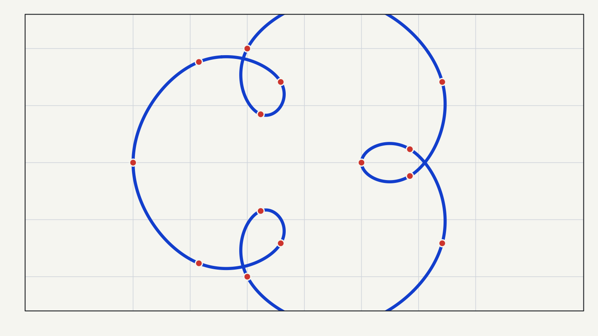
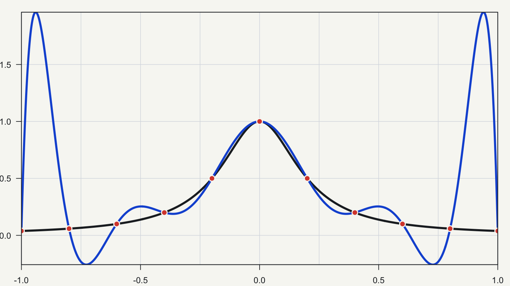
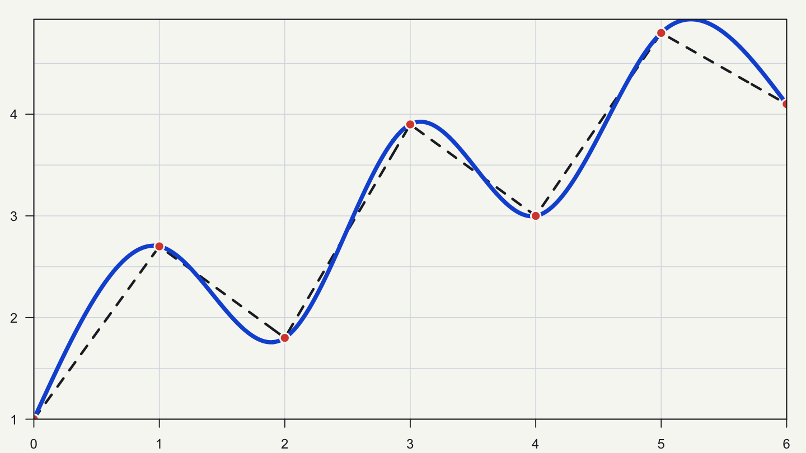
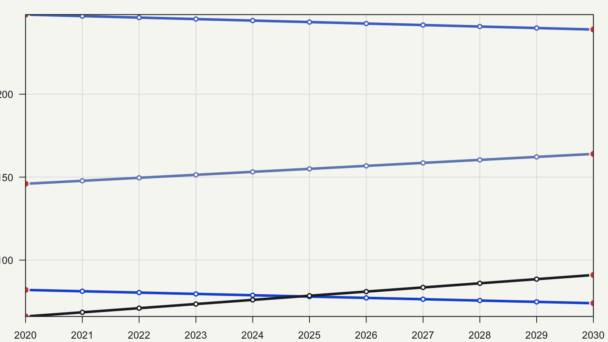
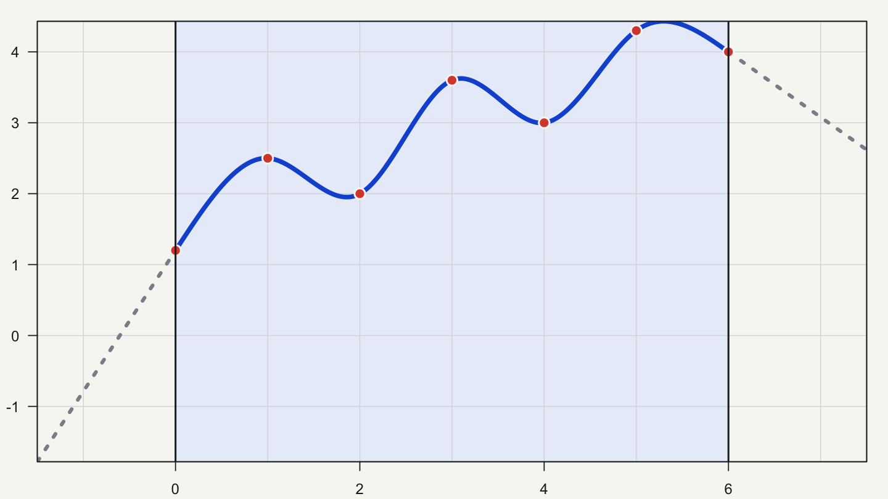

## 插值解决的是什么问题？

假设已经知道若干组坐标`(x, y)`，现在需要估计两个已知`x`之间某个位置对应的`y`。插值法会构造一条经过或接近已知点的函数，再用它计算区间内的新值。

这里有三个容易混淆的概念：

- **插值**估计已知数据范围内的新位置；
- **外推**估计已知范围以外的位置，依赖更强、也更难验证的趋势假设；
- **平滑**允许拟合曲线不经过每个数据点，用于描述总体趋势或降低噪声影响。

插值也不等于通用的缺失值插补。只有当变量存在有意义的顺序或空间位置，并且相邻点之间可以合理连接时，插值才有明确依据。对于由失访、选择偏倚或非随机缺失造成的数据空缺，单纯连接前后两个值并不能处理缺失机制。



## 四类常见插值方法

### 线性插值：用直线连接相邻点

线性插值只使用相邻两个已知点，在两点之间画一条直线。它的假设直观、计算量小，也不容易在点与点之间制造额外波动。代价是连接处通常不够平滑，无法表达明显的弯曲变化。

### 多项式插值：用一条多项式通过所有点

给定互不重复的横坐标，可以构造一条多项式通过所有已知点。数据点较少且结构合适时，这种方法表达紧凑；但多项式次数随点数升高后，曲线可能对节点位置和数值误差非常敏感。

一个经典风险是Runge现象：在等距节点上使用高次多项式时，区间两端可能出现明显振荡。增加节点不一定让结果更好。



### 样条插值：分段拟合，再平滑连接

样条方法把整个范围分成多个小区间，在每段使用低次多项式，并对连接处施加连续性条件。三次样条通常比折线平滑，也避免用一条很高次数的多项式控制整个区间。

平滑仍需付出假设成本。自然样条、周期样条和保单调Hermite样条的边界条件不同，得到的区间内曲线也可能不同。如果数据按理论应当单调，普通三次样条仍可能在局部产生过冲，需要选择保形方法并检查结果。



### 径向基函数插值：从散点重建多维曲面

径向基函数（Radial Basis Function，RBF）以各观测位置为中心放置径向函数，再将它们加权组合。它不要求观测点排列成规则网格，因此常用于二维或更高维的散点数据，例如地理位置、图像和不规则空间采样。

RBF并非只选一个函数名称就能完成。核函数、形状参数、平滑参数和邻域大小都会影响拟合效果、数值稳定性与计算量。数据规模增大时，全局RBF还可能需要较多内存。

## 方法之间怎样比较？

| 方法 | 主要特点 | 更适合的情况 | 需要警惕 |
|---|---|---|---|
| 线性插值 | 相邻点之间用直线连接 | 一维数据、局部变化较平缓、需要透明可解释 | 折点明显，不能表达弯曲变化 |
| 多项式插值 | 一条多项式通过全部节点 | 节点较少、函数结构明确 | 高次、等距节点可能产生振荡 |
| 样条插值 | 分段低次多项式平滑连接 | 一维平滑曲线、需要控制边界或单调性 | 方法和边界条件会改变曲线 |
| 径向基函数 | 按到散点中心的距离组合基函数 | 二维及更高维的不规则散点 | 核与参数选择、病态矩阵和计算成本 |

没有一种方法会因为曲线看起来更顺就自动更准确。已知点之间没有真实观测，方法优劣应通过领域约束、留出验证、敏感性分析或其他外部信息判断。

## 在R中完成线性插值和样条插值

R自带的`approx()`可以进行一维线性插值：

```r
x <- c(0, 1, 2, 3, 4, 5)
y <- c(1.0, 2.3, 1.8, 3.6, 3.1, 4.4)
x_new <- seq(min(x), max(x), by = 0.1)

linear_fit <- approx(
  x = x,
  y = y,
  xout = x_new,
  method = "linear"
)
```

`linear_fit$x`和`linear_fit$y`分别保存新位置及其插值结果。`approx()`默认对已知范围之外的位置返回`NA`，这样可以避免把外推结果无意中混入插值结果。

自然三次样条可以使用`splinefun()`：

```r
spline_fit <- splinefun(
  x = x,
  y = y,
  method = "natural"
)

y_spline <- spline_fit(x_new)
```

两段代码可能得到视觉上不同的曲线。线性插值在相邻点之间保持直线；自然三次样条更平滑，但平滑形状来自模型约束，不是新增的数据证据。

## 肿瘤登记应用：估计两次普查之间的人口结构

人群肿瘤登记计算发病率时，病例数是分子，登记地区的风险人口是分母。IARC建议人口分母至少按性别和五岁年龄组提供；如果还要分析其他人群亚组，病例和人口也应采用一致的分层口径（来源：IARC技术报告）。

人口普查通常不会每年开展。两次普查之间需要得到各年度的人口数，这类结果称为**普查间人口估计**。如果统计部门已经发布按地区、年龄和性别划分的年度人口，应优先使用官方估计。SEER使用的也是按年龄、性别等特征分层的年度年中人口，其中还纳入了迁移等人口变化信息（来源：IARC技术报告与NCI SEER人口数据说明）。

在只有两次普查表、暂时没有官方年度序列时，可以把按年龄和性别分组的线性插值作为一个透明的基线。计算分为两步。

> **第一步：计算目标年份的时间权重**
>
> `w = (t − t_start) ÷ (t_end − t_start)`

> **第二步：计算该年龄—性别组的人口**
>
> `P_t = (1 − w) × P_start + w × P_end`

其中，`t_start`和`t_end`是前后两次普查年份，`P_start`和`P_end`是该年龄—性别组在两次普查中的人口数，`t`和`P_t`分别表示目标年份及其估计人口。每个年龄—性别组需要单独计算。

下面先构造一个教学用的`population`数据框。数字仅用于展示字段结构，不代表真实地区的人口：

```r
population <- data.frame(
  area = rep("示例地区", 6),
  sex = rep(c("男", "女"), each = 3),
  age_group = rep(c("0-4", "5-9", "10-14"), times = 2),
  population_2020 = c(52000, 50000, 48000, 49000, 47000, 45000),
  population_2030 = c(50000, 48000, 46000, 47000, 45000, 43000)
)

str(population)
```

运行`str(population)`后，可以看到数据框由6行观测和5个字段组成：

```text
'data.frame': 6 obs. of  5 variables:
 $ area           : chr  "示例地区" "示例地区" "示例地区" ...
 $ sex            : chr  "男" "男" "男" "女" ...
 $ age_group      : chr  "0-4" "5-9" "10-14" "0-4" ...
 $ population_2020: num  52000 50000 48000 49000 47000 45000
 $ population_2030: num  50000 48000 46000 47000 45000 43000
```

在这个结构上，可以按行计算目标年份的人口：

```r
year_0 <- 2020
year_1 <- 2030
target_year <- 2024

w <- (target_year - year_0) / (year_1 - year_0)

population$population_est <- with(
  population,
  (1 - w) * population_2020 + w * population_2030
)
```

实际数据中，每行应当唯一对应一个地区、性别和年龄组。插值完成后，还要检查各年龄—性别组之和是否与同年度的总人口估计一致。



这种计算简单、可复现，但它隐含“两个普查节点之间近似线性变化”的假设。同一个年龄组在两次普查中对应的并不是同一批人，出生、死亡、迁移和人口流动都可能改变年龄结构。以下情况尤其需要谨慎：

- 登记地区的行政区划或覆盖范围发生变化；
- 两次普查对常住人口、流动人口或年龄的定义不同；
- 某些年龄组人口较少，分母误差会明显放大发病率波动；
- 新一次普查公布后，原有普查后推算人口被修订。

因此，线性插值更适合作为资料有限时的工作估计。正式发布肿瘤发病率时，应记录人口来源、估计方法、年龄和性别分组、登记地区边界以及后续修订情况。分母估计改变后，既往率值也可能需要重新计算。

## 区间之外不再是插值

已知数据只覆盖某个区间时，区间内和区间外的估计应分别报告。即使同一个函数可以在边界之外继续计算，那部分结果也属于外推。



外推是否可用，取决于边界之外是否仍满足相同趋势。对于疾病率、随访指标或仪器信号，这一假设往往需要额外证据。图形连续，只能说明公式可以继续计算，不能证明边界外的真实过程也会沿着同一方向变化。

## 选择方法前，先回答五个问题

1. 估计位置在已知数据范围内，还是范围外？
2. 数据是一维有序序列，还是二维及更高维的散点？
3. 是否必须经过每个已知点，还是应当允许平滑噪声？
4. 数据是否应保持单调、非负或周期性等结构？
5. 能否用留出点、重复测量或领域知识检查误差？

线性插值适合作为透明的基线方法；样条适合需要平滑连接的一维数据；多项式插值要重点检查次数和节点分布；径向基函数适合多维散点，但参数选择和计算成本不能省略。无论选择哪种方法，都应保留原始观测标记，并把插值值与实测值区分开。

## 参考资料

1. R Core Team. Interpolation Functions: https://stat.ethz.ch/R-manual/R-devel/library/stats/html/approxfun.html
2. R Core Team. Interpolating Splines: https://stat.ethz.ch/R-manual/R-devel/library/stats/html/splinefun.html
3. SciPy Developers. RBFInterpolator: https://docs.scipy.org/doc/scipy/reference/generated/scipy.interpolate.RBFInterpolator.html
4. Corless RM, Rafiee Sevyeri L. The Runge Example for Interpolation and Wilkinson's Examples for Rootfinding: https://doi.org/10.1137/18M1181985
5. Hardy RL. Multiquadric equations of topography and other irregular surfaces: https://doi.org/10.1029/JB076i008p01905
6. IARC. Planning and Developing Population-Based Cancer Registration in Low- or Middle-Income Settings: https://www.ncbi.nlm.nih.gov/books/NBK566951/
7. NCI SEER. U.S. Population Data: https://seer.cancer.gov/data-software/uspopulations.html

> 本文用于理解插值方法，不替代针对具体数据的分析方案。正式分析应记录原始点、插值位置、所用方法与参数，并评估插值带来的不确定性。
