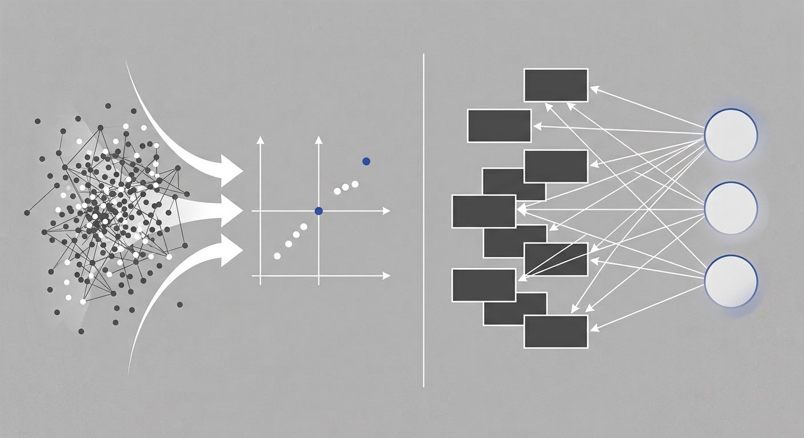
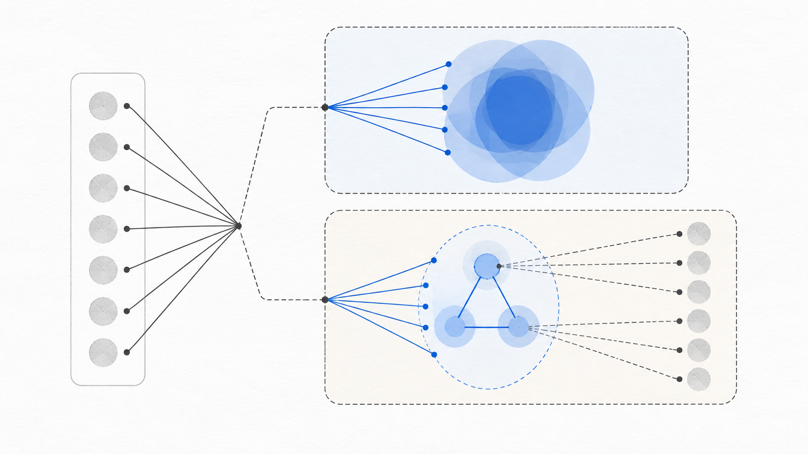
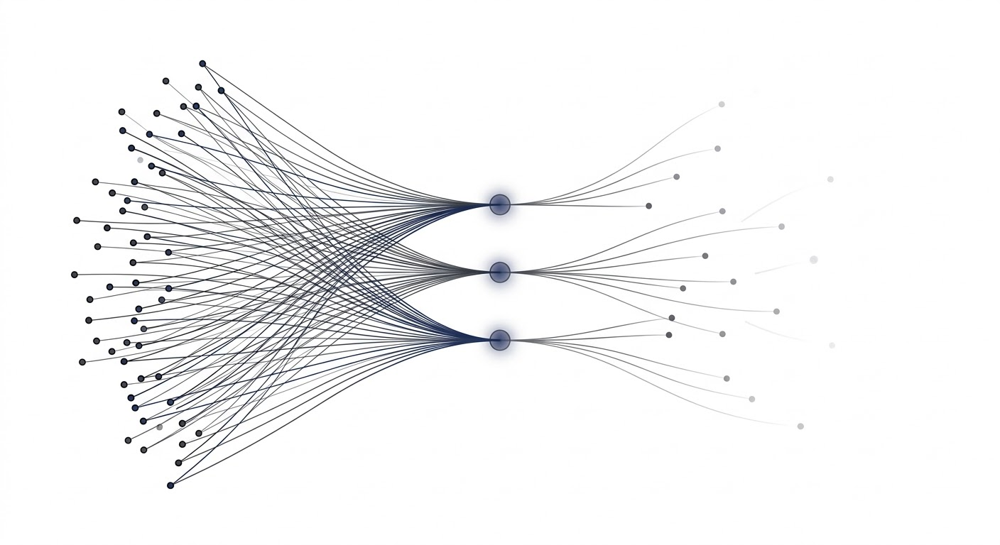
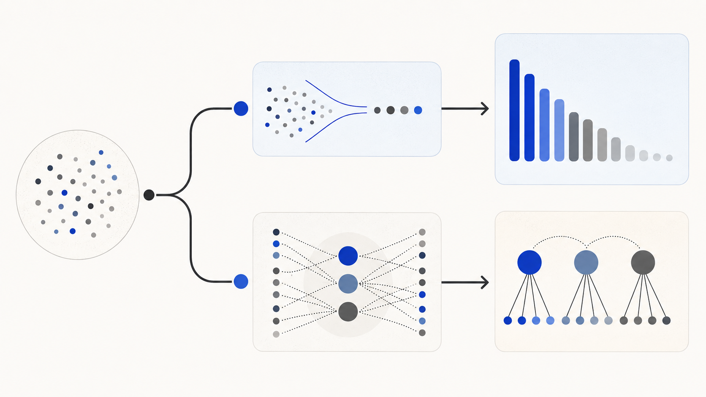

## 先分清研究目的：减少变量，还是寻找共同特征？

如果希望用较少的新变量保留原始数据中尽可能多的变异，通常考虑PCA。例如，一组高度相关的指标可以被压缩成几个主成分，再用于可视化、聚类或后续建模。

如果希望了解多个观测指标是否共同反映某些不能直接观察的特征，则更适合考虑因子分析。生活质量、健康素养等概念往往需要通过多个题项或指标来反映。在测量学中，这类抽象概念常被称为“构念”。

两种方法都能得到少数几个维度，但主成分和因子不是同一种对象。



## 主成分分析（PCA）：把多个变量压缩成综合指标

主成分分析（PCA，Principal Component Analysis）将原始变量重新组合成一组新的变量。每个主成分都是原始变量的线性组合：第一主成分保留最大的方差，后续主成分在与前面主成分不相关的条件下，继续保留剩余方差。

PCA处理的是原始变量的**总方差**。变量之间共同变化的部分，以及各变量自身的变化，都会进入计算。得到的主成分是根据数据计算出的综合指标，并不是预先假定存在的潜在特征。

PCA常用于：

- 把多个相关变量压缩成少数几个综合指标；
- 将高维数据投影到二维或三维空间中展示；
- 在建模前减少变量数量和多重共线性；
- 为聚类等方法提供较低维的数据输入。

需要注意，方差较大不等于临床意义更重要，也不等于预测能力更强。PCA优化的是方差保留，而不是因果解释或研究价值。变量量纲不同时，是否标准化会明显影响结果。例如，把年龄、收入和量表评分放在一起分析时，不能默认它们可以直接比较。

## 因子分析：解释指标为什么会共同变化

因子分析（Factor Analysis，FA）从一个统计模型出发：多个观测变量之间的相关性，可能部分来自一个或多个不能直接观察的因子。简化后可以写成：

`观测变量 = 因子载荷 × 潜在因子 + 独特部分`

因子载荷表示观测变量与潜在因子的关系强弱。独特部分则包括该变量特有的变异和随机误差。因此，因子分析关注的是变量之间的**共同方差**，并把共同变化与变量自身的独特变化区分开。



因子分析常用于探索问卷条目背后的维度、分析多个指标是否共同反映某种特征，以及研究测量工具的内部结构。本文后面的R示例使用`factanal()`进行探索性因子分析。

潜在因子是模型对相关结构的一种解释，不是数据直接证明的“真实原因”。因子数、提取方法、旋转方式和变量选择都会改变结果。即使旋转后的载荷矩阵更容易阅读，因子的命名仍要结合研究问题和指标含义，不能只看哪个载荷最大。

## PCA和因子分析的关键差别

| 比较角度 | PCA | 因子分析 |
|---|---|---|
| 主要目的 | 压缩变量，保留较多总方差 | 用潜在因子解释共同方差 |
| 得到什么 | 原始变量的线性组合，即主成分 | 模型中不能直接观察的因子 |
| 独特方差 | 计入总方差 | 与共同方差分开处理 |
| 常见问题 | 怎样减少变量，方便展示或建模？ | 多个指标是否反映少数共同特征？ |
| 解释重点 | 主成分得分、权重和方差解释比例 | 因子载荷、共同度、独特度和旋转结果 |

两种方法都涉及矩阵分解，数据中的相关性较强时，结果有时也会相似。但它们的目标和模型不同，不能把主成分直接解释成潜在因子，也不能把因子分析简单看成另一种PCA。



## 在R中怎样实现？

PCA可以使用R自带`stats`包中的`prcomp()`：

```r
pca_fit <- prcomp(
  x,
  center = TRUE,
  scale. = TRUE
)

summary(pca_fit)       # 各主成分的方差解释情况
pca_fit$rotation       # 原始变量在各主成分中的权重
head(pca_fit$x)        # 每个观测的主成分得分
```

`scale. = TRUE`表示在分析前对变量进行标准化。是否标准化应根据变量量纲和研究目的决定，而不是机械套用。

探索性因子分析可以使用`factanal()`。该函数采用最大似然法估计因子模型：

```r
fa_fit <- factanal(
  x,
  factors = 3,
  rotation = "varimax",
  scores = "regression"
)

print(fa_fit$loadings)   # 因子载荷
fa_fit$uniquenesses      # 各变量的独特度
```

代码中的因子数量只用于演示参数写法。实际分析需要结合相关矩阵、平行分析、模型拟合、共同度、载荷结构和研究背景判断因子数。对于有序分类题项，也不能不加判断地把它们当作连续正态变量处理。

## 使用前，先检查数据

PCA和因子分析通常从变量的协方差矩阵或相关矩阵出发，并用线性结构描述变量之间的关系。缺失值、异常值、变量分布和变量类型都会影响结果。

PCA尤其需要关注变量尺度和异常值；因子分析还要判断变量之间是否存在足够的相关结构，以及样本量能否支持所设定的模型。使用最大似然因子分析时，分布假设也会影响拟合检验和统计推断。

## 怎样选择？从要回答的问题出发

可以按下面的顺序判断：

1. 目标是减少变量、方便展示或建模吗？如果是，优先考虑PCA。
2. 目标是解释多个指标背后的共同特征吗？如果是，因子分析更符合问题设定。
3. 结果需要怎样解释？主成分适合解释为数据的综合方向；因子则需要结合理论和指标内容解释。



软件可以同时给出得分、权重或载荷，但相似的输出形式并不会让两种方法变得相同。先明确研究目的，再检查数据条件和模型诊断，通常比从软件菜单中直接挑一种“降维方法”更可靠。

## 参考资料

1. R Core Team. `prcomp` documentation: https://stat.ethz.ch/R-manual/R-devel/library/stats/html/prcomp.html
2. R Core Team. `factanal` documentation: https://stat.ethz.ch/R-manual/R-devel/library/stats/html/factanal.html
3. Jolliffe, I. T., & Cadima, J. Principal component analysis: a review and recent developments. https://doi.org/10.1098/rsta.2015.0202
4. Bartholomew, D. J. The foundations of factor analysis. https://doi.org/10.1093/biomet/71.2.221

> 本文用于理解统计方法，不替代针对具体数据集制定的分析方案。实际分析前，应明确变量类型、研究目的、数据预处理方式和模型诊断计划。
