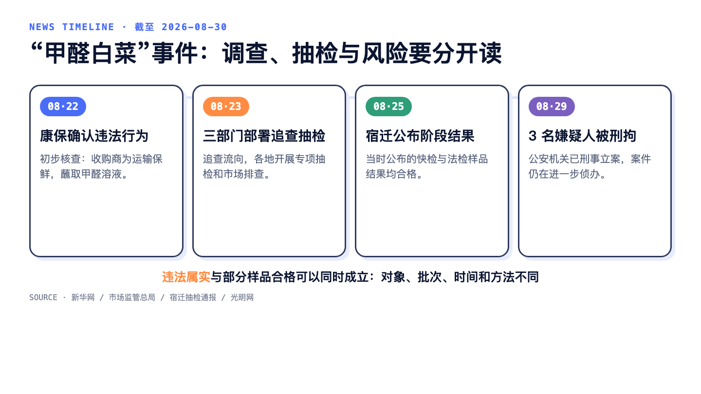
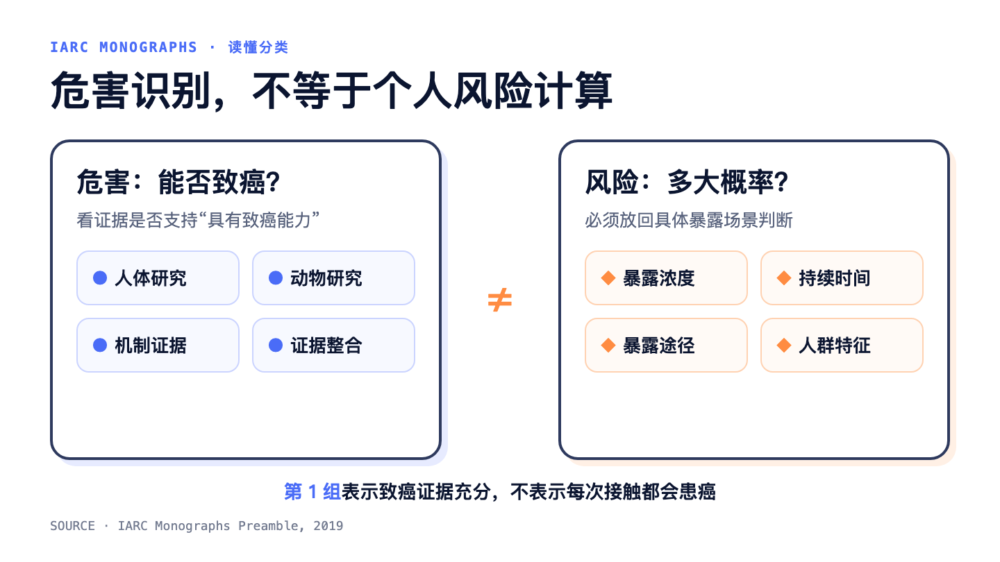
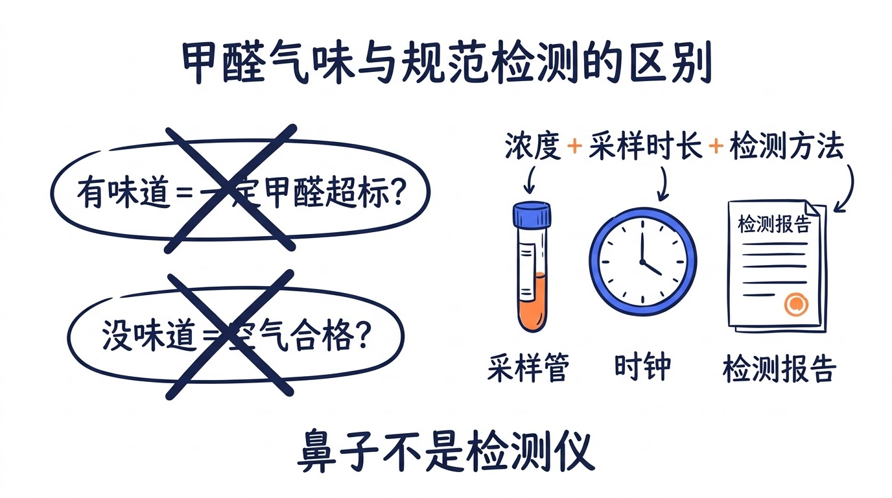
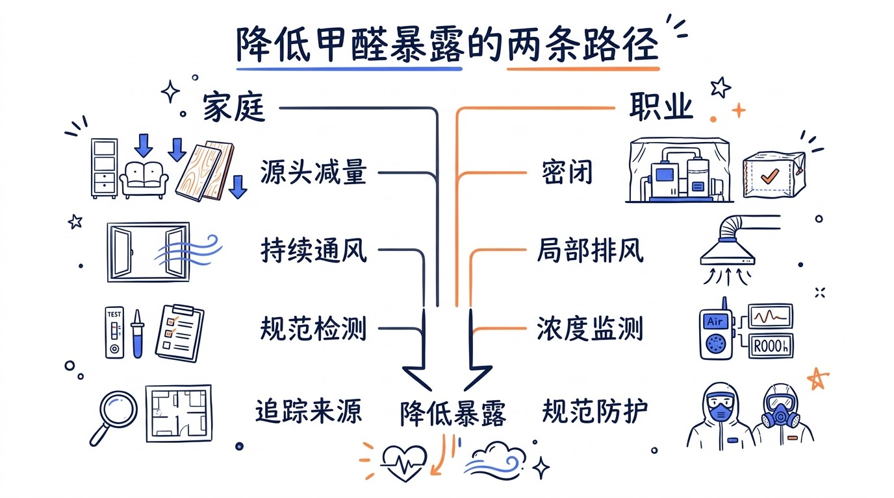

## 热点事件进展到哪了？

8 月 22 日，河北省康保县人民政府通报：网传“白菜收购环节蘸取甲醛溶液”的情况经初步核查属实，系收购商为运输保鲜实施的违法行为。次日，国务院食安办、农业农村部、市场监管总局要求追查涉事白菜流向，并在各地开展专项抽检和市场排查。

8 月 25 日，宿迁公布阶段性结果：截至 8 月 24 日 16 时，当地抽检农批、农贸市场 69 家，完成快检 284 批次、法检 17 批次，当时公布的样品结果均合格。8 月 29 日，公开报道显示案件已刑事立案，3 名犯罪嫌疑人被刑事拘留。

违法行为属实，与某些市场的抽检样品合格，可以同时成立。抽检只回答被抽到的样品、采样时间和检测方法下的问题，不能倒推视频中的白菜没有接触甲醛；确认有人违法操作，也不足以推断市场上所有白菜都有问题。

## 这不只是一道毒理学题

“吃一口不会得癌”回答的是一个很窄的健康风险问题。它没有回答公众对食品安全的其他担心：这是个别违法操作，还是更长链条上的问题？涉事批次是否全部追回？现有抽检覆盖了哪些地区和批次？后续调查会公布哪些结果？

这些问题不能由一句“不必恐慌”代替。抽检样品合格是有价值的信息，但还需要与样品来源、批次、检测方法、流向追查和案件进展一起公布，才能逐步回应公众的不确定感。

风险沟通需要同时守住两边：不把一次可疑暴露夸大成确定的癌症结局，也不用“致癌风险没那么高”冲淡违法添加、供应链追溯和监管责任。

---

## 先说结论：甲醛会致癌吗？

**会。国际癌症研究机构（IARC）当前将甲醛列为第 1 组致癌物。** IARC 的评价指出，人体研究对鼻咽癌和白血病有充分证据，对鼻腔及鼻窦癌的证据有限。

关键证据主要来自可能有较高或较长期吸入暴露的职业人群，以及动物和机制研究。它能说明甲醛具有致癌危害，不能直接计算某个人在一套房子里、吃一次可疑食品后的患癌概率。

**第 1 组**表示“对人类致癌的证据充分”，不是日常风险排行榜。暴露多少、持续多久、通过什么途径进入人体，都会影响实际风险。

---

## 我们平时在哪里接触甲醛？

对大多数人来说，**室内空气是更值得关注的日常暴露场景，吸入是主要途径。**

### 人造板材、家具和装修材料

刨花板、中密度纤维板、胶合板，以及使用相关胶黏剂的橱柜、家具、地板和饰面材料，都可能向空气释放甲醛。单件产品符合限量要求，不等于多件材料在封闭空间里叠加后，室内空气必然合格。

### 烟草烟雾与燃烧

烟草烟雾含有甲醛。通风不良时，燃气灶、煤油取暖器等无外排或燃烧不充分的设备，以及香烛、焚香等燃烧过程，也可以增加室内甲醛。

### 部分日用品

某些涂料、胶黏剂、纺织品、清洁或个人护理用品可能含有甲醛、释放甲醛，或在使用过程中造成短时暴露。风险取决于具体配方、使用方式、通风和暴露时间，不宜只凭“有化学名称”下结论。

### 职业接触

病理科、解剖实验室、殡葬业，以及生产甲醛或甲醛树脂的岗位，可能接触更高浓度或更长时间。这类风险属于职业卫生管理问题，不能靠个人“忍一忍气味”解决。

### 可疑食品中的违法添加

甲醛不得用于食品或农产品保鲜。生物代谢可能产生微量内源性甲醛，所以“检出甲醛”和“证实有人外源添加”需要结合样品、方法和调查证据回答。这一区分不会改变违法添加的性质。

---

## 鼻子能帮忙，但不是检测仪

甲醛可以刺激眼、鼻和咽喉，但人与人的嗅觉和刺激感受差异很大，室内还可能混有其他挥发性有机物。闻到明显异味需要找来源，什么也没闻到，同样不能给空气发一张“合格证”。

我国现行推荐性国家标准 GB/T 18883—2022 规定，室内空气甲醛应 **不高于 0.08 mg/m³，取 1 小时平均**。WHO 2010 年指南给出 0.1 mg/m³、30 分钟平均的指导值。两个数字的平均时间和适用目的不同，不能脱离采样条件硬做比较。便携仪器的一次瞬时读数，也不自动等于按标准方法完成的室内空气评价。

---

## 怎样减少甲醛暴露？

家庭环境的原则是 **源头减量、把污染物排出去、需要时按规范检测**。

1. **购买前减少释放源。** 装修和添置家具时，查看产品执行标准、甲醛释放限量和检测信息，同时控制人造板、胶黏剂等材料的总量。
2. **持续通风并用好排风设备。** 新家具、涂料或其他释放源进入室内后，增加新风；烹饪和燃烧时使用有效外排。释放会受温度、湿度、材料和空间影响，没有适用所有住房的“通风几个月就一定安全”。
3. **室内和车内不吸烟。** 开窗不能将二手烟变成无害；避免室内吸烟也能减少甲醛暴露。
4. **日用品按说明处理。** 新购免烫衣物、布艺等可先清洗；胶黏剂、涂料和清洁品在通风条件下按标签使用，不随意混用。
5. **需要作入住、治理或争议判定时，选择规范检测。** 查看检测机构资质、采样条件、检测方法、检出限和平均时间。异常后优先定位、减少或隔离主要释放源，再在可比条件下复测。

消费者能做的其实有限：甲醛不能靠外观可靠识别，嗅觉也不能代替检测。从证照齐全的商超、农贸市场等渠道购买并保留凭证，是个人可以采取的防范措施，但不能替代供应链的进货查验、批次追溯、市场抽检和执法责任。

如果食品有明显刺激性异味、来源异常，或怀疑属于涉事批次，停止食用并保留产品信息，向市场管理方或 12315 反映。不要把冲洗、浸泡、加热当成处理可疑食品的保证。

职业场景需要更高等级的控制：密闭操作、局部排风、浓度监测、规范的泄漏处置，以及经风险评估选择的个人防护。普通医用口罩或泛称“活性炭口罩”的产品，不能替代工程控制和合格的呼吸防护方案。

---

## 最后，把不同问题分开

甲醛是第 1 组致癌物，这回答了“它有没有致癌能力”。一个人的风险有多大，还要看浓度、时间和暴露途径。一批白菜是否存在违法添加，需要批次追溯、采样检测和执法调查。公众对食品安全的信心能否恢复，则取决于这些调查和监管信息是否持续、具体、可核查。

对日常甲醛暴露，比反复背诵“一类致癌物”更有用的，是找到自己所在场景的释放源，减少长时间吸入，并在需要时用规范检测代替嗅觉和猜测。对这起食品安全事件，继续关注流向追查、抽检口径和案件进展，同样合理。

文章提供群体层面的证据解释和一般性风险控制原则，不能替代个体诊断或现场环境、职业卫生评估。

## 参考来源

1. [新华网：河北康保回应“白菜收购环节蘸取甲醛溶液”问题](https://www.news.cn/20260822/9bd3f876f10c4384854d280c07752d97/c.html)，2026-08-22。
2. [新华网：国务院食安办等多部门指导地方严查甲醛白菜](https://www.news.cn/government/20260824/36cb29f1c4d84e649ba5c9da7d97bf87/c.html)，2026-08-24。
3. [扬子晚报：宿迁通报白菜抽检情况](https://www.yzwb.net/news/jiangsu/202608/t20260825_385998.html)，2026-08-25。
4. [光明网：河北张家口“甲醛白菜”最新进展](https://m.gmw.cn/2026-08/29/content_1304556005.htm)，2026-08-29。
5. [农业农村部：金针菇、大白菜等都是“甲醛菜”吗](https://jgs.moa.gov.cn/kptd/202501/t20250121_6469356.htm)，2025-01-21。
6. [IARC：Agents Classified by the IARC Monographs](https://monographs.iarc.who.int/agents-classified-by-the-iarc/)。
7. [IARC：Preamble to the IARC Monographs](https://monographs.iarc.who.int/wp-content/uploads/2019/07/Preamble-2019.pdf)，2019。
8. [IARC：2025–2029 年优先评估报告](https://monographs.iarc.who.int/wp-content/uploads/2024/11/AGP_Report_2025-2029.pdf)，甲醛条目见第 325–326 页。
9. [WHO：Air quality, energy and health—types of pollutants](https://www.who.int/teams/environment-climate-change-and-health/air-quality-and-health/health-impacts/types-of-pollutants)。
10. [WHO：WHO guidelines for indoor air quality: selected pollutants](https://www.who.int/publications/i/item/9789289002134)，2010。
11. [国家标准信息公共服务平台：GB/T 18883—2022《室内空气质量标准》](https://openstd.samr.gov.cn/bzgk/std/newGbInfo?hcno=6188E23AE55E8F557043401FC2EDC436)。
12. [美国环境保护署：Formaldehyde and indoor air quality](https://www.epa.gov/indoor-air-quality-iaq/what-should-i-know-about-formaldehyde-and-indoor-air-quality)，更新于 2026-08-17。
13. [美国国家癌症研究所：Formaldehyde and Cancer Risk](https://www.cancer.gov/about-cancer/causes-prevention/risk/substances/formaldehyde/formaldehyde-fact-sheet)。
14. [NIOSH：About Formaldehyde and Reproductive Health](https://www.cdc.gov/niosh/reproductive-health/prevention/formaldehyde.html)，2024-02-14。
