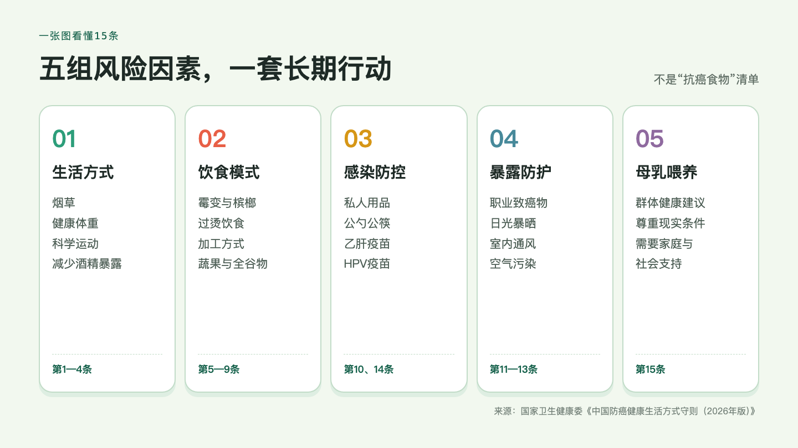
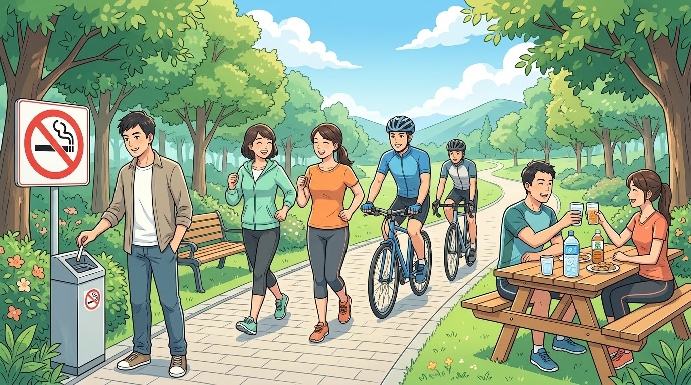
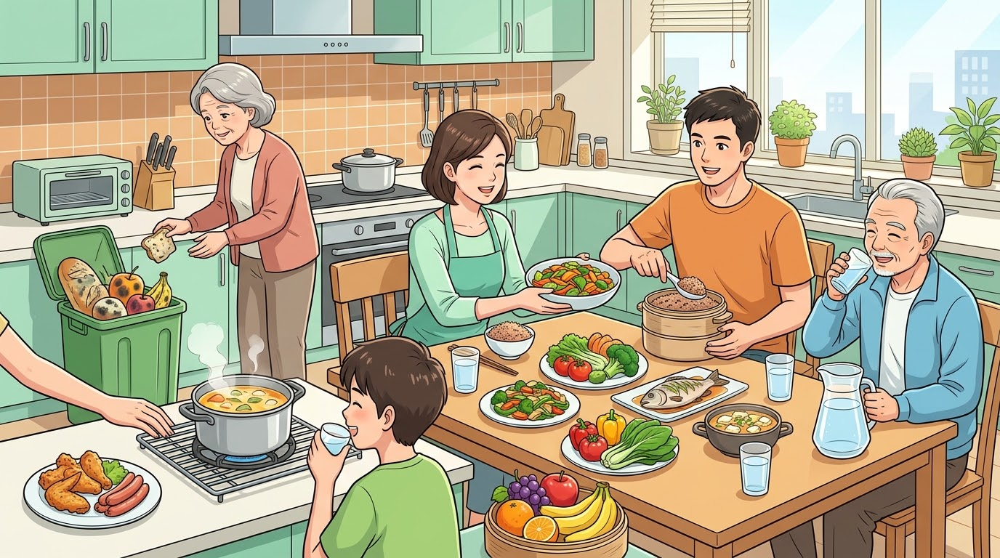
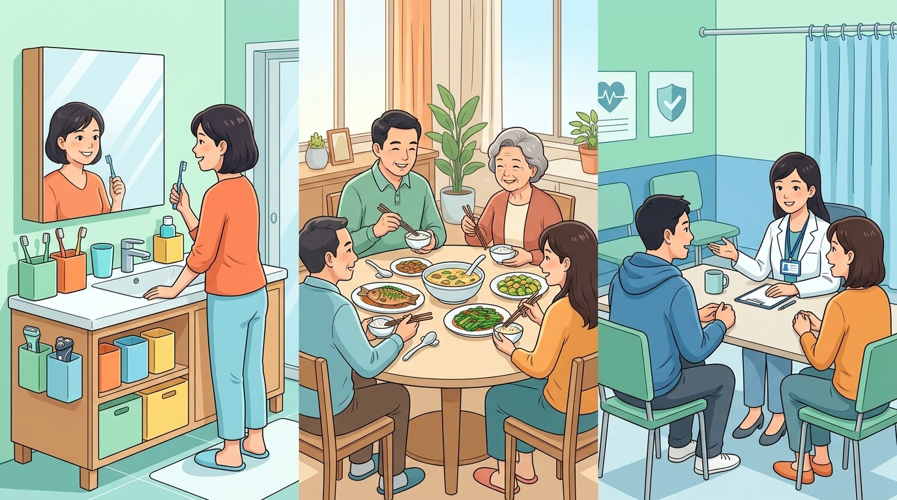
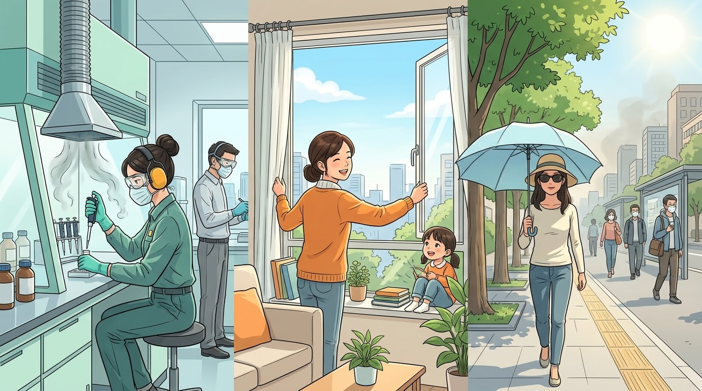
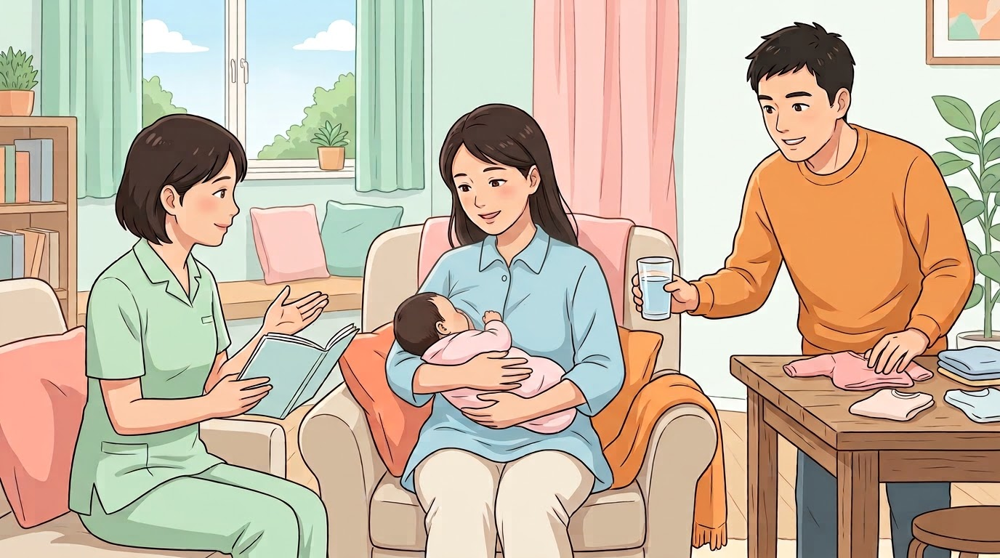
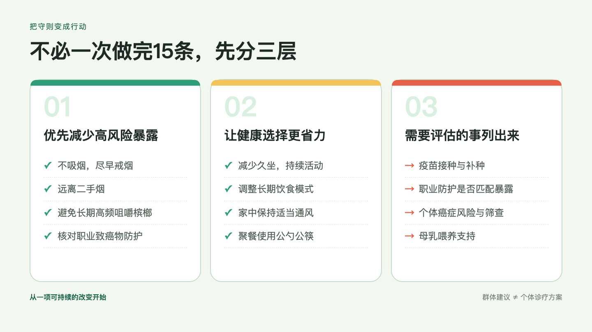

## 这15条，管的是患癌之前的风险

这份文件的正式名称是**《中国防癌健康生活方式守则（2026年版）》**，“中国抗癌守则15条”是常见的通俗叫法。

守则由国家癌症中心组织专家制定，内容属于癌症一级预防，也就是在癌症发生前减少已知危险因素的暴露。

癌症通常由多种因素共同作用，并经过较长时间发展。生活方式会影响风险，年龄、遗传易感性、感染、职业和环境暴露同样会影响风险。守则给出的是人群预防建议，不能用来解释某个人为什么患癌，更不应据此责备患者。

---

## 15条守则，逐条看

以下文字按2026年版正式文本呈现。

1. **不吸烟，早戒烟，远离二手烟。**
2. **保持健康体重，避免超重或肥胖。**
3. **坚持科学运动，减少久坐。**
4. **少饮酒，不酗酒。**
5. **不吃霉变食物，避免长期、高频咀嚼槟榔及其制品。**
6. **不吃过烫食物，不喝过烫饮品。**
7. **避免过多摄入腌制、熏烤和高温油炸类食物，少吃加工肉制品。**
8. **少吃甜食，不喝或少喝含糖饮料。**
9. **摄入充足蔬菜水果和全谷物。**
10. **不共用牙具和剃须刀等私人清洁物品，聚餐时使用公勺公筷。**
11. **做好个人职业防护，避免致癌物暴露。**
12. **避免长时间日光暴晒。**
13. **保持室内通风，空气污染时减少出行，外出时佩戴口罩。**
14. **建议尽早接种乙肝疫苗和人乳头瘤病毒（HPV）疫苗。**
15. **提倡母乳喂养。**

不必死记编号。按风险来源来看，这15条大致可以分成下面五组。

---

## 第一组：烟草、体重、运动和酒精

前4条涉及几种常见的生活方式因素。烟草排在第一位。吸烟与多种癌症有关，戒烟和远离二手烟带来的获益也不只限于肺癌。

体重和运动可以放在一起看。“保持健康体重”说的是健康风险，不是体型审美；“科学运动”看的是持续活动和少坐一会儿，不要求人人进行高强度训练。运动方式还要适合自己的年龄和身体状况。

第4条写的是“少饮酒，不酗酒”。IARC 已确认酒精会增加多种癌症风险。因此，“少饮酒”不能理解成少量饮酒有防癌作用；原本不饮酒的人也无需为了健康开始喝酒。

---

## 第二组：把注意力放在长期饮食上

第5至9条谈的都是日常饮食：

- 避开明确不利的暴露，例如霉变食物、长期高频咀嚼槟榔和过烫饮食；
- 减少腌制、熏烤、高温油炸及加工肉制品；
- 少吃甜食，减少含糖饮料；
- 让蔬菜、水果和全谷物在日常饮食中占有稳定位置。

这些建议看的是长期习惯。一顿烧烤不会单独决定一个人的癌症结局，多吃一次水果也抵消不了长期吸烟、饮酒或能量摄入过多。WCRF 的癌症预防建议也把体重、运动和饮食放在同一种生活模式中评价。

“不吃过烫食物”不要求拿温度计测每一口。刚出锅、入口明显烫的食物和饮品，先放一放就可以。需要避免的是长期、反复的热刺激。

---

## 第三组：减少感染相关风险

第10条讲日常卫生，第14条讲疫苗，两条都与感染防控有关。

牙具、剃须刀等物品可能接触血液或体液，不应与他人共用。聚餐时使用公勺公筷，可以减少病原体传播。这样的卫生习惯简单，但不能替代疫苗或必要的医疗措施。

乙肝病毒和 HPV 与部分癌症有明确的因果关系，接种相应疫苗可以降低相关感染及其后续风险。守则写的是“建议尽早接种”。具体是否接种、何时接种，要根据国家免疫程序、年龄、既往接种史和健康状况，由接种门诊评估。疫苗只针对相关感染，不能预防所有癌症。

---

## 第四组：工作和生活环境里的暴露

第11至13条涉及职业致癌物、日光暴晒和空气污染。

控制职业致癌物暴露，主要依靠密闭、通风、监测和规范操作，个人防护是其中一环。不同岗位接触的物质不同，防护措施应依据职业卫生评价和单位制度确定。只让工作人员“自己戴好口罩”，解决不了全部问题。

在日常生活中，可以避免长时间暴晒，保持室内通风，并在空气污染时减少外出、按需佩戴口罩。清洁空气和合规的工作环境，还需要单位管理和公共政策支持。并非所有暴露都能靠个人选择避开。

---

## 第五组：母乳喂养需要现实条件支持

第15条是“提倡母乳喂养”。WCRF 也把母乳喂养列入癌症预防建议，前提是母亲和婴儿的情况允许。

身体状况、用药、泌乳、婴儿情况和工作环境都会影响喂养选择，家庭能否提供支持也很实际。这是一条人群健康建议，不能用来评判无法母乳喂养或选择其他喂养方式的母亲。遇到困难时，可向妇幼保健或临床专业人员寻求帮助。

---

## 不知道从哪条开始，可以这样排

1. 先处理明确的高风险暴露，例如吸烟、长期接触二手烟、长期高频咀嚼槟榔，或者工作中接触职业致癌物。
2. 再调整日常环境。家里少备含糖饮料，把蔬果和全谷物放在容易取用的位置；工作间隙起身活动；聚餐时直接把公勺公筷摆上桌。
3. 需要专业判断的事情单独列出来，包括疫苗接种、职业防护和癌症筛查。筛查项目、开始年龄和间隔时间取决于年龄、家族史、既往疾病和个人暴露，守则本身没有给出筛查处方。

---

## 怎样理解“超过40%”和“37%”

国家卫生健康委在2026年新闻发布会上引用的口径是：超过40%的癌症可以通过健康生活方式、减少致癌物暴露等措施进行有效预防。IARC 同年的全球归因分析估计，2022年约37%的新发癌症病例与可预防原因相关。

这两个比例的统计范围和方法不同，不能直接比较，也不能解释成“个人照做后风险下降40%”。它们说明的是人群中有相当一部分癌症与可改变的因素有关。这里引用的是群体证据，不能直接当成个体建议。一个人具体面临多大风险，还要结合年龄、家族史、既往疾病、生活方式和职业暴露评估。

读完15条，可以先检查自己最明确的暴露，再挑一件能长期坚持的事去做。比起背熟守则，这样更有用。

## 参考来源

1. [国家卫生健康委办公厅：关于开展2026年全国肿瘤防治宣传周活动的通知](https://www.nhc.gov.cn/ylyjs/gzdt/202604/f56a4ba13e91496ea304cec6d5729691.shtml)，附件2《中国防癌健康生活方式守则（含解读）》，2026-04-02。
2. [国家卫生健康委员会2026年4月23日新闻发布会文字实录](https://www.nhc.gov.cn/xcs/c100122/202604/e3fe2ad7805c49d5b55eea744ecf0ae0.shtml)，2026-04-23。
3. [IARC：Four in ten cancer cases could be prevented globally](https://www.iarc.who.int/news-events/four-in-ten-cancer-cases-could-be-prevented-globally/)，2026-02-03；对应研究 DOI: 10.1038/s41591-026-04219-7。
4. [World Cancer Research Fund：Cancer Prevention Recommendations](https://www.wcrf.org/preventing-cancer/cancer-prevention/our-cancer-prevention-recommendations/)，访问于2026-08-28。
5. [IARC：Alcohol—a major preventable cause of cancer](https://www.iarc.who.int/featured-news/alcohol-a-major-preventable-cause-of-cancer/)，2025-10-08。
