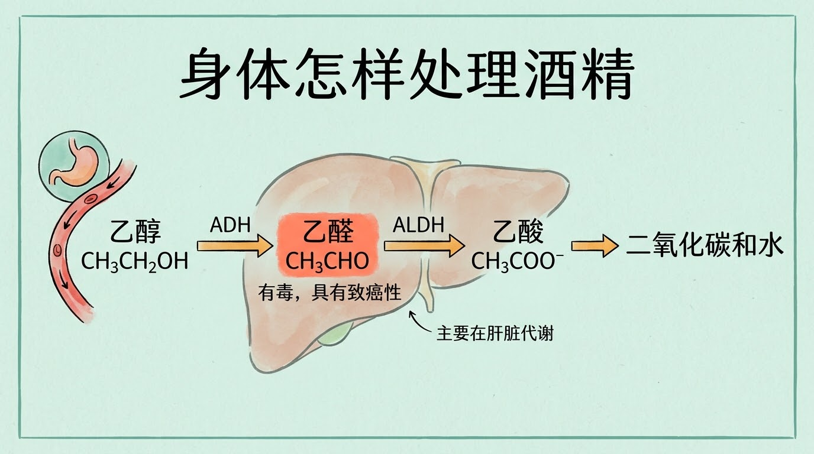
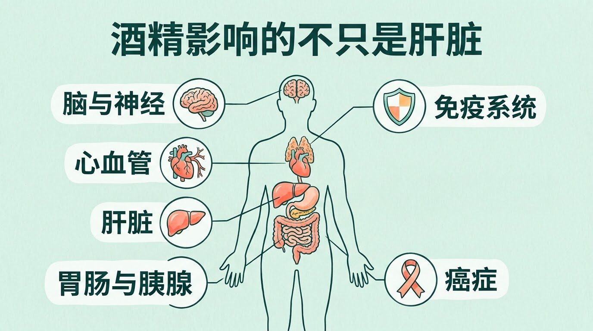
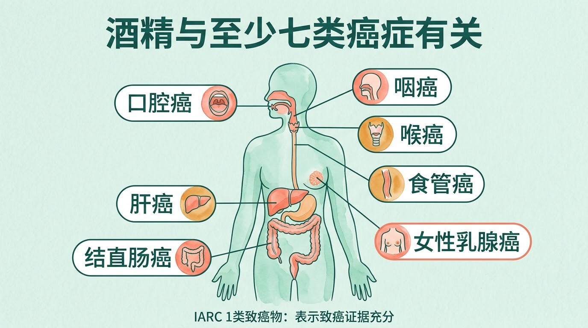
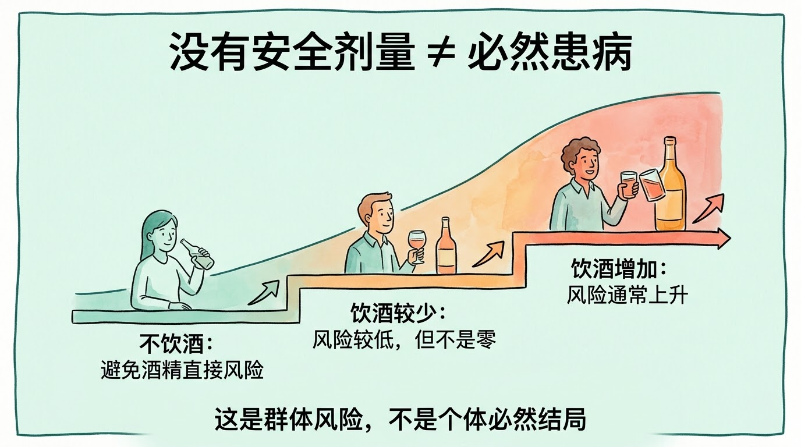

## 酒杯不同，身体面对的是同一种乙醇

白酒、啤酒、葡萄酒的酒精浓度和一杯的容量不同，但产生主要健康风险的成分都是乙醇。酒的价格、颜色或酿造方式，不能改变乙醇及其代谢产物带来的风险。

饮酒后，乙醇从胃和小肠进入血液，随体液分布到全身。它能进入脑组织，干扰神经细胞之间的信息传递。反应变慢、判断受影响、动作不协调，都是乙醇对中枢神经系统的直接作用，不是身体“放松得更好”。

空腹、短时间内连续饮酒会使血液酒精浓度上升得更快。身体分解酒精的速度却有限，后喝下的酒不会因为喝水、咖啡或洗澡而被迅速清除。

## 代谢酒精时，身体会经过乙醛这一关

大部分乙醇在肝脏中完成两步转化：

**乙醇 → 乙醛 → 乙酸 → 二氧化碳和水**

第一步主要依靠乙醇脱氢酶（ADH），把乙醇转成乙醛。乙醛有毒，也具有致癌性，可以损伤DNA和蛋白质。第二步主要依靠乙醛脱氢酶（ALDH），把乙醛转成活性较低的乙酸。乙酸随后在其他组织中继续分解。

大量饮酒时，CYP2E1等代谢旁路参与增加，并伴随更多氧化应激。肝脏承担了大部分代谢工作，但口腔、胃肠道、胰腺和脑等组织也可能接触乙醇、乙醛或其他代谢产物。因此，酒精造成的伤害远不止肝脏。

## 喝酒脸红，不代表酒量差一点而已

有些人饮酒后很快脸红、心跳加快或恶心，常见原因是ADH1B或ALDH2等基因存在变异，乙醛生成较快或清除较慢。脸红是乙醛积聚的信号，不是“代谢快”，更不是多练几次就能提高的酒量。

在携带相关基因变异的人群中，继续饮酒与食管癌和部分头颈部癌症风险升高有关。用抗组胺药遮住脸红也不能清除乙醛，反而可能让人忽略警告信号并喝得更多。

## 一次喝多和长期饮酒，伤害并不相同

短时间内摄入较多酒精，最先受到影响的通常是脑。判断力、反应速度和平衡能力下降，会增加跌倒、溺水、交通事故和其他意外伤害。一次大量饮酒还可能诱发心律失常，并影响免疫系统对感染的防御。

长期或反复大量饮酒会把伤害带到更多器官：

- **肝脏：**可经历脂肪变、脂肪性肝炎、酒精相关肝炎、纤维化和肝硬化，肝癌风险也会升高。
- **心血管：**与高血压、心律失常和心肌病有关；“少量饮酒护心”不能作为开始饮酒的理由。
- **胃肠道和胰腺：**可损伤消化道黏膜、促进炎症，长期大量饮酒可导致急性或慢性胰腺炎。
- **脑和神经：**长期大量饮酒可影响记忆、情绪和认知，也可能造成周围神经损伤；酒精本身还具有依赖性。

这些结局的发生概率并不一样，也不会在每个人身上按同一顺序出现。总饮酒量、单次饮酒量、频率、年龄、遗传、营养状况和既有疾病都会影响风险。

## 酒精与至少七类癌症有关

国际癌症研究机构（IARC）把酒精饮料列为1类致癌物，表示已有充分证据证明它能导致人类癌症。

目前证据明确涉及口腔癌、咽癌、喉癌、食管癌、肝癌、结直肠癌和女性乳腺癌。酒精致癌并非只有一条路径：乙醛可损伤DNA，酒精代谢会产生氧化应激，还可能影响叶酸等营养物质的利用、提高雌激素水平，并促进烟草中的有害化学物质被口腔和咽部吸收。

不同癌种的风险上升幅度不同，但总体方向一致：长期饮用越多，风险通常越高。红酒中的白藜芦醇不能抵消乙醇的致癌风险，换成“低度酒”也只有在实际摄入乙醇总量随之减少时才可能降低暴露。

## “没有安全剂量”该怎样理解

世界卫生组织所说的“没有无风险的饮酒方式”，指的是现有证据没有找到一个确定阈值，能保证低于它就完全不增加癌症或其他健康风险。它不等于喝下一口酒就必然患病，也不表示每一次饮酒都会立刻造成可检测的器官损伤。

这是一个概率问题。饮酒会把风险向上推多少，取决于饮酒量、饮酒模式和个人情况；低风险不等于零风险。最准确的表达是：**饮酒越少，风险越低；不饮酒可以避免由酒精直接带来的风险。**

没有饮酒习惯的人，不需要为了所谓“活血”“护心”而开始喝。已经饮酒的人，减少总量、降低频率并避免一次大量饮酒，都能减少暴露。驾车、操作机械、妊娠期以及服用可能与酒精相互作用的药物时，应避免饮酒；具体疾病、治疗期间能否饮酒，需要咨询医生或药师。

以上结论来自群体层面的研究，用于说明风险方向，不能预测某个个体是否会患病，也不能替代针对个人病史、用药和饮酒情况的诊疗建议。

## 参考资料

1. World Health Organization. Alcohol. https://www.who.int/news-room/fact-sheets/detail/alcohol
2. WHO Regional Office for Europe. No level of alcohol consumption is safe for our health. https://www.who.int/europe/news/item/04-01-2023-no-level-of-alcohol-consumption-is-safe-for-our-health
3. National Institute on Alcohol Abuse and Alcoholism. Alcohol Metabolism. https://www.niaaa.nih.gov/publications/alcohol-metabolism
4. National Cancer Institute. Alcohol and Cancer Risk Fact Sheet. https://www.cancer.gov/about-cancer/causes-prevention/risk/alcohol/alcohol-fact-sheet
5. National Institute on Alcohol Abuse and Alcoholism. Alcohol's Effects on the Body. https://www.niaaa.nih.gov/alcohols-effects-health/alcohols-effects-body
6. National Institute on Alcohol Abuse and Alcoholism. Alcohol Flush Reaction: Does Drinking Alcohol Make Your Face Red? https://www.niaaa.nih.gov/publications/alcohol-flush-reaction-does-drinking-alcohol-make-your-face-red
