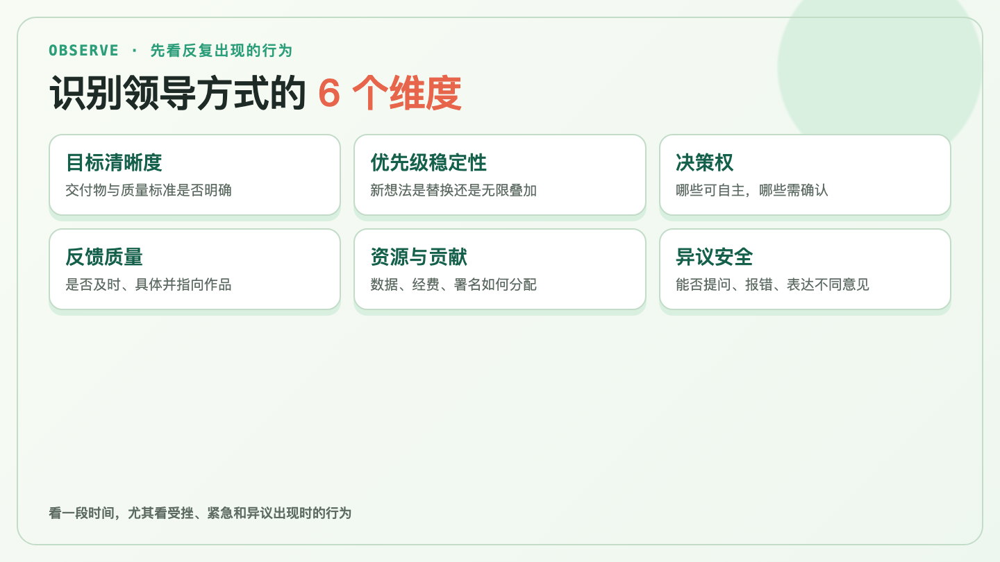
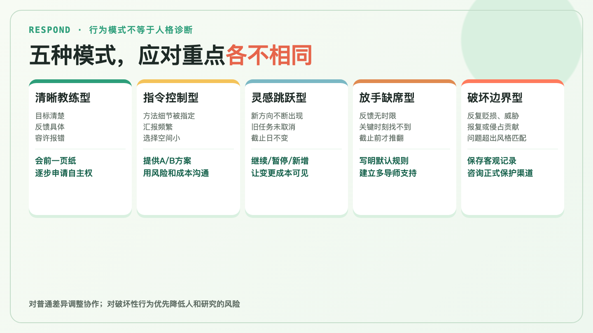
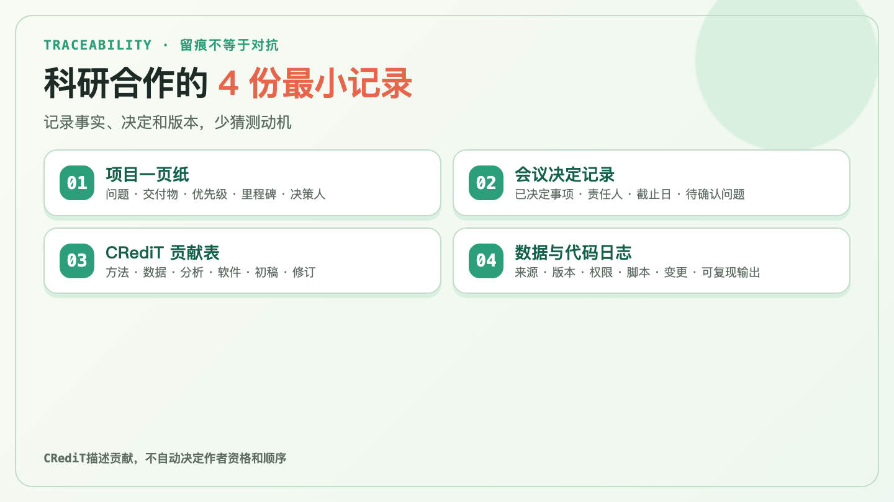

## 先别急着给人分类

管理学和导师关系研究有很多风格模型，但没有一张表能准确定某个人“本质上是哪一型”。同一位课题组负责人，可能在申报截止日前非常指令化，在方法探索阶段又允许很大自主空间。

所以，本文的“类型”只是一张实用行为地图，不是人格测评。判断时看一段时间里反复出现的行为，尤其是项目受挫、资源紧张或你提出不同意见时的行为。

可以连续观察六个维度：目标是否清楚，优先级是否稳定，谁有最终决策权，反馈是否及时且具体，资源与贡献如何分配，团队能否安全地提问、报错和表达异议。

1999年，Amy Edmondson对51个工作团队的研究发现，团队心理安全与学习行为相关。这项研究来自制造业，不能直接等同于科研团队的因果证据；但“能否公开讨论错误”对需要持续试错的研究工作尤其值得观察。

## 五种常见行为模式，分别怎样应对

### 1. 清晰教练型：方向清楚，也愿意给反馈

这类领导会说清交付物和质量标准，定期反馈，允许成员说“我不知道”或提出反证。他们不一定温和，甚至可能对方法和写作要求很高；关键在于标准可解释，反馈指向作品而不是贬低人。

应对方式是把这种支持用足。会前发一页摘要，写明已完成、卡点、需要的决策和下一个里程碑。随着能力提高，主动申请更大的方法选择权或子项目责任，并约定复盘节点。

### 2. 指令控制型：决策快，自主空间小

典型信号是：具体指定方法、变量、图表和时间表，要求频繁汇报，成员的备选方案很少进入决策。在高风险实验、伦理合规或紧急节点，较强的指令未必不合理；若长期扩展到所有细节，则会挤压研究独立性。

不要只用“这样不好”进行抽象争论。准备A/B两个选项，对比时间、资源、统计或伦理风险，明确请对方决定。若你希望增加自主权，可以申请一个有明确边界的小范围试点，用结果讨论是否扩大。

### 3. 灵感跳跃型：想法多，优先级容易变

每次会议都会出现新方向，旧任务没有被明确取消，截止日却保持不变。这种模式可能带来创意，也容易造成范围蔓延：数据字典不断改，分析集难以冻结，论文反复转向。

会后用几行文字确认“继续、暂停、新增”三张清单。接到新任务时，说明替换成本：“如果本周改做B，A的初稿将从周五顺延到下周三，请确认优先级。”这不是拒绝新想法，而是让变更成本进入决策。

### 4. 放手缺席型：给自由，但关键时刻找不到人

授权与缺席的区别，在于责任是否仍然存在。真正的授权会说清目标、决策边界和升级条件；缺席则常表现为反馈长期没有时限，直到截止日前才推翻关键决策。

与这类领导合作，要把默认规则写出来：“若周三前没有收到修改意见，我将按v2方案继续；方法或署名变更仍需明确确认。”同时建立多导师或同行支持：方法问题找统计或专业导师，职业选择找另一位可信任的前辈，不要让一个人承担所有指导功能。

### 5. 破坏边界型：问题已超出风格匹配

需要警惕的是反复出现的贬损、公开羞辱、威胁或报复，以及未经讨论便占用数据、想法或应认定的贡献。这些事情不宜被淡化为“他就是要求高”。破坏性领导的元分析显示，这类行为与工作态度、福祉、绩效和离职意向等多类结果有关联。

此时的目标不是用更完美的话术“改造”对方，而是降低个人和研究风险。保存客观记录：时间、事件、原始文件、当时的任务约定及其后果，少写对动机的推测。根据具体问题，咨询机构的研究诚信、人事、研究生培养、工会或申诉渠道。不同机构对署名纠纷、职场骚扰和研究不端的定义不同，不要随意混用。若存在人身安全、严重威胁或不当处置敏感数据的即时风险，应优先寻求正式保护。

## 科研人员值得保留的四份最小记录

沟通技巧能改善许多摩擦，但科研工作还需要可追溯性。记录不必写成法律文件，也不必带着对抗语气。

1. **项目一页纸：** 研究问题、主要交付物、当前优先级、里程碑和最终决策人。
2. **会议决定记录：** 记录已决定事项、责任人、截止日与待确认问题。对方若需修正，可直接在同一记录上回复。
3. **贡献表：** 用CRediT的14类角色记录概念化、数据整理、方法、分析、软件、初稿和修订等工作，在项目转向和论文提交前更新。CRediT用于描述贡献，不自动决定作者资格和顺序。
4. **数据与代码日志：** 数据来源、版本、访问权限、分析脚本、主要变更和可复现输出。这既保护贡献，也保护研究质量。

## 一次对话，可以直接问五个问题

对于大部分风格差异，一次结构化对话比猜测动机更有用：

- 这个阶段最重要的交付物是什么，质量标准是什么？
- 哪些事我可以自主决定，哪些必须先确认？
- 您希望多久看一次进展，什么格式最方便？
- 若两周内无法回复，我应按什么默认规则继续？
- 数据、代码、想法、署名和对外汇报的规则是什么，在哪个节点复核？

一项关于临床与转化科研导师关系的研究把会面频率、反馈、资源、数据与想法的使用、贡献认定和独立性都列为需要对齐的期望。NIH的被指导者工具也建议在关系早期讨论期望，而不是等失望累积后再追溯。

## 这套方法能做什么，不能做什么

它可以帮助科研工作者把模糊感受转成可观察的行为，再选择对应的沟通、记录、协作或升级方式。它也提醒我们，领导风格与研究阶段、资源约束和双方经验有关，不应根据一次冲突下结论。

本文引用的是群体层面的组织、团队和导师关系研究。这些证据能帮助识别常见行为与风险，不能单凭某个人的几次互动，就对其动机、人格或未来行为作出个体判断。

它不能诊断某个人的人格，不能保证一段不平等关系会因为沟通技巧而改善，也不能代替机构的署名、数据、伦理、人事和申诉程序。本文的五种模式是基于研究和实务规范整理的观察框架，并非已经验证的人格分类量表。

识别领导的目的，是更准确地决定自己下一步做什么。对普通风格差异，对齐目标和反馈；对持续的管理缺位，补上默认规则和多导师支持；对破坏性行为，把保护人、数据和贡献放在话术之前。

## 参考资料

1. National Academies of Sciences, Engineering, and Medicine. *The Science of Effective Mentorship in STEMM*. 2019. https://doi.org/10.17226/25568
2. Huskins WC, et al. Identifying and Aligning Expectations in a Mentoring Relationship. *Clinical and Translational Science*. 2011;4:439–447. https://pmc.ncbi.nlm.nih.gov/articles/PMC3476480/
3. National Institutes of Health. *Mentee Toolkit: Tips for Mentees*. https://hr.nih.gov/sites/default/files/public/documents/working-nih/mentoring/pdf/tips-mentees.pdf
4. Edmondson A. Psychological Safety and Learning Behavior in Work Teams. *Administrative Science Quarterly*. 1999;44(2):350–383. https://doi.org/10.2307/2666999
5. Mackey JD, Ellen BP III, McAllister CP, Alexander KC. The dark side of leadership: A systematic literature review and meta-analysis of destructive leadership research. *Journal of Business Research*. 2021;132:705–718. https://doi.org/10.1016/j.jbusres.2020.10.037
6. Schyns B, Schilling J. How bad are the effects of bad leaders? A meta-analysis of destructive leadership and its outcomes. *The Leadership Quarterly*. 2013;24(1):138–158. https://doi.org/10.1016/j.leaqua.2012.09.001
7. NISO. CRediT – Contributor Role Taxonomy. https://credit.niso.org/
8. U.S. Office of Research Integrity. Plagiarism and Authorship Disputes. https://ori.hhs.gov/plagiarism-and-authorship-disputes

> 本文提供的是科研协作与风险管理的一般框架，不是对特定人或事件的判断，也不构成法律、劳动争议或心理健康建议。
