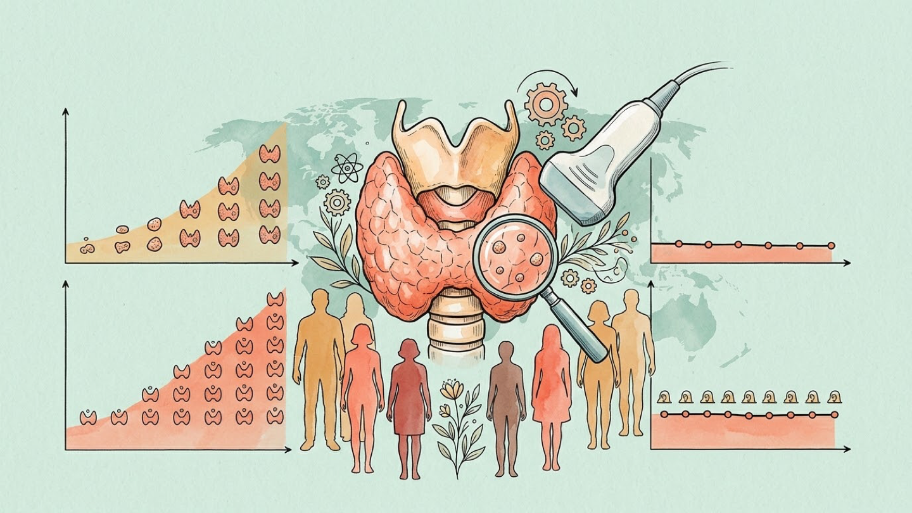
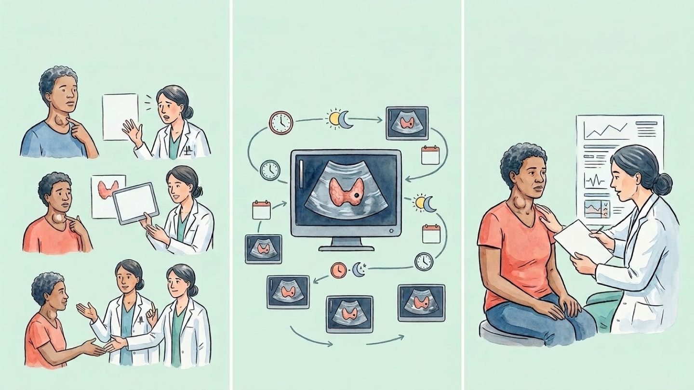
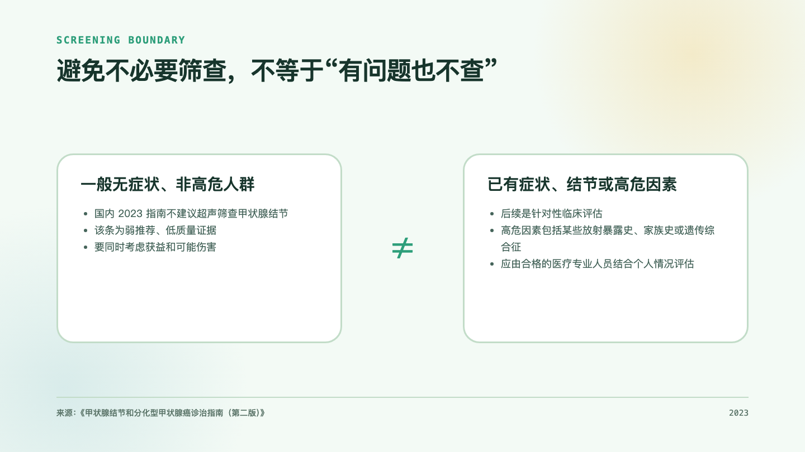

2026 年 8 月 31 日，IARC 在甲状腺癌宣传月信息中公布了两组容易引起注意的数字：2024 年全球约有 100 万人被诊断为甲状腺癌，约 5 万人死于该病；新发病例中约四分之三是女性。

IARC 同时指出，部分国家的甲状腺癌过度诊断占比可高达 90%。这个数字并不表示“90% 的甲状腺癌都是误诊”，也不能直接用来判断某一位患者。

## 过度诊断不等于误诊

误诊是把原本不是癌的情况错误判断为癌。过度诊断则不同：病理诊断可以是真的甲状腺癌，但这个肿瘤如果从未被发现，在当事人一生中也不会引起症状或死亡。

难点在于，医生并不能在诊断当时确定某个人的肿瘤将来是否一定不会造成伤害。过度诊断因而是一个人群层面的估计，需要根据发病率、死亡率、年龄曲线、病理类型和诊断方式等信息综合判断。

## “部分国家高达 90%”是怎样得出的

IARC 本次提醒的重要依据之一，是 2024 年发表在 *The Lancet Diabetes & Endocrinology* 的一项多国人群研究。研究者整合了 IARC 《五大洲癌症发病率》数据库中的人群癌症登记资料、WHO 死亡数据和联合国人口估计。

对 2013—2017 年 63 个国家的资料进行估计后，研究者认为，2297057 例甲状腺癌中约有 1736133 例可归因于过度诊断，占 75.6%。各国差异非常明显：女性中，塞浦路斯、中国、韩国和土耳其的估计占比超过 85%；有的国家则未观察到过度诊断。

这些数字不是对每位患者做长期随访后逐一确认的结果。研究使用了已开发和验证过的统计方法，通过比较实际观察到的发病模式与“没有过度诊断”的假定情景来估计。估计会受模型假设和登记数据质量影响，不应脱离国家、性别和时期使用。

## 为什么发病率上升，死亡率却可能很稳定

超声、CT 和 MRI 等影像检查越来越敏感，也更容易在检查其他问题时偶然发现很小的甲状腺结节。其中一部分肿瘤生长缓慢，本来可能终生不会引起临床问题，却因为更密集的检查而进入诊断和治疗流程。

在多个国家，甲状腺癌发病率大幅上升，死亡率却长期处于很低且较稳定的水平；新增病例又主要来自甲状腺乳头状癌。这些人群层面的模式与过度诊断一致，但不能单靠某一年发病率上升就计算出过度诊断程度。真实风险变化、登记完整性和病理分类变化也需要纳入分析。

## 过度诊断为什么会带来伤害

一个无症状的人在筛查中发现异常后，可能继续接受复查、细针穿刺、手术或其他治疗。如果被发现的肿瘤原本不会造成伤害，这条路径就不会带来相应的健康获益，但检查、手术和长期管理的身体、心理与经济负担仍然存在。

美国国家癌症研究所（NCI）的 PDQ 证据综述指出，现有证据尚未显示甲状腺癌筛查能降低甲状腺癌死亡，而筛查会导致过度诊断和过度治疗。这里也有一个重要限制：甲状腺癌筛查尚无以死亡为结局的随机对照试验，现有判断主要来自生态学研究和发病、死亡趋势的对照。

## “避免无症状人群筛查”不是“有问题也不查”

这一边界直接决定了 IARC 提醒应该怎样理解。

2023 年国内《甲状腺结节和分化型甲状腺癌诊治指南（第二版）》不建议对非高危的普通人群进行甲状腺结节超声筛查。该条推荐的证据等级为低，推荐强度为弱，这一不确定性也需如实保留。

指南列出的高危情况包括童年时期头颈部放射线暴露、全身放疗史、一级亲属甲状腺癌家族史，以及甲状腺癌相关遗传综合征的家族史或个人史。对这些人群，不应把一般人群的建议直接照搬过来。

同样，如果已经出现颈部肿块或肿胀、声音嘶哑、吞咽困难等情况，或者已在其他检查中发现甲状腺结节，后续的医疗评估属于症状或已知异常后的临床诊断，不是一般无症状人群筛查。

## 对肿瘤登记和健康传播的提醒

甲状腺癌是理解“检出更多不必然等于人群更健康”的一个典型例子。在解读发病率时，最好同时观察死亡率、年龄分布、性别、组织学类型和时间趋势。如果数据允许，肿瘤大小、分期、诊断途径和地区医疗资源差异也能帮助解释发病率变化。

对公众传播而言，说清“不建议常规筛查”的适用人群，和解释过度诊断本身同样重要。它针对的是无症状、非高危的一般人群，不能替代对已有症状、已知结节或特定高危因素者的专业评估。

对个人来说，是否需要进一步检查应结合症状、已有检查结果、暴露史和家族史，由合格的医疗专业人员评估。本文提供的是群体证据的解读，不替代个体诊疗建议。

## 参考资料

1. International Agency for Research on Cancer. Thyroid Cancer Awareness Month 2026. https://www.iarc.who.int/fr/news-events/thyroid-cancer-awareness-month-2026/
2. Li M, Dal Maso L, Pizzato M, Vaccarella S. Evolving epidemiological patterns of thyroid cancer and estimates of overdiagnosis in 2013–17 in 63 countries worldwide: a population-based study. *Lancet Diabetes Endocrinol*. 2024;12(11):824–836. https://doi.org/10.1016/S2213-8587(24)00223-7
3. International Agency for Research on Cancer. Evolving epidemiological patterns of thyroid cancer and estimates of overdiagnosis in 2013–17 in 63 countries worldwide: a population-based study. https://www.iarc.who.int/news-events/evolving-epidemiological-patterns-of-thyroid-cancer-and-estimates-of-overdiagnosis-in-2013-17-in-63-countries-worldwide-a-population-based-study/
4. 中华医学会内分泌学分会等. 甲状腺结节和分化型甲状腺癌诊治指南（第二版）. https://rs.yiigle.com/CN311282202303/1451011.htm
5. National Cancer Institute. Thyroid Cancer Screening (PDQ®)–Health Professional Version. https://www.cancer.gov/types/thyroid/hp/thryoid-screening-pdq
6. U.S. Preventive Services Task Force. Final Recommendation Statement: Thyroid Cancer: Screening. https://www.uspreventiveservicestaskforce.org/uspstf/document/RecommendationStatementFinal/thyroid-cancer-screening
