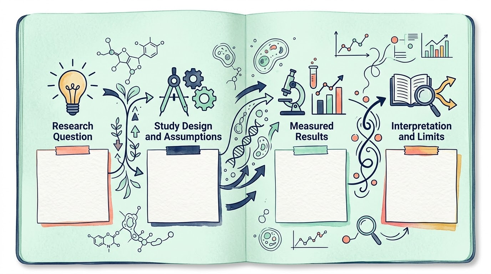
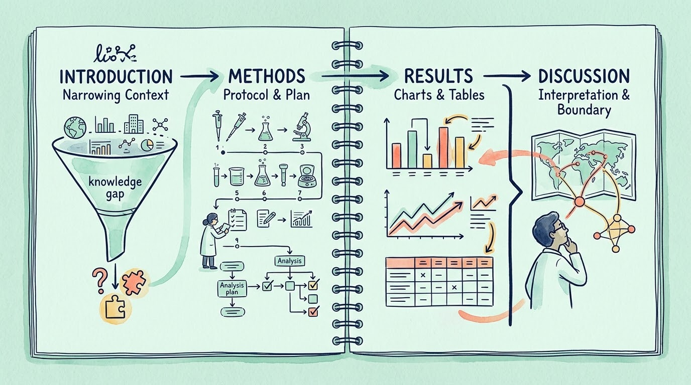
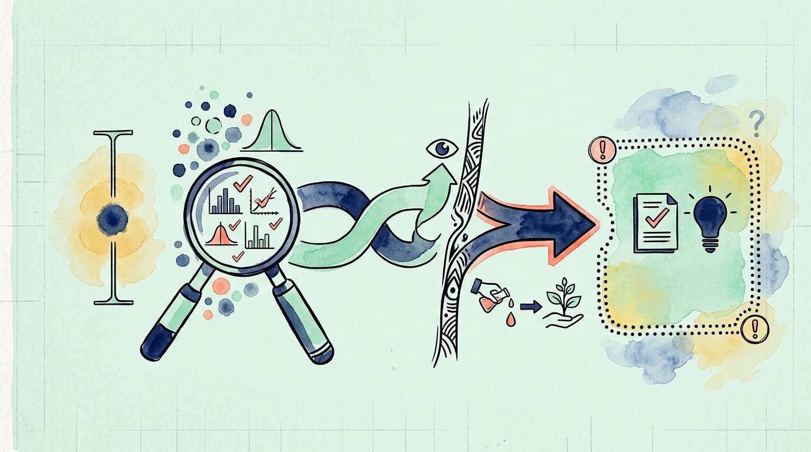

很多稿件的问题不在英语、格式或图表数量，而在论证链没有成形。研究问题太宽，方法没有写到可以复核，结果和讨论互相重复，结论又比数据走得更远。修改句子只能缓解表面问题，不能替代研究设计与写作结构。

这篇文章提供一条适合医学和健康研究的写作路径：先确定这篇论文最重要的一个研究发现或回答，再按研究设计选择报告规范，最后做逻辑、可复核性和投稿要求三轮检查。

## 1. 先写清楚：这篇论文只想让读者记住什么

动笔前先回答五个问题：

1. 研究对象和场景是什么？
2. 现有研究已经知道什么？
3. 哪个具体问题仍未解决？
4. 你的数据和方法能回答什么？
5. 结果支持的最强结论是什么，不能支持什么？

把答案压缩成一段“主张卡”：

> 在某一人群和研究场景中，我们用某种设计和分析方法，观察到某个结果；这个结果支持某种解释，但不等于证明更广泛的因果关系或对所有人群都成立。

这不是摘要，也不是宣传语。它的作用是约束后文。若标题说的是“某因素与结局的关联”，结果和讨论就不应悄悄改成“某因素导致结局”。若研究是单中心回顾性研究，也不能把结论写成适用于所有地区的普遍规律。

一篇论文可以包含多个结果，但最好有一个最重要的发现或回答。标题、摘要、主要图表、引言最后一段和讨论第一段，都应该围绕它展开。Mensh 和 Kording 对论文结构的建议也强调，论文要先明确最想传达给读者的主要信息，再安排各部分内容。[1]

## 2. 用四部分结构组织证据，但不要把它当成填空题

医学原始研究常见的 IMRAD 结构，是 Introduction（引言）、Methods（方法）、Results（结果）和 Discussion（讨论）四个部分名称首字母组成的写作结构。国际医学期刊编辑委员会（International Committee of Medical Journal Editors，简称 ICMJE）说明，这种结构对应科学发现和论证的过程；综述、病例报告、社论等文章可能需要不同格式。[2]

### Introduction：把背景收窄到一个缺口

引言不需要把领域历史全部复述一遍。可以按下面的收窄路径写：

- 这个问题为什么值得研究；
- 已有研究在什么范围内给出了哪些答案；
- 哪个关键缺口仍然存在；
- 本研究要做什么，主要结局或假设是什么。

最后一段最好直接交代研究目的和设计。引用与当前问题无关的文献，只会增加篇幅，不能自动增加论证力度。

### Methods：让别人知道你是怎样得到结果的

方法部分的标准不是“写得很专业”，而是读者能否据此判断研究是否合适、分析是否可复核。至少交代：

- 研究设计、研究期间、研究场景和研究对象；
- 纳入与排除标准、样本来源和主要变量；
- 主要和次要结局如何定义，何时测量；
- 数据清理、缺失值处理、统计模型及其关键假设；
- 软件名称与版本，哪些分析是预先设定的，哪些属于探索性分析；
- 伦理审批、数据来源、注册信息以及数据和代码的可获得性。

ICMJE 建议，方法应尽量详细，使拥有原始数据的合格读者能够复现结果；统计方法要说明到可以判断其适用性，并尽量报告效应量和不确定性，而不是只给出 P 值（P-value）。[2]

### Results：按照问题顺序给出答案

结果部分应该先呈现最重要的发现，再补充支持它的分析。每个小节可以遵循一个简单单元：

> 这一段要回答什么问题？使用了哪些数据？结果是多少？这对该问题给出的直接答案是什么？

报告比例时同时给出分子和分母；报告组间差异时说明效应量、置信区间和分析人群；主要结局和次要结局都应与方法部分的预先定义对应。表格和图已经呈现的数据，不必在正文逐个数字重复一遍，正文应强调读者需要带走的比较和趋势。[2]

“统计学显著”也不是结果的完整描述。一个很小但精确的差异，和一个幅度较大但估计不精确的差异，含义不同。结果部分先把测量尺度、效应大小和不确定性说清楚，讨论部分再解释其意义。

### Discussion：解释结果，也主动说明边界

讨论可以按四个问题展开：

1. 本研究最主要的发现是什么？
2. 它与已有证据相符还是不同？可能原因是什么？
3. 研究设计、测量、样本、分析和外推有哪些限制？
4. 这个结果对后续研究、实践或政策讨论有什么具体启示？

“没有观察到关联”不等于“证明没有影响”；“在本研究人群中相关”也不等于“对个体一定如此”。结论应与研究目标相连，并与设计能提供的证据强度匹配。若提出新的机制或假设，应明确标为推测，而不是把它写成研究已经验证的结果。[2]

## 3. 在写作前选报告规范，而不是投稿前才对照清单

报告规范不是格式模板，而是针对研究设计的最低信息清单。EQUATOR Network（Enhancing the QUAlity and Transparency Of health Research，提升健康研究质量与透明度网络）将它定义为用于指导特定研究类型报告的清单、流程图或结构化文本，目标是让研究更容易被理解、复核和纳入证据综合。[3]

常见对应关系如下：

| 研究类型 | 可先查看的报告规范 |
| --- | --- |
| 随机对照试验 | CONSORT（Consolidated Standards of Reporting Trials，随机对照试验报告规范） |
| 观察性研究 | STROBE（Strengthening the Reporting of Observational Studies in Epidemiology，流行病学观察性研究报告规范） |
| 系统综述和荟萃分析 | PRISMA（Preferred Reporting Items for Systematic Reviews and Meta-Analyses，系统综述和荟萃分析优先报告条目） |
| 诊断准确性研究 | STARD（Standards for Reporting Diagnostic Accuracy Studies，诊断准确性研究报告规范） |
| 预测模型研究 | TRIPOD（Transparent Reporting of a multivariable prediction model for Individual Prognosis Or Diagnosis，个体预后或诊断多变量预测模型透明报告规范） |
| 病例报告 | CARE（CAse REport，病例报告指南） |

这张表只是一张入口地图。具体项目还要检查扩展版本、目标期刊要求和研究领域的特殊条款。比如，观察性研究不只是把 STROBE 清单附在投稿文件里，还应在研究方案和数据整理阶段确认：研究人群从哪里来，变量怎样定义，缺失数据怎样处理，哪些分析是预先设定的。

清单的价值在于减少遗漏，不在于把研究“装扮成规范”。它不能修复样本来源不清、结局定义含糊、模型假设不成立或结论超出数据的问题。

## 4. 把每张图、每个段落都当成证据链的一环

图表不是文章的装饰，也不是分析做完后的截图。写作时可以给每张主要图表加一句内部标题，格式接近一个可检验的结论：

> 在什么人群、什么时间范围内，哪个指标呈现了什么差异？

如果一句话写不出来，通常说明图表仍在展示“所有发现”，却没有服务于某个研究问题。图题应帮助读者先理解主要信息，图注再交代数据、单位、分析方法和必要的限制。结果小节的顺序，也应能解释为什么先看图 A，再看图 B，而不是按软件输出顺序排列。

表格和图不要机械重复。同一结果若用图表达趋势，用表补充精确数值即可；如果两者承担的是同一信息，就保留更容易核查的一种。图注中出现的缩写、统计量和分组方式，都应在正文或图注中定义。

## 5. 统计结果要回答研究问题，而不是只展示软件输出

写统计分析时，先确认四件事：

- **估计对象：** 你想估计的是风险差、比值比、风险比、平均差，还是某个时间窗内的生存概率差？
- **比较对象：** 暴露组和对照组如何定义，参考组是什么，分析人群是否与研究问题一致？
- **假设条件：** 模型依赖哪些条件，是否做了诊断，偏离后如何处理？
- **不确定性：** 估计值的置信区间多宽，结果是否受到样本量、事件数、缺失或测量误差影响？

例如，HR（hazard ratio，风险比）=0.80 描述的是模型下的瞬时风险比，不能自动改写成“累计风险降低 20%”；P>0.05 表示当前数据没有提供足够证据拒绝零假设，也不能直接改写成“没有影响”。这些句子看起来简短，却可能改变读者对研究结果的理解。

还要把预先设定的分析与探索性分析分开。探索性结果可以帮助形成新假设，但不应在文章中伪装成研究开始前已经确定的主要结局。统计软件能执行计算，不能替作者决定研究问题、因果方向和结论边界。

## 6. 提前处理署名、利益冲突和人工智能（artificial intelligence，简称 AI）使用

多人合作时，署名问题不宜留到投稿系统里才处理。ICMJE 建议，作者应同时满足四类条件：对研究有实质性贡献；参与起草或重要智力修订；批准最终版本；并愿意对工作的准确性和完整性负责。[4]

数据收集、一般管理、技术编辑或校对本身，不必然等于作者资格。没有满足全部条件的贡献者，可以按实际贡献致谢；具体规则还要遵守目标期刊和所在机构的政策。更稳妥的做法是在项目开始、分析方案变化和投稿前各更新一次贡献记录。

资金来源、与研究相关的财务或非财务关系，也要按期刊要求透明披露。披露并不等于存在不当影响，但它让读者可以自行判断潜在偏倚。[5]

如果使用了 AI 辅助写作、数据分析或图表生成，应先查目标期刊的现行政策，并由人类作者核对事实、引用、原创性和研究责任。ICMJE 明确指出，AI 工具不能列为作者；使用情况应按用途在致谢、方法或投稿材料中说明。[4]

## 7. 投稿前做三轮检查

### 第一轮：逻辑检查

- 标题是否准确概括论文最重要的发现或回答？
- 引言提出的缺口，结果是否真正回答？
- 每个主要结论能否在结果中找到对应数据？
- 讨论是否把关联写成因果，把群体结果写成个体判断？

### 第二轮：可复核性检查

- 研究对象、变量、结局、时间和分析集是否清楚？
- 读者能否知道数据从哪里来、如何处理、用什么软件和版本分析？
- 主要效应量、不确定性、缺失数据和模型诊断是否交代？
- 图表、图注、补充材料和正文是否互相一致？

### 第三轮：投稿要求检查

- 目标期刊的文章类型、字数、摘要格式和图表限制是否满足？
- 是否使用了适合研究设计的报告规范？
- 伦理审批、注册、资金、利益冲突、作者贡献和 AI 使用是否按要求披露？
- 参考文献、数据集标识符、代码和补充材料是否可访问且版本一致？

## 写在最后

科学论文写作的起点不是把句子写得漂亮，而是把研究问题、证据和结论之间的关系固定下来。先写清最重要的发现或回答和结果提纲，再组织 IMRAD；先明确估计对象和假设，再润色统计表达；先讨论每个人做了什么、如何承担责任，再确定署名。

如果读者读完标题、摘要和主要图表，能够说出你的研究回答了什么问题；如果方法足以让合格研究者判断并复核分析；如果讨论主动说明了结论的边界，这篇论文就已经具备了可靠沟通的基础。格式、语言和投稿信仍然重要，但它们应服务于这条证据链。

## 参考资料

1. [ICMJE：Preparing a Manuscript for Submission to a Medical Journal](https://www.icmje.org/recommendations/browse/manuscript-preparation/preparing-for-submission.html)
2. [Mensh B, Kording K. Ten simple rules for structuring papers](https://doi.org/10.1371/journal.pcbi.1005619). *PLOS Computational Biology*. 2017;13(9):e1005619.
3. [EQUATOR Network：What is a reporting guideline?](https://www.equator-network.org/about-us/what-is-a-reporting-guideline/)
4. [ICMJE：Defining the Role of Authors and Contributors](https://www.icmje.org/recommendations/browse/roles-and-responsibilities/defining-the-role-of-authors-and-contributors.html)
5. [ICMJE：Disclosure of Financial and Non-Financial Relationships and Activities, and Conflicts of Interest](https://www.icmje.org/recommendations/browse/roles-and-responsibilities/author-responsibilities--conflicts-of-interest.html)
