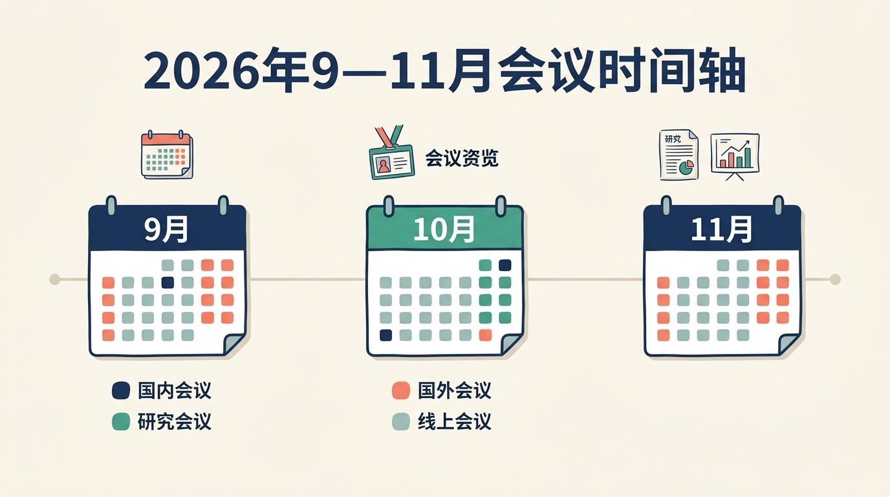
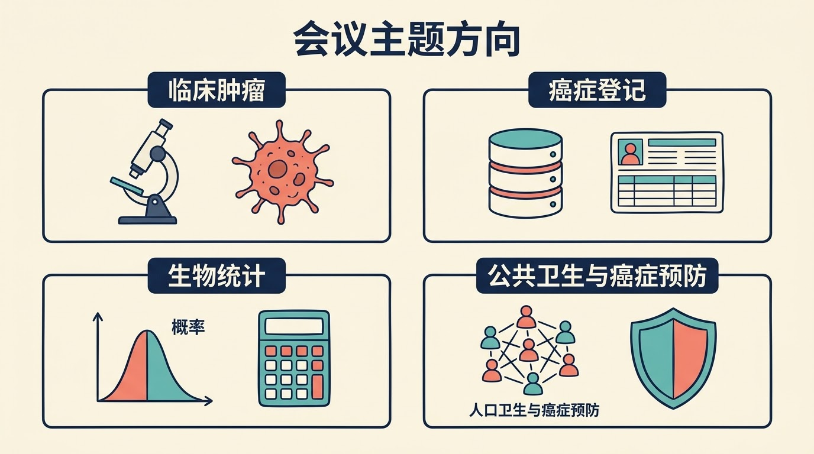

2026 年 9 月至 11 月，国内外将举办多场肿瘤、癌症预防、生物统计和公共卫生相关学术会议。本文根据会议主办方或学会官网截至 2026 年 9 月 2 日公开的信息，按举办月份整理会议名称、地点和主要方向，方便读者提前查看安排。

这是一份按公开信息整理的会议日历，不是所有学术活动的完整目录。本文补充纳入了一场会期跨越 9 月、但起始日期在 8 月的正式会议。部分会议目前只公布了省份或城市，具体会场、议程、注册和投稿安排，请以主办方后续通知为准。

## 9月会议

### 国内会议

中国抗癌协会（Chinese Anti-Cancer Association，简称 CACA）会议平台目前列出以下 9 月会议：

| 日期 | 会议 | 地点 | 主要方向 |
| --- | --- | --- | --- |
| 9月4—6日 | 2026 CACA北部整合肿瘤学大会 | 河北省 | 整合肿瘤学 |
| 9月4—6日 | 2026 CACA口腔颌面肿瘤整合医学大会 | 黑龙江省 | 口腔颌面肿瘤、整合医学 |
| 9月4—6日 | 2026 CACA整合肝癌大会 | 河北省 | 肝癌、整合肿瘤学 |
| 9月11—13日 | 中国抗癌协会胃癌专业委员会第20届胃癌学术会议 | 北京市 | 胃癌 |
| 9月11—13日 | 2026中国抗癌协会肿瘤基因诊断学术大会 | 北京市 | 肿瘤基因诊断、分子检测 |
| 9月13日 | CACA淋巴瘤指南巡讲—天津站 | 天津市 | 淋巴瘤诊疗指南、学术巡讲 |
| 9月17—19日 | 第29届中国临床肿瘤学会（Chinese Society of Clinical Oncology，简称 CSCO）学术年会 | 济南市 | 临床肿瘤学 |
| 8月6日—9月13日 | 第十四届中国抗癌协会肿瘤营养学大会 | 广西壮族自治区 | 肿瘤营养、支持治疗 |
 
上述国内会议的日期和地点信息来自中国抗癌协会会议平台或中国临床肿瘤学会官网；其中部分 CACA 会议目前公开到省份，具体城市和会场尚待会议通知进一步明确。[1]

### 国外会议（含线上会议）

国际癌症登记协会（International Association of Cancer Registries，简称 IACR）与非洲癌症登记网络（African Cancer Registry Network，简称 AFCRN）、撒哈拉以南非洲肿瘤研究网络（Network of Oncology Research in Sub-Saharan Africa，简称 NORA）等机构将于 10 月在坦桑尼亚阿鲁沙举办联合科学会议，重点涉及癌症监测、登记标准、描述性流行病学、分期、预后、研究和培训。

| 日期 | 会议 | 地点 | 主要方向 |
| --- | --- | --- | --- |
| 9月6—9日 | 第18届世界公共卫生大会（World Congress on Public Health，简称 WCPH） | 南非开普敦 | 公共卫生、公平、包容与可持续性 |
| 9月12—15日 | 世界肺癌大会（World Conference on Lung Cancer，简称 WCLC） | 韩国首尔 | 肺癌和胸部肿瘤 |
| 9月21—25日 | 美国国家癌症研究所（National Cancer Institute，简称 NCI）队列联盟2026年年会（NCI Cohort Consortium Annual Meeting） | 现场及线上 | 癌症流行病学、队列研究、人群科学 |
| 9月22—25日 | 美国癌症研究协会（American Association for Cancer Research，简称 AACR）儿童癌症专题会议 | 美国费城 | 儿童肿瘤 |
| 9月25—28日 | AACR胰腺癌专题会议 | 美国圣迭戈 | 胰腺癌 |
| 9月26—30日 | 美国放射肿瘤学会（American Society for Radiation Oncology，简称 ASTRO）第68届年会 | 美国波士顿 | 放射肿瘤学 |
| 9月27日—10月1日 | 国际临床生物统计学会（International Society for Clinical Biostatistics，简称 ISCB）第47届年会 | 德国弗赖堡 | 临床生物统计、医学数据研究 |
| 9月28—30日 | 第4届癌症预防药物转化研究线上会议（Translational Advances in Cancer Prevention Agent Development，简称 TACPAD） | 线上 | 癌症预防、癌症截获、预防性药物研发 |

## 10月会议

### 国内会议

| 日期 | 会议 | 地点 | 主要方向 |
| --- | --- | --- | --- |
| 10月15—18日 | 第十四届全国生物治疗大会暨第三届国际 CIK 大会（Cytokine-Induced Killer，细胞因子诱导的杀伤细胞） | 天津市 | 生物治疗、细胞免疫治疗 |
| 10月22—25日 | 中国抗癌协会肿瘤转移专业委员会2026年学术年会 | 广东省 | 肿瘤转移、转化研究 |

### 国外会议（含线上会议）

| 日期 | 会议 | 地点 | 主要方向 |
| --- | --- | --- | --- |
| 10月1—3日 | 国际妇科肿瘤学会（International Gynecologic Cancer Society，简称 IGCS）2026年全球年会 | 加拿大蒙特利尔 | 妇科肿瘤 |
| 10月2—4日 | 第18届血液肿瘤会议 | 南非开普敦 | 血液肿瘤、血液病 |
| 10月6—8日 | 癌症早期检测大会（The Early Detection of Cancer Conference） | 英国爱丁堡 | 癌症早期检测、筛查与流行病学研究 |
| 10月9—11日 | 日本血液学会（Japanese Society of Hematology，简称 JSH）第88届年会 | 日本京都 | 血液学、恶性血液病 |
| 10月13—16日 | 国际生物制药统计学第8届研讨会（International Symposium on Biopharmaceutical Statistics，简称 ISBS） | 西班牙马德里 | 生物制药统计、监管科学、真实世界数据与证据 |
| 10月13—16日 | IACR-AFCRN-NORA联合科学会议 | 坦桑尼亚阿鲁沙 | 癌症监测、癌症登记、描述性流行病学、分期与预后 |
| 10月18—21日 | AACR第19届癌症健康差异科学会议 | 美国亚特兰大 | 癌症健康差异、人口科学与预防研究 |
| 10月19—21日 | 第5届国际癌症预防大会（International Conference on Cancer Prevention，简称 ICCP） | 德国海德堡；提供线上直播 | 癌症预防、早期检测、风险分层和预防实施 |
| 10月23—24日 | Cancer Biomarkers Conference VIII | 美国休斯敦 | 癌症病理、分子诊断、生物标志物与精准肿瘤学 |
| 10月23—27日 | 欧洲肿瘤内科学会（European Society for Medical Oncology，简称 ESMO）2026年会 | 西班牙马德里 | 综合肿瘤学 |
| 10月26—27日 | Mayo Clinic Cancer Care 2026线上护理会议 | 线上 | 肿瘤护理、姑息与支持治疗、营养和生存者照护 |
| 10月29—31日 | 欧洲肿瘤影像学会（European Society of Oncologic Imaging，简称 ESOI）Touchdown 2026 | 德国海德堡 | 肿瘤影像、诊断与治疗影像 |

## 11月会议

### 国内会议

| 日期 | 会议 | 地点 | 主要方向 |
| --- | --- | --- | --- |
| 11月12—15日 | 2026中国整合肿瘤学大会 | 湖南省 | 整合肿瘤学 |

### 国外会议（含线上会议）

EORTC-NCI-AACR 肿瘤分子靶点与治疗国际会议的名称中，EORTC、NCI 和 AACR 分别是 European Organisation for Research and Treatment of Cancer（欧洲癌症研究与治疗组织）、National Cancer Institute（美国国家癌症研究所）和 American Association for Cancer Research（美国癌症研究协会）的缩写。

| 日期 | 会议 | 地点 | 主要方向 |
| --- | --- | --- | --- |
| 11月1—4日 | 美国公共卫生协会（American Public Health Association，简称 APHA）年会暨博览会 | 美国圣安东尼奥 | 公共卫生、健康政策与人群健康 |
| 11月2—4日 | 第33届生物制药应用统计研讨会（Biopharmaceutical Applied Statistics Symposium，简称 BASS） | 美国佐治亚州萨凡纳 | 生物制药研发与应用统计 |
| 11月4—8日 | 肿瘤免疫治疗学会（Society for Immunotherapy of Cancer，简称 SITC）2026年会 | 美国凤凰城；提供线上参与 | 肿瘤免疫治疗 |
| 11月5—7日 | 国际老年肿瘤学会（International Society of Geriatric Oncology，简称 SIOG）2026年会 | 西班牙瓦伦西亚 | 老年肿瘤、肿瘤与衰老、支持治疗 |
| 11月10—13日 | 2026年欧洲公共卫生大会（European Public Health Conference） | 西班牙毕尔巴鄂 | 公共卫生研究、卫生政策与疾病预防 |
| 11月12—13日 | AACR-KCA癌症精准医学联合会议 | 韩国庆州 | 癌症精准医学、基因组与生物标志物 |
| 11月13日 | EORTC诊断与治疗影像组秋季会议 | 比利时布鲁塞尔 | 肿瘤影像、诊断与治疗 |
| 11月18—20日 | EORTC-NCI-AACR肿瘤分子靶点与治疗国际会议 | 西班牙巴塞罗那 | 分子靶点和癌症治疗 |
| 11月19—20日 | PathologyHub 2026全球病理、诊断与检验医学会议暨博览会 | 美国旧金山 | 病理、实验室医学、分子诊断与数字病理 |

## 信息来源与说明

本文只整理会议举办时间、地点和公开的会议方向，不对会议报告内容、研究结果或临床意义作评价。本文提供的是群体层面的会议日历信息，不针对任何个体作诊疗、预防或参会建议。会议日期、地点、议程、注册方式和线上安排可能发生变化，计划参会前请以会议官网最新通知为准。

1. 中国抗癌协会会议平台： https://www.sciconf.cn/cn/index/339
2. WCLC 2026：International Association for the Study of Lung Cancer： https://wclc.iaslc.org/
3. CSCO 2026会议官网： https://meeting.csco.org.cn/
4. ASTRO 2026 Annual Meeting： https://www.astro.org/meetings-and-education/micro-sites/2026/annual-meeting
5. ESMO 2026 official site： https://www.esmo-2026.org/about/
6. SITC 2026 Annual Meeting： https://www.sitcancer.org/2026/home
7. EORTC-NCI-AACR Symposium on Molecular Targets and Cancer Therapeutics： https://www.aacr.org/meeting/eortc-nci-aacr-symposium-on-molecular-targets-and-cancer-therapeutics/
8. International Society for Clinical Biostatistics Annual Conference： https://iscb.international/iscb-annual-conference/
9. International Society for Biopharmaceutical Statistics： https://isbiostat.org/announcement-2/
10. BASS XXXIII： https://www.bassconference.org/
11. 18th World Congress on Public Health： https://wcph2026.gcon.me/page/home
12. AACR scientific meetings： https://www.aacr.org/about-the-aacr/newsroom/scientific-meetings/
13. 5th International Conference on Cancer Prevention： https://indico.dkfz.de/event/1240/
14. APHA 2026 Annual Meeting and Expo： https://www.apha.org/events-and-meetings/apha-calendar/2026-apha-annual-meeting-and-expo
15. European Public Health Conference 2026： https://eupha.org/events/eph-conference-2026/
16. NCI EGRP-Supported Events： https://epi.grants.cancer.gov/events/
17. NCI TACPAD 2026： https://www.prevention.cancer.gov/news-and-events/meetings-and-events/tacpad-2026
18. IGCS 2026 Annual Global Meeting： https://igcs.org/education-resources/global-meeting/
19. HaemOnc 2026： https://www.haemonc.org.za/
20. The Early Detection of Cancer Conference： https://www.earlydetectionresearch.com/
21. Japanese Society of Hematology 88th Annual Meeting： https://www.jshem.or.jp/88/en/guide.html
22. MD Anderson Cancer Biomarkers Conference VIII： https://mdanderson.cloud-cme.com/course/courseoverview?EID=60121&P=5
23. Mayo Clinic Cancer Care 2026： https://ce.mayo.edu/nursing/content/cancer-care-2026-livestream-virtual-cne-nursing-conference
24. ESOI Touchdown 2026： https://www.esoi-society.org/app/uploads/ESOI-26_Promotion-Flyer.pdf
25. SIOG 2026 Annual Conference： https://siog.org/events/siog-events/siog-2026-annual-conference/
26. AACR-KCA Joint Conference on Precision Medicine in Cancer： https://www.aacr.org/meeting/aacr-kca-joint-conference-on-precision-medicine-in-cancer-2/
27. EORTC Events： https://www.eortc.org/events/
28. UICC PathologyHub 2026： https://www.uicc.org/news-and-updates/events/pathologyhub-2026
29. IACR 2026 Tanzania official announcement： https://www.linkedin.com/posts/iacr-iarc-746743308_iacr-2026-tanzania-call-for-abstracts-activity-7440173435038814208-NSuP
30. IARC Cancer Surveillance Branch： https://www.iarc.who.int/branches-csu/
31. 2026 CACA整合肝癌大会： https://39534.sciconf.cn/
32. 2026中国抗癌协会肿瘤基因诊断学术大会： https://2026gene.sciconf.cn/
33. CACA淋巴瘤指南巡讲—天津站： https://39850.sciconf.cn/
34. 第十四届全国生物治疗大会暨第三届国际CIK大会： https://2026cik.sciconf.cn/
35. 中国抗癌协会肿瘤转移专业委员会2026年学术年会： https://39703.sciconf.cn/
36. 第十四届中国抗癌协会肿瘤营养学大会： https://38705.sciconf.cn/
