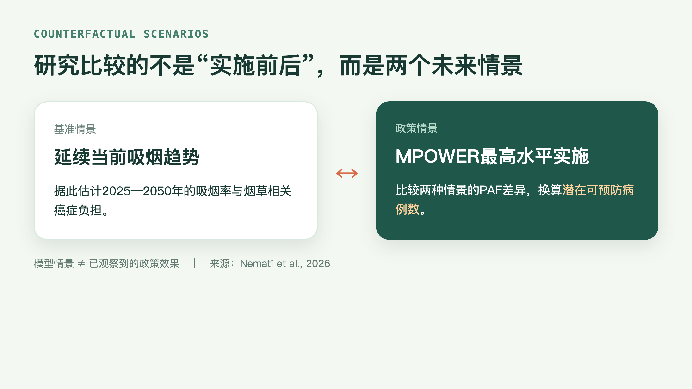
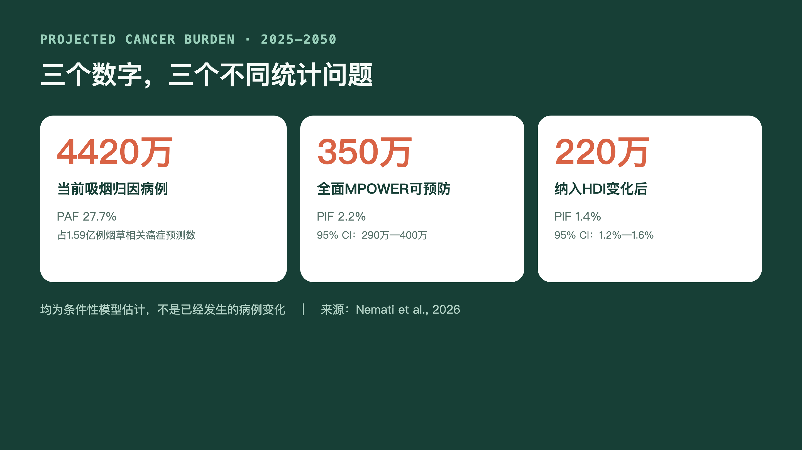
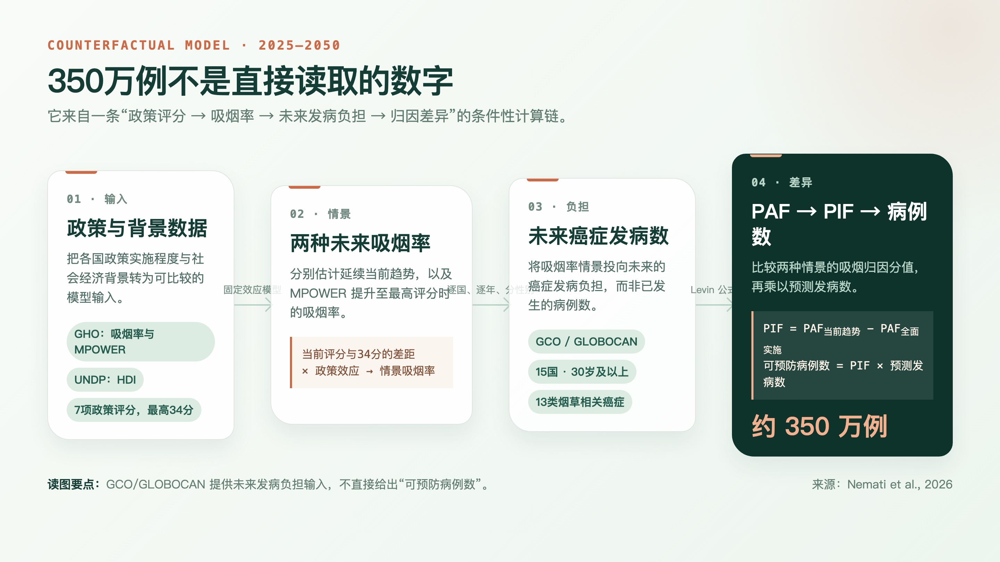
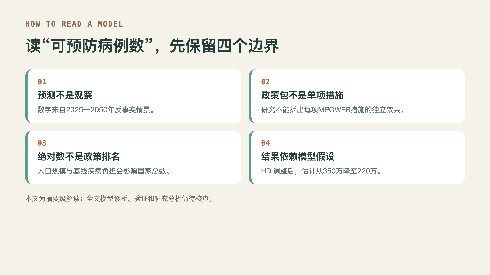

2026年9月7日，IARC 新闻介绍了由他们主导的一项研究，该研究估计了世界卫生组织烟草控制框架公约(World Health Organization (WHO) Framework Convention on Tobacco Control (FCTC))全面实施能够在未来25年内预防350万例癌症病例，这项研究发表在 **The Lancet Regional Health – Western Pacific**（第74卷，文章号101962），原文链接：[DOI: 10.1016/j.lanwpc.2026.101962](https://doi.org/10.1016/j.lanwpc.2026.101962)。

根据国际癌症研究机构（IARC）Global Cancer Observatory 的最新估计，2025—2050年，东亚和东南亚预计将发生约 1.59 亿例烟草相关癌症。按照当前吸烟水平，其中约 4,420 万例可归因于吸烟。研究人员估计，如果全面实施 WHO FCTC 的各项措施，可预防其中约 350 万例新发癌症。

进一步分析显示，社会经济发展水平会在一定程度上减弱这一预防效应。在对人类发展指数（Human Development Index，HDI）进行调整后，全面实施 WHO FCTC 措施预计可预防的癌症病例数由 350 万例下降至 220 万例。

不同国家和不同癌种之间的潜在预防效果存在显著差异。从可预防癌症病例的绝对数量来看，中国最多，其次为日本和印度尼西亚。从癌种来看，肺癌可预防的病例数最多。在调整HDI后预计可避免的 220 万例各类癌症中，超过 110 万例为肺癌。

这些研究结果表明，在东亚和东南亚进一步加强 WHO FCTC 烟草控制政策的实施，具有巨大的癌症预防潜力。该地区承担着全球相当大比例的烟草相关癌症负担，因此，加强这一地区的烟草控制，有望为全球癌症预防作出重要贡献。

下面，我们来看看这项研究是怎么开展的？

## 这项研究想回答什么问题

研究者关心的是一个面向未来的问题：**如果东亚和东南亚各国把世界卫生组织 MPOWER 控烟政策组合提升到最高评分水平，2025—2050年与延续当前吸烟趋势相比，可能少发生多少例与吸烟有关的癌症？**

研究纳入15个国家：中国、蒙古、日本、韩国、文莱达鲁萨兰国、柬埔寨、印度尼西亚、老挝人民民主共和国、马来西亚、缅甸、菲律宾、新加坡、泰国、东帝汶和越南。朝鲜因缺少更新的吸烟率和 MPOWER 评分数据而未纳入。

## 主要结果是什么

研究预计，在纳入的13种与吸烟有因果关联的癌症中，15国在2025—2050年将有约1.59亿例新发病例。若延续当前吸烟水平，约4420万例可归因于吸烟，归因分值（PAF）为27.7%（95%置信区间：25.5%—29.9%）；其中男性约4160万例，女性约260万例。

若各国把 MPOWER 提升至最高评分水平，未纳入 HDI 的主模型估计可预防346.8万例癌症（95%置信区间：292.4万—401.3万），潜在影响分值（PIF）为2.2%（1.8%—2.5%）。其中男性约200.4万例、女性约146.5万例。这里的“可预防”是两个情景之间的预测差值，不是已经发生的减少。

研究者又将人类发展指数（HDI）纳入模型，以考察社会经济发展可能与政策实施、吸烟率变化共同关联的部分。此时估计降至217.8万例（184.4万—251.3万），PIF为1.4%（1.2%—1.6%）；男性约129.7万例，女性约88.1万例。两组结果应并列理解：350万例是未作 HDI 调整的模型结果，220万例是加入该调整后的结果。

## 哪些国家和癌种对结果贡献最大

### 国家：绝对数高度集中，但不是政策排名

按 HDI 调整模型，所有国家中中国的可预防病例数最多，约167.4万例，占15国合计217.8万例的约77%；其后依次为日本和印度尼西亚。这一排序反映人口规模、年龄结构、吸烟流行水平、未来癌症发病负担以及各国距最高 MPOWER 评分的差距共同作用，**不能据此给各国控烟工作打分**。

| 国家或国家组 | HDI调整后可预防病例数（2025—2050年） | 占15国合计的比例 |
|---|---:|---:|
| 中国 | 167.4万（143.7万—191.2万） | 76.9% |
| 日本 | 22.2万（18.6万—25.8万） | 10.2% |
| 印度尼西亚 | 8.0万（6.5万—9.5万） | 3.7% |
| 韩国 | 6.4万（5.3万—7.5万） | 2.9% |
| 缅甸 | 3.7万（3.4万—4.1万） | 1.7% |
| 越南 | 3.3万（2.4万—4.2万） | 1.5% |
| 其余9国合计 | 6.8万 | 3.1% |

表中“其余9国”包括文莱达鲁萨兰国、柬埔寨、老挝人民民主共和国、马来西亚、蒙古、菲律宾、新加坡、泰国和东帝汶。为保证可比性，表内均采用论文的 HDI 调整模型；四舍五入后各行比例之和可能不等于100%。

### 癌种：肺癌贡献最大，绝对数与比例需分开看

在 HDI 调整模型中，肺癌约可预防115.4万例，占全部217.8万例的约53%，是最大的单一癌种贡献；其后是肝癌、胃癌和食管癌。其余9种癌合计约50.0万例。

| 癌种 | HDI调整后可预防病例数 | 占全部可预防病例的比例 |
|---|---:|---:|
| 肺癌 | 115.4万（93.2万—137.6万） | 53.0% |
| 肝癌 | 20.2万（16.8万—23.5万） | 9.3% |
| 胃癌 | 16.9万（14.5万—19.3万） | 7.8% |
| 食管癌 | 15.4万（12.9万—17.8万） | 7.0% |
| 其余9种癌 | 50.0万 | 23.0% |

绝对病例数最多，并不必然表示相对影响最大。按癌种的 PIF，HDI 调整后最高的是肺癌（2.3%）、咽癌（1.9%）和膀胱癌（1.8%）。因此，肺癌同时是绝对贡献最大的癌种；而咽癌、膀胱癌虽在绝对病例数上未居前列，其预测相对降幅仍值得关注。

## 数据结果怎么估算的

### 数据来源与政策定义

| 输入 | 数据来源 | 在模型中的用途 |
|---|---|---|
| 吸烟率与 MPOWER 评分 | 世界卫生组织全球卫生观察站（Global Health Observatory，GHO） | 提取15国、按性别的年龄标化吸烟率（2015、2017、2020、2022、2025年）及其前一年的政策评分。 |
| 人类发展指数（HDI） | 联合国开发计划署（UNDP） | 在调整模型中表征社会经济发展变化。 |
| 未来癌症发病数 | IARC 全球癌症观察站（GCO）中的 GLOBOCAN／Cancer Tomorrow | 提取15国、30岁及以上人群、按性别的2025—2050年预测新发病例数。 |
| 吸烟与癌症的相对危险度 | 各癌种已发表的最新 Meta 分析 | 与情景化吸烟率共同计算 PAF。 |

MPOWER 是世界卫生组织支持实施《烟草控制框架公约》的政策组合。论文将其拆为7项评分：

| 缩写 | 英文全称 | 对应措施 |
|---|---|---|
| M | **Monitor tobacco use and prevention policies** | 监测烟草使用和预防政策。 |
| P | **Protect people from tobacco smoke** | 通过无烟法律保护人们免受烟草烟雾危害。 |
| O | **Offer help to quit tobacco use** | 提供戒烟服务或项目。 |
| W | **Warn about the dangers of tobacco** | 警示烟草危害。 |
| W | **Anti-tobacco mass media campaigns** | 开展反烟草大众媒体宣传活动。 |
| E | **Enforce bans on tobacco advertising, promotion, and sponsorship** | 执行烟草广告、促销和赞助禁令。 |
| R | **Raise taxes on tobacco to reduce its affordability** | 提高烟草税，降低烟草制品可负担性。 |

该研究期内 `Monitor` 最高4分，其余6项最高各5分，合计最高34分。

### 从政策评分到病例数：五步计算链

1. **估计政策与吸烟率的关联。** 研究者按性别建立国家和年份固定效应线性回归，以前一年的 MPOWER 总评分预测当年的年龄标化吸烟率；另建加入 HDI 的模型。每增加1分，男性吸烟率在未调整模型中平均低0.56个百分点、HDI调整后低0.37个百分点；女性相应为0.13和0.08个百分点，后者的置信区间包含无效应值。

2. **构造两种未来吸烟率情景。** 基准情景延续当前趋势；政策情景假定各国评分提高至34分。研究者将回归估计的政策效应乘以“当前评分与34分的差距”，得到各国、各性别在政策情景下的假设吸烟率。

3. **投入未来癌症发病负担。** 对每个国家、年份和性别，研究者从 GCO/GLOBOCAN 的预测病例中汇总13类与吸烟有因果关联的癌症：口腔和唾液腺、咽、食管、胃、结直肠、肝、胰腺、喉、气管/支气管/肺、宫颈、肾/肾盂/输尿管、膀胱及急性髓系白血病。

4. **计算两种情景下的吸烟归因负担。** 对每个癌种，研究者用 Levin 公式计算人群归因分值（population attributable fraction，PAF）：

$$
PAF = \frac{P(RR - 1)}{1 + P(RR - 1)}
$$

其中 $P$ 为相应情景下的吸烟率，$RR$ 为吸烟与该癌种的相对危险度。将 PAF 乘以 GCO/GLOBOCAN 的预测发病数，得到该情景下吸烟归因的病例数。

5. **由 PAF 差值换算可预防病例。** 潜在影响分值（potential impact fraction，PIF）为两种情景的 PAF 差；再乘以预测发病数，得到模型中的可预防病例数：

$$
PIF = PAF_{\mathrm{current}} - PAF_{\mathrm{full\ MPOWER}} \\
\mathrm{preventable\ cases} = PIF \times \mathrm{projected\ cancer\ cases}
$$

论文对估计过程重复模拟1000次，以得到主要估计的95%置信区间；模拟中将吸烟率和相对危险度的点估计视为固定值。

### 这套估算依赖的假设条件

该模型把“最高 MPOWER 评分”视为全面实施，假定政策评分与吸烟率的关联具有因果解释，设定政策对吸烟率的作用有较短的1年滞后，并假定吸烟率改变会立即传导到癌症发病。这些设定有助于形成可比较的情景，但未完整包含政策执法、长期戒烟轨迹、暴露到发病的长时滞、相对危险度输入和未来人口及癌症预测等不确定性。因此，350万和220万应理解为明确条件下的模型量级，而不是25年后的实际数值。

## 对中国癌症防控有何启示

第一，**中国在区域绝对数中占比最高，提示一级预防的潜在规模大**。这并不等于中国的政策表现最差；在人口多、未来癌症负担大的国家，即使相同的相对变化也会转化为更大的病例数。对中国而言，绝对数更像“应优先投入、持续评估”的信号，而不是国家间排名。

第二，**控烟应被放在综合癌症防控的一级预防框架中，而不是只作为肺癌议题**。肺癌是模型中的最大受益癌种，但肝癌、胃癌和食管癌也贡献了相当数量的潜在可预防病例。研究评估的是 MPOWER 组合，不能从中推导某一项措施单独能减少多少癌症；政策设计仍需同时考虑税价与可负担性、无烟环境、广告促销赞助禁令、警示与健康传播、戒烟服务以及监测。

第三，**登记与监测数据是把政策目标转为可检验结果的基础**。模型使用 GCO/GLOBOCAN 的未来发病负担作为输入；在中国的实际评估中，还需要持续衔接按性别、年龄和地区的吸烟监测、政策实施与执法指标、戒烟服务可及性，以及肿瘤登记的分癌种发病数据。这样才能区分模型预测、政策过程指标与真实世界的发病变化。

第四，**不应把远期模型结果当作短期承诺**。癌症发生往往存在较长潜伏期，真实政策效果还取决于实施强度、人口变化和其他危险因素。更稳妥的解读是：这项研究为加强综合控烟提供了区域量级证据，也提出了中国需要用持续数据评估来检验的长期目标。

## 一句话带走

这项覆盖15国的建模研究估计，若将 MPOWER 提升到最高评分，2025—2050年可预防约346.8万例癌症；纳入 HDI 后约217.8万例。

## 资料来源

1. Nemati S, Nobels M-P, Rumgay H, et al. Projected preventable cancers through full implementation of tobacco control policies in East and South-East Asian countries, 2025–2050: a modeling study. *Lancet Reg Health West Pac*. 2026;74:101962. DOI: [10.1016/j.lanwpc.2026.101962](https://doi.org/10.1016/j.lanwpc.2026.101962)
2. IARC新闻稿：[Projected preventable cancers through full implementation of tobacco control policies](https://www.iarc.who.int/news-events/projected-preventable-cancers-through-full-implementation-of-tobacco-control-policies-in-east-and-south-east-asian-countries-2025-2050-a-modeling-study/)
3. WHO MPOWER：[MPOWER](https://www.who.int/initiatives/mpower)
4. IARC Global Cancer Observatory（GCO）：[Cancer Tomorrow](https://gco.iarc.fr/tomorrow/)
5. WHO Global Health Observatory（GHO）：[Tobacco indicators](https://www.who.int/data/gho)
6. United Nations Development Programme, Human Development Index：[HDI data](https://hdr.undp.org/data-center/human-development-index#/indicies/HDI)
