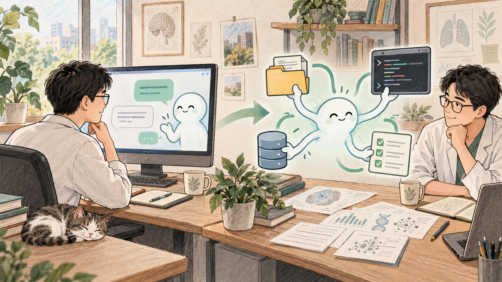
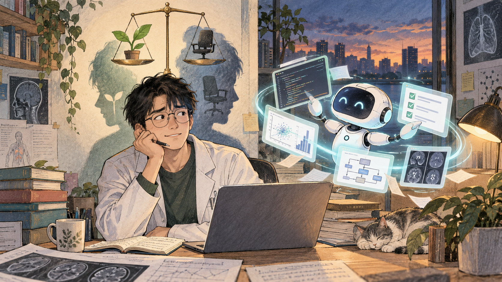
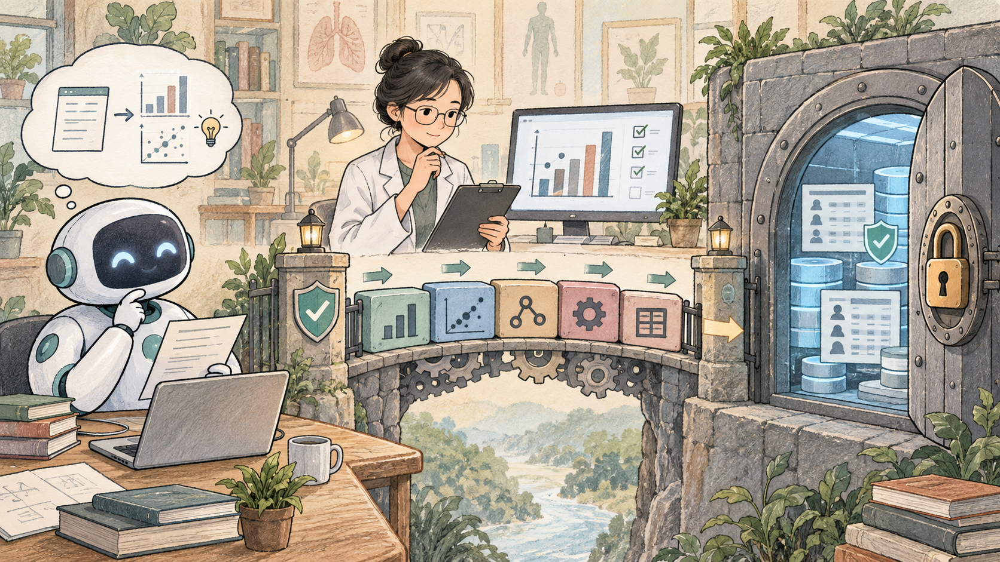

## 从聊天工具到 Agent

从 2022 年底 ChatGPT 发布以来，我面对 AI 的态度一直在变化。

刚开始接触 ChatGPT 时，我把它理解成一种聊天工具，可以帮助我整理和理解一些过去不容易搜索的问题。那时，我更愿意把 AI 看成一个更高级的搜索引擎，或者一个随时可以提问的知识库。

真正改变我看法的，是这两年 MCP、Agent、Skill 等概念和工具逐渐进入实际工作。

MCP、Agent 和 Skill 让 AI 开始接触外部工具和工作环境：读取文件、调用接口、执行代码、操作电脑，并围绕一个目标连续完成多个步骤，这让 AI 可以完成实际工作任务了。

这也是我第一次产生持续为 AI 产品付费的意愿。

我的专业是肿瘤登记，日常工作有很大一部分时间都在处理和分析数据。为了提高工作效率，我陆续开发了一些与肿瘤登记数据分析相关的 R 语言包，例如 canregtools、ltRISK、crcheck、ggcanreg、canreport、crformats等，通过这些 R 包来提升我的工作效率和质量。

开发这些 R 包时，我已经开始使用 AI 辅助编程，但用法仍然比较传统：不会写某个函数，就去聊天窗口提问；遇到报错，把错误信息复制给 AI；需要实现一个功能，让它提供一段示例代码。

这种方式确实能提高效率，但整个过程中，我仍然是主导者。我来构思用什么思路来实现某个功能，可能用到哪些函数等，我要决定写什么、怎么写，把代码复制到 RStudio 中运行；出现问题后，再把错误复制回来继续询问。

可是，从我开始使用 Cline，以及后来接触 ChatGPT 的 Agent 能力后，工作方式发生了变化。

我可以先提出一个相对完整的需求。Agent 会调用大模型生成代码，尝试运行和测试；遇到问题后，它会继续分析、修改，再次测试，最后交付一个可以执行的功能。我只需要描述目标、检查过程、验收结果。

## 生产力提升也带来职业焦虑

这带来了生产力，也带来了焦虑。

我有一段时间觉得，自己所做的 90% 的工作 AI 都可以完成，甚至可能比我完成得更好。它表现得越好，这种焦虑反而越明显：如果大部分具体操作都能被自动化，离失业是不是就不远了？

## 用受控工具处理医学数据

现在，我也在搭建一些 AI 工作流。例如，把之前开发的 R 包升级为兼容 MCP 的形式，让 Agent 可以直接调用 R 包中的函数完成工作。

这种方式和直接让 AI 自由发挥并不一样。R 包提供了明确的函数、输入和输出，Agent 能做什么，首先取决于这些接口允许它做什么。

这种方式对于我们在处理数据特别是医学数据时的保护隐私特别重要，实际上我们只是利用了AI的推理能力来调用传统工具来执行数据分析过程，而不是直接把数据丢给 AI 来做数据分析，这在一定程度上可以减少数据暴露的机会。

在 AI 的帮助下，我开发一些工具的速度越来越快，也让工作流程越来越顺畅。

## 自动化之后，人的工作是什么

工作流程越完善，自己被取代的可能性会不会越大？

可以确定的是，某些具体操作会越来越容易自动化。与此同时，定义问题、设计流程、设置权限、识别异常、解释结果和承担责任，会变得更加重要。

随着工作流程不断自动化，我们面对的工作内容也会随之变化。过去需要亲自完成的编码、调试和重复操作，可能逐渐交给 Agent；人的精力则需要更多地转向提出准确的问题、划定工具边界、检查结果，并理解这些结果在真实工作中意味着什么。

我们需要适应这种新的工作方式，也要主动调整自己的工作重心。与其只关注原有任务会不会被取代，不如继续学习如何与 AI 协作，把专业判断、质量控制和责任意识放在更重要的位置。时代一直在变化，我们能做的，是看清变化正在发生在哪里，然后重新找到自己能够创造价值的位置。
