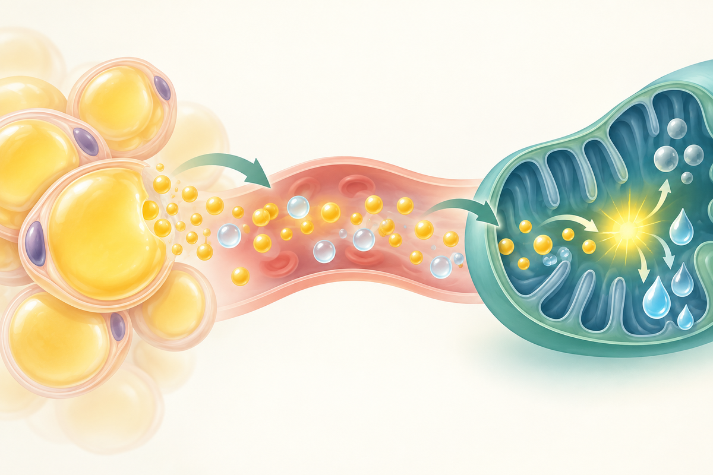
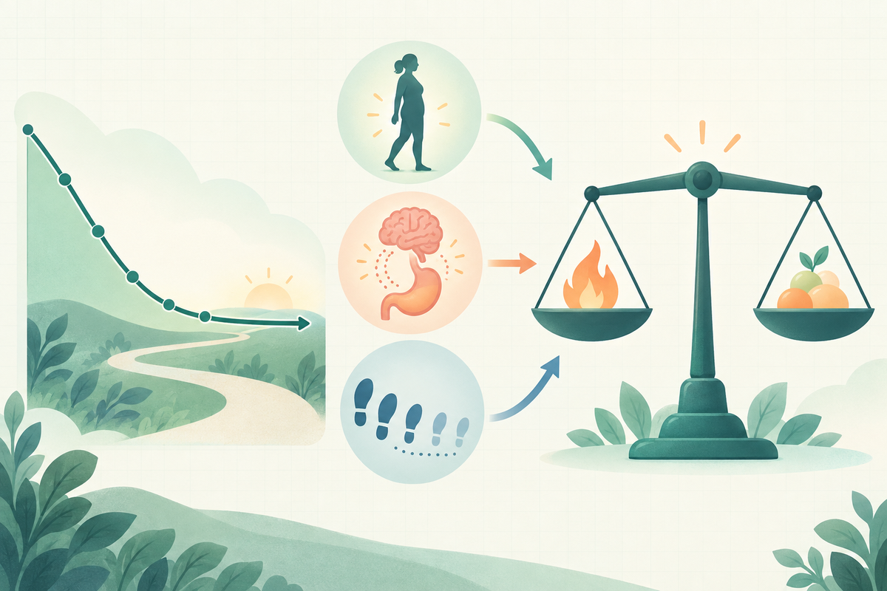

刚开始控制饮食、增加活动时，体重往往降得明显；过一阵子，同样的做法却像突然“失灵”。有人把它归咎于基础代谢坏了，有人开始寻找所谓“燃脂开关”。

先别急着怪意志力。脂肪并不是静静堆在身体里的存货，而是在**储存、释放和利用之间不停周转**。体重是否下降，取决于一段时间内这些过程的净结果，还会受到食欲、能量消耗、日常活动和执行环境共同影响。

## 脂肪不是“吃进去就原样贴在腰上”

食物中的脂肪会在消化道被分解、吸收，再重新组装并运送到组织。吃进去的碳水化合物和蛋白质也可以参与供能；当摄入持续超过消耗时，多余能量的一部分会以**甘油三酯**形式进入脂肪细胞的脂滴。

这就是脂肪的“存”。饭后胰岛素升高，有利于营养物质进入细胞，也会抑制脂肪组织的脂解。这个反应本身是正常生理，不等于“只要分泌胰岛素就一定长胖”。真正决定脂肪库存增减的，是较长时间尺度上的储存总量与消耗总量。

{fig-alt="流程图：进食后的多余能量以甘油三酯存入脂肪细胞；能量需要增加时脂解产生脂肪酸和甘油；脂肪酸进入组织并经线粒体氧化，最终产生能量、二氧化碳和水。"}

## “脂肪被拆开”还不等于“脂肪已经减掉”

两餐之间、空腹或运动时，身体需要调用储备。脂肪细胞中的甘油三酯会在多种酶和激素信号调控下发生**脂解**，生成脂肪酸和甘油，进入血液供其他组织使用。

接下来还有关键一步：脂肪酸要进入细胞，在以线粒体为主的场所经过 β-氧化等过程，才能把化学能转成身体可用的能量。完全氧化后，脂肪中的碳主要变成二氧化碳呼出，另一部分形成水排出。

因此，出汗多主要说明身体在散热和丢失水分；多喘几口气也不会凭空多消耗脂肪。更容易混淆的是，脂肪酸即使被释放出来，如果当下没有被充分氧化，仍可能重新合成为甘油三酯。**短时“动员脂肪”和长期“净减少脂肪”，不是同一个概念。**

## 为什么同样的办法，后来效果会变慢

减重不是一条匀速直线。随着体重下降，至少会发生几类变化：

1. **维持身体所需的能量减少。** 较轻的身体完成同样的日常活动，通常消耗更少；静息能量消耗也会随体重和身体组成改变。
2. **身体还可能出现额外的适应。** 有些人的实际能量消耗下降幅度会超过仅由体重变轻所能解释的部分，研究中称为适应性产热或代谢适应，但个体差异很大。
3. **食欲可能增强。** 一项小型纵向研究观察到，减重后多项食欲相关激素和主观饥饿感发生改变，其中部分变化持续到一年。它提醒我们：更容易饿并不只是“管不住嘴”。
4. **原来的能量缺口逐渐缩小。** 份量不知不觉回升、零食饮料被漏记，或者非运动性活动减少，都可能让实际摄入和消耗重新接近。

{fig-alt="示意图：减重后身体变轻、能量消耗降低、食欲增强，并可能伴随摄入或日常活动漂移，原有能量缺口因此缩小，体重下降速度放缓。"}

所谓平台期，通常不是身体违反了能量守恒，也不能简单解释为“代谢已经毁掉”。更准确的说法是：**身体和行为都在变化，原先足以推动体重下降的方案，后来形成的净能量缺口可能变小了。**

## 看平台期，别只盯着某一天的秤

体重计显示的不只有脂肪，还包括水分、糖原、胃肠内容物等。盐分、饮食时间、运动后的水分变化，都可能让短期数字遮住缓慢的脂肪变化。因此，连续、同条件记录后看周趋势，通常比拿今天和昨天比较更有意义。

如果趋势确实长期停滞，可以按顺序复盘：

- 当前饮食结构和份量是否还能稳定执行，而不是靠几天极端节食；
- 饮料、酒精、零食、调味料和周末进食是否被忽略；
- 日常步行、站立等非运动活动是否在疲劳后减少；
- 睡眠、压力、疾病或正在使用的药物是否可能影响食欲与体重。

这不是要求把每一口食物都变成数字，而是寻找**可以长期维持、不会频繁反弹的调整**。若体重变化伴随明显乏力、心悸、月经变化、水肿，或怀疑疾病及药物影响，应向专业人员咨询，而不是自行停药或购买“燃脂”产品。

## 为什么在肿瘤预防栏目谈体脂

美国国家癌症研究所汇总的证据显示，较高体脂与至少 13 类癌症风险升高有关。可能涉及性激素、胰岛素和 IGF-1、慢性炎症、脂肪因子等多条通路，但不同癌种的证据强度和风险增幅并不相同。

这里要守住两条边界：第一，这些证据大量来自队列等观察性研究，不能据此判断某个人会不会患癌；第二，现有减重与癌症风险下降的证据也有相当部分来自观察性研究，不能把减重说成防癌保证。BMI 适合人群监测，却不是个人体脂分布和健康风险的完整答案。

理解脂肪代谢的意义，不是找到一个神奇开关，而是放弃“某个食物、某个时段或某种激素决定一切”的想象。脂肪每天都在进出仓库；真正困难、也真正有效的，是让净变化朝有利方向缓慢积累，并给身体的适应留出调整空间。

## 参考资料

1. Duncan RE, et al. Regulation of Lipolysis in Adipocytes. *Annual Review of Nutrition*. 2007. https://pubmed.ncbi.nlm.nih.gov/17313320/
2. Hall KD. Predicting metabolic adaptation, body weight change, and energy intake in humans. *American Journal of Physiology-Endocrinology and Metabolism*. 2010. https://pmc.ncbi.nlm.nih.gov/articles/PMC2838532/
3. Sumithran P, et al. Long-term persistence of hormonal adaptations to weight loss. *New England Journal of Medicine*. 2011. https://pubmed.ncbi.nlm.nih.gov/22029981/
4. NIDDK. Eating & Physical Activity to Lose or Maintain Weight. https://www.niddk.nih.gov/health-information/weight-management/adult-overweight-obesity/eating-physical-activity
5. Meerman R, Brown AJ. When somebody loses weight, where does the fat go? *BMJ*. 2014. https://pubmed.ncbi.nlm.nih.gov/25516540/
6. National Cancer Institute. Obesity and Cancer Fact Sheet. https://www.cancer.gov/about-cancer/causes-prevention/risk/obesity/obesity-fact-sheet
